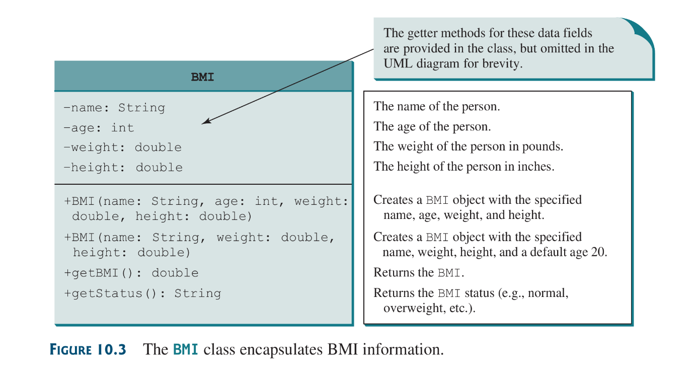
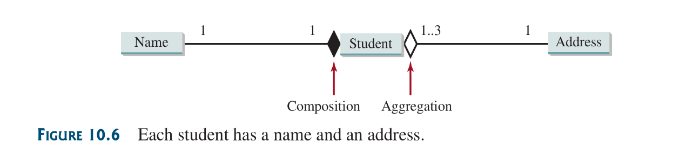
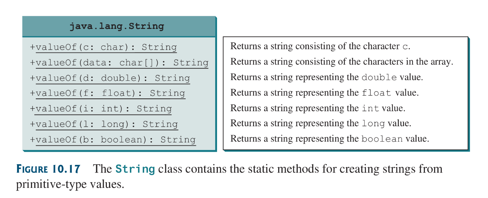
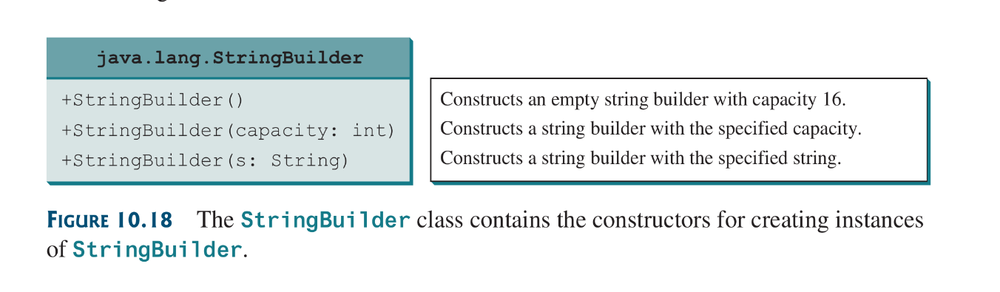
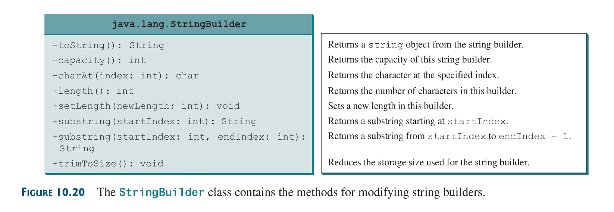

## 10.1 Introduction
The focus of this chapter is class design ans the difference between procedural programming and object oriented programming. 

## 10.2 Class Abstraction and Encapsulation
Class abstraction is the separation of a class implementation from it’s utility. The details of its implementation are hidden from the user; this is known as class encapsulation.

The creator of the class, when abstracting, describes the functions of the class and lets the user know how the class can be used.

The ***class contract*** is collection of public constructors, methods and fields that are accessible from outside the class, and a description of how these members are expected to behave.

## 10.3 Thinking in Objects
BMi.java:



```java
public class BMI {
	private String name;
	private int age;
	private double weight;
	private double height;
	public static final double KILOGRAMS_PER_POUND = 
	0.45359237;
	public static final double METERS_PER_INCH =
	0.0254;

	public BMI (
		String name, int age, 
		double weight, double height,
	) {
		this.name = name;
		this.age = age;
		this.weight = weight;
		this.height = height;
	}
	public BMI (
		String name, double weight, double height
	) {
		this(name, 20, weight, height);
	}
	public double getBMI() {
		double bmi = weight * KILOGRAMS_PER_POUND /
		((height * METERS_PER_INCH) * (height *
		METERS_PER_INCH));
		return Math.round(bmi * 100) / 100.0;
	}
	public String getStatus() {
		double bmi = getBMI();
		if (bmi < 18.5
			return "Underweight";
		else if (bmi < 25)
			retunr "Normal";
		else if (bmi < 30)
			return "Overweight";
		else
			return "Obese";
	}
	public String getName() { return name; }
	public int getAge() { return age; }
	public double getWeight() { return weight; }
	public double getHeight() { return height; }
}
```

## 10.4 Class Relationships
To design classes one must explore the relationship among classes, The common relationships among classes are:
1) association
2) aggregation
3) composition
4) inheritance
### 10.4.1 **Association**
Association is a general binary relationship that describes the activity between two classes. The UML diagram below shows the  relationship:


in a relation the number of class objects partaking to make that relationship valid is known as the *multiplicity* of that class object. Multiplicity may e a number a number or an interval.
In UML the character `*` means an unlimited number of objects
and the interval `m..n` indicates number of objects is between m and n, inclusively.


### 10.4.2  **Aggregation and Composition**
**Aggregation** is a special form of association between 2 objects in which one objects owns the other. The object that owns is known as the *aggregating objects* and the other being owned is known as the *aggregated object*. Aggregation is an ownership form of association. Aggregation models *has-a* relationships: the student *has a* name

**Composition** on the other hand, occurs when the aggregated object is dependent on the aggregating object for existence. Its a form of exclusive aggregation. An example: the name field is dependent on a student object without it the name field loses its reason of existence, while on the other hand, the relationship between a Student object and Address Object although aggregated, can exist perfectly independently of each other.

In UML, a filled diamond is attached to the aggregating class to denote an aggregation relationship between the related class, While a hollow diamond is attached to the aggregating class to denote a composition relationship between the related class.



the above UML can be represented as such:


Aggregation may also exist between objects of the same type, for example a person may have a supervisor:


## 10.6 Case Study: Designing a class for Stacks
In this a class stack holding integer values will be designed, This is the UML diagram:


The Integer Stack Implementation can be found [here](source-files/Chapter-10/TestStack.java)

## 10.7 Processing Primitive Data Type Values as Objects
The primitive-type is not an object, but it can be wrapped in an object using a wrapper class in the Java API.

Dues to the overhead in processing objects and performance considerations; primitive data type values are not objects. Java language performance will be seriously affected if all primitive types and computations on them are analogous with handling objects and processing them.

Java does provide a way as treating them as objects, this can be achieved by wrapping the primitive data type value into an object.

The `java.lang` package provides the following wrappers classes:
1) Boolean class
2) Character class
3) Double class
4) Float class
5) Byte class
6) Short class
7) Integer class
8) Long class
Numeric wrapper classes are very similar to each other:


These wrapper classes a heavily dissected and explained in the book. Don’t think its worth noting (i have read it tho).

### Note
Instances created with `valueOf()` static method might be shared and reusable although its worth nothing that this is not a functionality set in stone, some times instance created with the methods is re-usable, sometimes its not, java is really vague on what makes an instance created with that method re-usable.
## 10.8 Automatic Conversion between Primitive Types and Wrapper Class Types
a primitive type value can be automatically converted to an object using a wrapper class and vice versa, depending on the context.

**Boxing**: This is the conversion of a primitive value to a wrapper object, the reverse i called **Unboxing**. When the compiler automatically does the boxing and unboxing for us; this is known as *autoboxing or autounboxing*.


## 10.9 The *BigInteger* and *BigDecimal* Classes
The `BigInteger` and `BigDecimal` classes can be used to represent integers of decimal numbers of any size and precision. They belong in the `java.math` package. Both classes are immutable.

if one need to compute with very large decimal or high precision floating point values you can use the `BigInteger` or `BigDecimal` classes (respectively).

## Note
you can create a Big-decimal either by `new BigDecimal(String)` or  `BigDecimal(double)` but due to how the double type is approximated, using `BigDecimal(double)` it can yield Big-decimal objects with unpredictable values, so its best to stick with `BigDecimal(String)`

```java
public static BigIntger factorial(long n) {
	BigInteger result = BigInteger.ONE;
	for (int i = 0; i <= n; ++i) {
		result = result.multiply(
			new BigInteger(i + "";
		);
	}
	return result;
}
```
in the above snippet, it shows that we can use Big-Integer to handle very large numbers with precision, if we used the above method to find the factorial of 50 it would yield:
```
30414093201713378043612608166064768844377641568960512000000000000
```

## 10.10 The String Class
A String object is immutable; its content cannot be changed once the string is created.

String object can be created as such:
```java
String newString = new String(stringLiteral);
String nString   = new String("Yo!");
```
java treats string literals as objects so this is also valid:
```java
String message = "I am Happy!";
```
Strings can also be created from an array of characters.

###  10.10.1 Immutable Strings and Interned Strings
When two or more strings are created by assigning a string literal with the same contents, these strings are known as *interned strings*. what happens here is that instead of java creating new string objects, all string reference variables point to the same string object in heap, thereby reducing memory consumption.

Strings declared any other way like declaring a new string object using the `new` operator with similar content as an interned string;  will be a different object all together from the interned strings:
```java
String s1 = "my leg is long";
String s2 = new String("my leg is long");
String s3 = "ny leg is long";
------------------------------------------------------
s1 == s2 is false
s1 == s3 is true both are interned strings
s2 == s3 is false
```

### 10.10.2 Replacing and Splitting Strings

### 10.10.3 Matching, Replacing and Splitting by patterns
String methods that use regex:
* `match()`
* `replaceAll()`
* `replaceFirst()`
* `split()`
the `equal()`is similar to the `match()`just that it has no regex functionality, both returns a boolean.

### 10.10.4 Conversion between Strings and Arrays
the `toCharArray()` String method converts a string to an array of its individual characters.

The `String(char[])` constructor or `valueOf(char[])` method converts an array of characters into a string.

### 10.10.5 Converting Characters and Numeric Values to Strings


### 10.10.6 Formatting Strings
The string class contains a static `format`  method to return a formatted string. its syntax is:
```java
String.format(format, item1, item2, ..., itemk);
```
the `format` method is similar to the `printf` method except it returns the formatted string instead of printing it.

## 10.11 The StringBuilder and StringBuffer Classes
The StringBuilder and StringBuffer classes are similar to the String class except the String class is immutable.

These classes, in general, can be used wherever a `String` can be used. The StringBuilder/Buffer classes are more flexible than the normal String, you can add, insert or append new contents to them.

### 10.11.1 Perks of the StringBuffer class
The difference between the Builder and Buffer classes is that the Buffer class is *synchronized* : meaning only one task is allowed to execute its methods, these is very beneficial in concurrent programming, to prevent cases of corruption in the string (in a concurrent program multiple tasks might be trying to access and modify a single object, which might lead to corruption, synchronization prevents that).

### 10.11.2 Perks of the StringBuilder
Using the StringBuilder on the other hand is more beneficial if its accessed by a single task, because no synchronization is needed in this case.

The constructors and methods of the StringBuilder and Buffer classes are almost the same so they can be declared and handled the same way in most cases.

### StringBuilder Constructors


### StringBuilder Methods for modifying


### StringBuilder `toString`, `capacity`, `length`, `setLength` and `charAt` Methods


the `capacity` method returns the current capacity of the string builder; which is the number of characters the string builder is able to store without having to increase its size.

Note:
* the length of a string builder object is always less than or equal to the capacity of the object, the capacity is automatically increased if more characters are added that exceed the size of the its capacity. internally the string builder is an array of characters, so the builders capacity is the size of the array. if the builders capacity is exceeded the array is replaced by a new array with the size `2 * (the previous array size + 1)`.
* You can use the `StringBuilder(initialCapacity)` to create a string builder with a specified initial capacity, by carefully choosing the capacity one can make the program more efficient. The `trimToSize()` method can be used to reduce capacity to the actual size().

