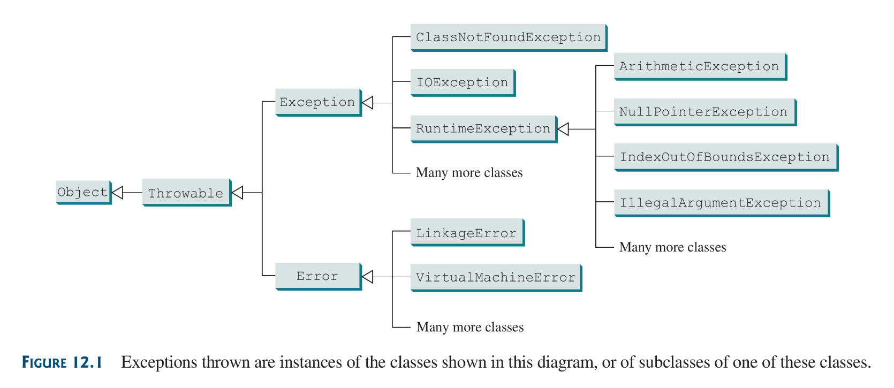

## 12.1 Introduction
Exceptions are runtime errors. Exception handling enables a program to deal with runtime errors and continue its normal execution.

Runtime errors occur while a program is running if the JVM, detects an operation that is impossible to carry out, For example the `ArrayIndexOutOfBoundsException`.

## 12.1 What is an Exception
in java, runtime errors are thrown as **exceptions**. An **exception** is an object that represents an error or a condition that prevents execution from proceeding normally. if the exception is not handled, the program will terminate abnormally.

## 12.2 Exception-Handling Overview
Exception are thrown from a method. The caller of the method can catch and handle the exception.

==Example== 1:
Dividing `int` by zero throws an _`ArithmethicException`: / by zero_ error, to handle this exception we can use an if statements that only allows division when the denominator is not zero:
```java
Scanner input = new Scanner(System.in);
int num1 = input.nextInt();
int num2 = input.nextInt();

if (num2 != 0)
	println(num1/num2);
else
	println("Integer Divisior cannot be Zero");
```
`double` on the other hand can be divided by zero.

The `System.exit(EXIT_STATUS)` is used to terminate a program, i think, exit status 0, means the program terminates behaving as expected, and exit status 1, means the program terminates behaving abnormally.

A method should not be allowed to terminate a program—The caller should decide that. Below is an example of a method terminating it’s program when it notices that an exception is about to be thrown.

 ### ==Example== 2:
```java
public class QuotuentWithMethod {
	public static int quotient(int num1, int num2) {
		if (num2 == 0) {
			System.out.println("Divisor is zero");
			System.exit(1);
		}
	}
	public static void main(String[] args) {
		Scanner input = new Scanner(System.in);
		
		int num1 = input.nextInt();
		int num2 = input.nextInt();
		
		int result = quotient(number1, number2)
	}
}
```
Although this works, its bad design because here: the method is responsible for terminating the program when it notices a potential exception.

### 12.2.2 The `throw` Keyword
A better design would to **notify** the caller of the the method that an exception just occurred and it should handle it (whether terminating it or whatever). This **notification** can be achieved using the `throw` keyword:
```java
throw new EXCEPTION_CLASS("error message");
```
remember: exceptions are objects, thus the `new` keyword.

### 12.2.3 The `try catch` block
Now that we understand how to notify the caller of an exception by *throwing* one. When an exception is thrown, the normal execution flow is interrupted until the exception is handled or the program terminates.

We can handle a thrown exception in the caller by using a `try catch` block. The statement to be tested for a potential thrown exception is placed in the `try` block, if an exception is not thrown, the program continues its normal execution, But if otherwise, the `catch` block catches the exception.

The code in the `catch` block is executed to *handle the exception*. Below is a try/catch block:
```java
try {
	code to run;
	a statement or method that may throw an exception;
	More code to run;
} 
catch (TYPE_OF_EXCEPTION ex) {
	code to handle exception;
}
```
in the catch block above the `TYPE_OF_EXCEPTION` is the class type of the expected exception to be thrown, and `ex` is the reference variable we can use to reference the exception object. 

Once the exception is handled by the catch block, the normal execution of the program can continue, unless its stated in the try block that the program should be terminated via: `System.exit(EXIT_CODE)`.

in the try block an exception can be thrown using the `throw` keyword in the block or invoking  a method that may throw an exception.

Now with the help of the `throw` and `try/catch` block we can edit [Example 2](#==Example==%202) in order to throw and handle exceptions better like so:

==Example== 3:
```java
public class QuotientWithException {
	public static int quotient(int num1, int num2) {
		if (num2 == 0)
			throw new ArithmeticException( "Divisor cannot be zero");
		return num1 / num2;
	}
	public static void main(String[] args) {
		Scanner input = new Scanner(System.in);
		int num1 = input.nextInt();
		int num2 = input.nextInt();
		
		try {
			int result = quotient(num1, num2);
			System.out.println(num1 + " / " + num2 + " is "
				+ result);
		}
		catch (ArithmeticException ex) {
			System.out.println("An integer cannot be "+
				"divided by zero");
		}
		System.out.println("Exception has been handled " +
			"execution can continue");
	}
}
```

Note
* the scanner class throws an `InputMismatchException` when reading an input if the input is of the wrong class, a try-catch block can be used to catch this exception and handle it. it can even be placed into a while loop so if this exception is caught the input process can loop again until the desired input is gotten.

## 12.3 Exception Types
Exceptions are objects, and objects are defined using classes.The root class for exceptions is `java.lang.Throwable`.



The Throwable class is the root of exception classes All Java exception classes inherit directly or indirectly from `Throwable`. One can create an exception class by extending `Exception` or its subclasses.

The exception classes can be classified into three major types: system errors, exceptions and runtime exceptions.
1) **System errors**: They are thrown by the JVM an are represented in the `Error` class. `Error` class describes internal system errors, they occur rarely. If one does there is little you can do beyond notifying the user and trying to terminate the program gracefully.
2) **Exceptions**: They are represented in the `Exception` class, which describes errors caused by your program and by external circumstances. These errors can be caught and handled by your program
3) **Runtime Exception**: These are represented in the `RuntimeException` class, which described programming errors, such as bad casting , accessing out of bound arrays etc. Runtime exceptions normally indicate programming errors

**RuntimeException, Error** and their subclasses are *unchecked exceptions*. All other exceptions are known as *checked exceptions*, meaning the compiler forced the programmer to check and deal with them with a try-catch block. Unchecked exceptions mostly refer to programming logic errors.

## 12.4 Declaring, Throwing and Catching Exceptions
A handler of an exception is found by propagating the exception backward through a chain of method calls, starting from the current method.

Java has an exception handling model which is based on three operations:
1) Declaring an exception
2) Throwing an exception and
3) Catching an exception
 


### 12.4.1 Declaring Exception
Every method musts state the typed of **checked exceptions** it must throw. This is known as *declaring exceptions*.  Because System and Runtime exceptions can happen to any code, Java does no require we declare `Error` and `RuntimeException` (unchecked exceptions) explicitly in the method.

However other exceptions must be explicitly declared in the method header; an ==example==:
```java
public void myMethod() throws IOException
```
This indicates the the `myMethod()` methods might throw an `IOException`. if the method might throw multiple exceptions, a list of exceptions can be added, separated by commas after `throws`:
```java
public void myMethod()
	throws Exception1, Exception2, ..., ExceptionN
```

### 12.4.2 Throwing Exceptions
A program that detects and error can instantiate an Exception Object of the appropriate type and throw it. This is *throwing an exception*

==Example== 4: Say in program a method notices an argument passed onto  it violates its contract, the method can instantiate the exception type noticed and throw it as follows:
```java
IllegalArgumentException ex = new IllegalArgumentException("Wrong Args");
throw ex;
```
or (for brevity):
```java
throw new IllegalArgumentException("Wrong Args");
```

#### Note
 * in most cases the Exception classes posses two constructors, a no-arg one, and one with a `String`parameter intended for a string describing the error message to passed. The error message can be retrieved using the `getMessage()` method.
 * The keyword to declare an exception is *`throws`* while the keyword to throw and exception is `throw` 

### 12.4.3 Catching Exceptions
Exceptions are caught and handled with the `try-catch` block. If no exceptions arise in the try block the catch blocks are skipped. But if an exception arises, java skips the remaining statements in the try block and stated the process of finding the code to handle the exception.
```java
try {
	statements;
}
catch (Exception1 exVar1) {
	handler for exception1;
}
catch (Exception2 exVar2) {
	handler for exception2;
}
...
catch (ExceptionN exVar3) {
	handler for exception3;
}
```
the code that handles the exception is known as the exception handler. Each exception block is examined in turn, form first to last, to see whether the type of the exception object is an instance of the exception class in the catch block. if so the exception object is assigned to the variable declared and the code in the catch block is executed. if no handler is found java exist method, passing the exception to the methods caller and continues the process of finding a handler, if no handler is found in the chain of methods invoked, the program terminates and prints the error message in the console.

### Note:
* Various exception class can be derived from a common superclass, if a `catch` block catches an exception of a superclass, that same catch block will be able to catch Exceptions from subclasses of the superclass.
* The order in which exceptions are specified in a catch block is important, A compile error will result if a catch block for a superclass type is declared before the catch block for a subclass type.


* Java force us to deal with checked exceptions, if a method declares a checked exception, you must invoke it in a try-catch block or declare to throw the exception to the calling method.


* You can use the new JDK7 multi-catch feature to simplify coding for the exceptions with the same handling code, it syntax:
```java
catch (Exception1 | Exception2 | ... | ExceptionK ex) {
	// same code for handling these exception
}
```

### 12.4.4 Getting information from Exceptions


### 12.4.5 Example: Declaring Throwing  and Catching Exceptions
==Example== 5:
```java
class CircleWithException {
	private double radius;
	private static int numberOfObjects = 0;

	public CircleWithException() {
		this(1.0;)
	}
	public CircleWithException(double newRadius) {
		setRadius(newRadius);
		++numberOfObjects;
	}
	public double getRadius() {
		return radius;
	}
	public void setRadius(double radius) 
	throws IllegalArgumentException {
		if (radius < 0)
			throw new IllegalArgumenException(
				"Radius cannot be negative");
		this.radius = radius;
	}
	public static int getNumberOfObjects() {
		return numberOfObjects;
	}
	public double findArea() {
		return Math.PI * radius * radius;
	}
}

public class TestCircleWithException {
	public static void main(String[] args) {
		try {
			CircleWithException c1 = new CircleWithException(5);
			CircleWithException c2 = new CircleWithException(-5);
			CircleWithException c3 = new CircleWithException(0);
		}
		catch (IllegalArgumentException ex) {
			System.out.println(ex);
		}
		System.out.println("Number of objects created: " +
			CircleWithException.getNumberOfObjects());
	}
}
```

## 12.5 The `finally` Clause
the finally clause always executes regardless of whether an exception occurs or not.
```java
try {
	statements;
}
catch (Exception ex) {
	handles ex;
}
finally {
	must always execute statements;
}
```
The `catch` block can be omitted when the `finally` clause is used, as shown below:
```java
try {
	code math throw a non-checked exception; regardless of 
	whether an exception occurs, finalStatements are executed
}
finally {
	finalStatements;
}
```

## 12.6 When to Use Exceptions
A method should throw an exception if the error needs to be handled by its caller.
But if the exception can be handled in the same method where it occurs there is no need to throw it.

Although simple errors, most of the time, can and should be handled by `if` statements, so a `try-catch` block should, mostly, be used in cases that requires dealing with an unexpected error condition. The `try-catch` blocks should not be used to deal with simple, expected situations.

## 12.7 Rethrowing Exceptions
Java allows an exception handler to re-throw the exception if the handler cannot process the exception, or simply wants to lets its caller be notified, of the exception.
```java
try {
	statements;
}
catch (Exception ex) {
	perfrom operations before exits;
	throw ex;
}
```

## 12.8 Chained Exceptions
Throwing an exception along with another exception forms a chained exception. Sometimes you may need to throw a new exception (with additional information) along with the original exception. This is called *chained exceptions*.

an illustration:
```java
public class ChainedExceptDemo {
	public static void main(String[] args) {
		try{
			method1();
		}
		catch (Exception ex) {
			ex.printStackTrace();
		}
	}
	public static void method1() throws Exception {
		try {
			method2();
		}
		catch (Exception ex) {
			throw new Exception("New info from method1", ex);
		}
	}
	public static void method2() throws Exception {
		throws new Exception("New info from method2");
	}
}
```

## 12.9 Defining Custom Exception Classes
You can define a custom exception class by extending the `java.lang.Exception` class.
```java
public class InvalidRadiusException extends Exception {
	private int radius;

	public InvalidRadiusException(double radius) {
		super("Invalid radius " + radius);
		this.radius = radius;
	}
	public void getRadius() {
		return radius;
	}
}
```
The `Exception` class extends `java.lang.Throwable`. So all the methods (`getMessage()`, `toString()` and  `printStackTrace()`) in the `Exception` class are inherited from the `Throwable` class.

These are the often used constructors in the Exception class:


Its better to inherit from **checked** `Throwable` classes ( classes that are not `Error` or `RuntimeException` and its subclass), You could inherit from unchecked but in that case the compiler will not force the exception to be caught in your program which can lead to bugs.

## 12.10 The `File` Class
The `File` class contains the methods for obtaining the properties of a file/directory and fro renaming and deleting a file/address.

A `File` object encapsulates the properties of a file or a path, but it does not contain the methods for writing/reading data to/from a file; that is done by I/O classes. 


There are two types of files:
1) **Text**: characters on disk
2) **Binary**: executable files on disk

I/O classes that can used to read/write into a file are: the `Scanner` and `PrintWriter` classes.

### 12.11.1 Writing Data using the `PrintWriter`
The `java.io.PrintWriter` class can be used to create a file and write data to a text file. First `PrintWriter` Object would have to be created; as so:
```java
PrintWriter output = new PrintWriter(filename);
```
Below is the UML of the `PrintWriter` class:


An ==Example==:
```java
public class WriteData {
	public static void main(String[] args) throws IOException {
		
		java.io.File file = new java.io.File("scores.txt");
		if (file.exists()) {
			System.out.println("File already exists");
			System.exit(1);
		}
		
		java.io.PrintWriter writer = new java.io.PrintWriter(file);
		
		writer.print("John F Kennedy: ");
		writer.println(100);
		writer.print("Theodore Roslvelt: ");
		writer.println(121330);
		
		writer.close()
	}
}
```

Things to Note:
* You can append data to an existing file use `PrintWriter( new FileOutputStream(file, true) )` to create a `PrintWriter` object.
* The `PrintWriter.close()` method must be used to close the file to prevent corruption or the file not saving properly

### 12.11.2 Closing Resources Automatically Using `try-with-resources`
Because sometimes programmers forget to close a file, JDK 7 provides the try-with-resources syntax that automatically closes the file.
```java
tru (declare and create resources) {
	Use the resources to process the file;
}
```
With this syntax we can edit the previous example to:
```java
public class WriteData {
	public static void main(String[] args) {
		java.io.File file = new java.io.File("scores");
		if (file.exists()) {
			System.out.println("File already exists.");
			System.exit(0);
		}

		try (
			java.io.PrintWriter writer = new java.io.PrintWriter(file);
		) {
			writer.print("John F Kennedy: ");
			writer.println(100);
			writer.print("Theodore Roselvelt");
			writer.println(1244535);
		}
	}
}
```
The resource declared and created in the parenthesis following the keyword `try` must be a sub-type of `AutoCloseable` such as `PrintWriter` that has the `close()` method. A resource must be declared and created in the same statement. Multiple resources can be declared inside the parentheses. The statements in the block use the resources, after the block is finished, the resources `close()` method is automatically invoked to close the resource.


### 12.11.3 Reading Data Using Scanner
A `Scanner` breaks its input into delimited by whitespace characters. To read input from the Keyboard, you create a `Scanner` for System.in, as follows:
```java
Scanner input = new Scanner(System.in);
```
To **read from a file**, create a `Scanner` for the file as follows:
```java
Scanner input = new Scanner(new File(filename));
```


An ==Example== using the Scanner class for a file:
```java
import java.util.Scanner;

public class ReadData {
	public static void main(String[] args) throws Exception {
		java.io.File file = new java.io.File("scores.txt");
		
		Scanner input = new Scanner(file);
		while(input.hasNext()) {
			String firstName = input.next();
			String middleName = input.next();
			String lastName = input.next();
			int score = input.nextInt();
			System.out.println(
				firstName + " " + middleName + " " +
				lastName + " " + score
			);
		}
		
		input.close();
	}
}
```
Invoking the constructor `new Scanner(file)` may throw an I/O exception; so the main methods is declares `throws Exception`.

Re-writing the above program using try-with-resources:
```java
import java.util.Scanner;

public class ReadData {
	public static void main(String[] args) throws Exception {
		
		java.io.File file = new java.io.File("scores.txt");
		
		try ( Scanner input = new Scanner(file) ) {
			while (input.hasNext()) {
				String fName = input.next();
				String mName = input.next();
				String lName = input.next();
				int score = next.nextInt();
				
				System.out.println( fName + " " + mName + 
					" " + lName + " " + score
				);
			}
		}
	}
}
```

### 12.11.4 How Does `Scanner` Work?
**Token based** input methods in the `Scanner` class (example: next***PrimitiveType***() and the next() method) read input separated by delimiters. By default delimiters are white-space characters.

A new delimiter can be set using `useDelimiter(String regex)` to set a new pattern for delimiters.

Token based input works by:
1) First, skipping any delimiters
2) Then, reads a token ending at a delimiter
3) The token is then automatically converted into a value of the next***PrimitiveType*** method invoked (if `nextInt()` is invoked it converts the value to `int`).
4) For the `next()` method no conversion is performed
5) if the token does not match the expected type, `java.util.InputMismatchException` runtime exception is thrown.

Both `next()` and `nextLine()` reads a string, `next` read a string separated by delimiters, `nextLine()` reads a line ending with a line separator `\n` (Linux).

To find out the line separator for you platform (in windows its `\r\n`):
```java
String lineSeparator = System.getProperty("line.seperator");
```
#### Difference between Token based input methods and the `nextLine()` method
The token based input method does not the read the delimiter after the token

The `nextLine()`, on the other hand, reads whatever characters and ends its reading with the line separator, the line separator is read but is not part of the string returned by `nextLine()`. `nextLine`always ends its reading at a line separator.

so in case that a `token` based input method was invoked before `nextLine()`; what happens is that the token based input method skips all delimiters encountered at the beginning of the data stream and reads all character present before a delimiter, remember the delimiter is not read, then its execution stops and  `nextline()` begins its execution, the `nextLine` starts its reading from whatever character the token based input stops at (even a delimiter) and ends its reading, inclusively, at a line separator character, although the line separator character is read it is not part of the returned string.

Now in a situation that input of: 32 `Enter` 567 `Enter`, was done (`Enter` inputs a line separator) on the keyboard, and `nextInt()`(a token based input method) was invoked then `nextLine()` like so:
```java
Scanner input = new Scanner(System.in);
int intValue = input.nextInt();
String line = input.nextLine();
```
What do you suppose might happen?  What happens is that 32 will be stored in `intValue` and an empty String will be stored in `line`. This happens because a token based input reads its characters and stops at a delimiter which is the line separator in this case, and when the `nextLine` is invoked it always stops at the first occurrence of a line separator while returning the string before that line separator, in this case there are no characters before the line separator; so it returns an empty string.

For this reason, you should not use a line based input after a token based input.
