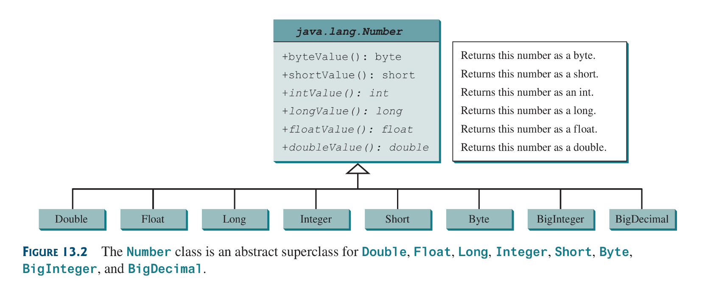

## 13.1 Introduction
A superclass defined common behavior for related classes. An ***interface*** is used to define common behavior for classes (including unrelated classes).

## 13.2 Abstract classes
An abstract class cannot be used to create objects. An abstract class contain abstract methods that are implemented in concrete subclasses. 

In the inheritance hierarchy; classes become more specific and concrete with each new subclass, and more general and less specific along the superclass direction. Sometimes superclass can be so abstract that it cannot be used to create any specific instance, this classes are known as ***Abstract Classes***

an example of an abstract class:
```java
public abstract class GeometricObject {
	private String color = "white";
	private boolean filled;
	private java.util.Date dataCreated;

	protected GeometricObject() {
	}
	protected GeometricObject(String color, boolean filled) {
		this.dateCreated = new java.util.Date();
		this.color = color;
		this.filled = filled;
	}
	public String getColor() {
		return color;
	}
	public void setColor(String color) {
		this.color = color;
	}
	public boolean isFilled() {
		return filled;
	}
	public void setFilled(boolean filled) {
		this.filled = filled;
	}
	public java.util.Date getDateCreated() {
		return dateCreated;
	}
	@Override
	public String toString() {
		return "created on " + dateCreated + "\ncolor: " +
		 color + " and filled: " + filled;
	}
	
	public abstract double getArea(;
	public abstract double getPerimiter();
}
```
abstract class implementation are provided by its subclasses; it, itself, cannot be instantiated.

### 13.2.1 Why Abstract Methods?
Defining abstract classes and methods creates an abstract blueprint that makes defining subclasses that fit in such blueprint easier.

### 13.2.2 Interesting Points about Abstract Classes
* An abstract method cannot be contained in a non-abstract class.
* if a subclass does not implement all abstract methods, the subclass must be defined as abstract. In order words, an abstract class subclass must implement all its abstract methods.
* Abstract methods are non-static
* An abstract class cannot be instantiated using the `new` operator, but its constructors can still be defined, which are to be invoked in its subclasses.
* A class that contains abstract methods must be abstract, however its possible to define an abstract class with no abstract methods
* A subclass can override a method from its superclass to define it as abstract: this is very *unusual*. when this happens the subclass must now be defined as abstract.
* A subclass can be abstract even if its superclass is concrete. For example, the `Object` class is concrete, but its subclasses, such as `GeoemetricObject` may be abstract.
* You cannot create an instance of an abstract class using the `new` operator, but am abstract class can be used as a data-type, so an array of abstract classes can be created:
```java
GeometricObject[] objects = new GeometricObject[10];
objects[0] = new Circle();
```

## 13.3 Case Study: The Abstract `Number` Class
`Number` is an abstract superclass for numeric wrapper classes `BigInteger` and `BigDecimal`. 



An example:
```java
import java.util.ArrayList;
import java.math.*

public class LargestNumber {
	public static void main(String[] args) {
		ArrayList<Number> nums = new ArrayList<>();
		
		nums.add(45);
		nums.add(213.34);
		nums.add(new BigInteger("13224284483783623843"));
		nums.add(new BigDecimal("1.3224358353753859365"));
		
		System.out.println("The largest number is " +
			getLargetNumber(nums));
	}
	public static Number getLargetNumber(ArrayList<Number> list) {
		if (list == null || list.size() == 0)
			return null;
		
		Number largest = list.get(0);
		for (int i = 1; i < list.size(); ++i) {
			if (list.get(i).doubleValue() > largest.doubleValue()) 
				largest = list.get(i);
		}
		
		return largest;
	}
}
```

## 13.4 Case Study: `Calendar` and `GregorianCalendar`
`GregorianCalendar` is a concrete subclass of the abstract class `Calendar`.


## 13.5 Interfaces
An interface is a class-like construct for defining common operations for objects.

in many ways an interface is similar to an abstract class but its intent is to specify common behaviors for objects or related classes or unrelated classes.

with interfaces you can specify that an object is comparable, edible and/or cloneable.

interface syntax:
```java
modifier interface InterfaceName {
	/*** Constant declarations */
	/*** Abstract method signatures */
}
```
an example:
```java
public interface Edible {
	public abstract String howToEat();
}
```

In java an interface is treated like a special class in Java. Each interface is compiled into a separate bytecode file, just like a regular class. You can use an interface more or less the same way an abstract class is used. An instance of an abstract class cannot be created using the `new` operator.

You can use the edible interface to specify that an object is edible, this is done by letting the class for the object to implement the interface using the `implements` keyword.

The relationship between a class and its interfaces is known as ***interface inheritance***

An example:

	Edible.java
```java
public interface Edible {
	public abstract String howToEat();
}
```
	TestEdible.java
```java
public class TestEdible {
	public static void main(String[] args) {
		Object[] objects = {new Tiger(), new Chicken(), new Apple()};
		for (int i = 0; i < objects.size(), ++i) {
			if (objects[i] instanceof Edible) {
				println(( (Edible)objects[i] ).howToEat());
			}
			if (objects[i] instanceof Animal) {
				println(( (Animal)objects[i] ).sound())
			}
		}
	}
}
abstract class Animal {
	private double weight;
	public double getWeight() { return weight; }
	public void setWeight(double w) { this.weight = w; }
	
	public abstract String sound();
}
class Chicken extends Animal implements Edible {
	@Override
	public String howToEat() {
		return "Chicken: Fry it";
	}
	@Override
	public abstract String sound() {
		return "cook-a-dooodle-doo";
	}
}
class Tiger extends Animal {
	@Override
	public String sound() {
		return "Tiger: Roooar";
	}
}

abstract class Fruit implements Edible {
}

class Apple extends Fruit {
	@Override
	public String HowToEat {
		return "Make apple pie!";
	}
}
class Orange extends Fruit {
	@Override
	public String HowToEat {
		return "Make Orange Juice";
	}
}
```


* ## Note:
	* ### Java 8 `default` keyword
	java 8 introduced default interface methods using the `default` keyword. it enables creating a default implementation of a method, which can later be overriden by its implementors or (inheritors), its also a nifty way to add already implemented methods to existing classes implementing such interface without modifying each implementing classes
	* ### Java 8 `public static` method in interfaces
	a public static methods in an interface can be used just like one in a class
	* Java 9 `private` methods in an interface
	private methods can be used in interfaces since java 9
	
	These methods are used for implementing default methods. Here is an example of all interface feature introduced in Java 8 and 9:
	```java
	public interface Java89Interface {
		public default void doSomething() {
			System.out.println("Do something");
		}
		public static int getValue() {
			return 0;
		}
		private static int getStaticValue() {
			return 0;
		}
		private void performPrivateAction() {
		}
	}
	```

## 13.6 The `Comparable` Interface
the `Comparable` interface defines the `compareTo` method for comparing objects. The comparable interface is a generic interface that enable comparing two objects of the same type. 

In order to accomplish this; the common behavior of the objects is what is used to judge if an object is comparable. the comparable interface is defined in `java.lang` as so:
```java
package java.lang;

public interface Comparable<E> {
	public int compareTo (E o);
}
```

the `compareTo` method returns -1 if the compared object is less than the actual object, 0 if equal and 1 if greater. `E` is a concrete type.

Since all `comparable` objects have the `compareTo` method, the `java.util.Arrays.sort(Object[])` method in Java API uses the `compareTo` method and sort. SO in other words, if a class implements the comparable interface it should be able to be sorted by that method. Many classes implement the comparable interface (`String`, `Number` subclasses, `Date` )

```java
import java.math.*

public class SortComparables {
	public static void main(String[] args) {
		String[] cities = {"Jos", "Lagos", "Atlanta", "Tampa";
		java.util.Arrays.sort(cities
		for (String city: cities)
			System.out.print(city + " ");
		System.out.println();
		
		BigInteger[] hugeNumbers {new BigInteger("13354543234342233"),
			new BigInteger("5356345235255256"),
			new BigInteger("255253255555")};
		java.util.Arrays.sort(hugeNumbers);
		for (BigInteger n: hugeNumbers)
			System.out.print(n + " ");
		System.out.println();
	}
}
```

This is an example of the  [Circle](source-files/Chapter-11/GeometricObjects/Circle.java)  class implementing the Comparable interface:
```java
public class ComparableCircle extends Circle
	implements Comparable<ComparableCircle> {
	
	public ComparableCircle(double radius) {
		super(radius);
	}
	@Override
	public int compareTo(ComparableCircle o) {
		if (o.radius < radius)
			return 1;
		else if (o.radius > radius)
			return -1;
		else
			return 0;
	}
	@Override
	public String toString() {
		return "Radius: " + radius + " Area " + getArea();
	}
}
```
Now it can be sorted:
```java
public class SortCircle {
	public static void main(String[] args) {
		ComparableCircle[] circles = {
			new ComparableCircle(3.3);
			new ComparableCircle(12.4);
			new ComparableCircle(9.3);
			new ComparableCircle(1.3);
		};
		java.util.Arrays.sort(circles);
		for (ComparableCircle c: circles) {
			System.out.println(circle);
		}
	}
}
```

the `Object`class has an `equals()` method used for comparing methods, it should be noted that the overridden `compareTo` method should always yield the same result as the `equals` method for good design. Meaning; if there exists 2 objects `o1` and `o2`; `o1.compareTo(o2)` should only be zero if `o1.equals(o2)` is true.

So, its good design to override the `equals` method in the `ComparableCircle` class to return `true` if the two circles have the same radius.

## 13.7 The `Cloneable` Interface
The `Cloneable` interface specifies that an object can be cloned. it often desirable to have a copy of an object; this can be achieved with the `clone` method.
The `Cloneable` interface is defined in the `java.lang` package as so:
```java
package java.lang;

public interface Cloneable {
}
```
The interface is empty. an interface with an empty body is referred to as ***marker interface***. A class that implements the cloneable interface can be cloned using the `clone()` method defined in the `Object`  class.

A clone of an object is a different object in memory that posseses the same contents as its *cloner*.

### Defining a class that implements the `Cloneable` interface
Read the comments to understand no so obvious details:
```java
public House implements Cloneable, Comparable<House> {
	private int id;
	private double area;
	private java.util.Date whenBuilt;

	public House(int id, double area) {
		this.id = id;
		this.area = area;
		whenBuilt = new java.util.Date();
	}

	public int getId () { return id; }
	public double getArea () { return area; }
	public java.util.Date getDate () { return whenBuilt; }

	// overidding the protected clone method in Objects and increasing
	// its visibility
	@Override
	public Object clone() {
		try {
			return super.clone();
		}
		catch (CloneNotSupportedException ex) {
			// if the class object trying to be cloned
			// does not implement the cloneable interface
			// the above exception will be thrown and cloning
			// will happen.
			return null;
		}
	}
	@Override
	public int compareTo(House o) {
		if (area > o.area)
			return 1;
		else if (area < o.area)
			return -1;
		else
			return 0
	}
}
```
the header for the `clone` method in the `Object` class is:
```java
protected native Object clone() throws CloneNotSupportedException;
```
the keyword `native` indicated that this method is not written in Java, but it is implemented in the JVM for the native platform. 

Now we can clone a `House` Object:
```java
House house1 =  new House(1, 1313.35);
House house2 = (House) house1.clone();
```
a clone might be a different object but the reference type variable of the clone points to the same object of the cloner. This is known as *shallow* copy. 

### Deep and Shallow copy
What the clone method does it copy the data fields of the cloner to the clone: so the primitive-type data fields are copied by value ( *pass-by-value* as they are naturally designed) to, so also, the reference data-types are copied by *pass by reference* (as they are also designed to). This creates a copy; but a **shallow** one.

so in the House object we created, although:
```java
(house1 == House2) is false
(house1.whenBuilt == house2.whenBuilt) is true
```
For a deep copy to be done; that means all reference variables in the clone also point to a different objects with the same contents as its cloner reference members. This can be achieved as so:
```java
public Object clone() throws CloneNotSupportedException {
	// shallow clone
	House clone = (House) super.clone();
	// Deep clone
	clone.whenBuilt = (java.util.Date) whenBuilt.clone();
	return clone;
}
```
or 
```java
public Object clone() {
	try {
		// Perform a shallow copy
		House clone = (House) super.clone();
		// Deep copy
		clone.whenBuilt = (java.util.Date) whenBuilt.clone();
		return clone;
	}
	catch (CloneNotSupportedException ex) {
		return null;
	}
}
```
a *manually* defined `clone()` method can be created without implementing the `Cloneable` interface or calling `Object.clone()`; You design the shwiz yourself.

## 13.8 Interface vs. Abstract Classes
A class can implement multiple interfaces, but it can only extend one superclass. Java only allows *single inheritance* for class extensions but *multiple extensions* for interfaces.


an interface can inherit other interface using the `extends` keyword, such interface is called a ***subinterface***
```java
public interface NewInterface extends Interface1, ..., InterfaceN {
	// constant and abstract methods
}
```

### Things to note about interfaces

* a class implementing `NewInterface` must implement the abstract methods defined in `NewInterface`, `Interface1`, …and `InterfaceN`. 
* An interface can extend other interfaces not classes.
* All classes share a single root, `Object` class, but there is no single root for interfaces.
* an interface, like classes, defines a type; a variable of an interface type can reference any instance of the class that implements the interface.
* if a class implements an interface the interface is like a superclass of the class.
* Class names are nouns; interface names may be adjectives or nouns.
* **Strong** `is a` relationships between objects should be modelled using classes, while, **Weak** `is a`  relationships between objects, representing a `is kind of` relationship; should be modelled using interfaces
* You can use an interface data type and cast a variable of an interface type to its subclass and vice-versa
* You can use an interface type and store its subclasses into it.


```java
public class DesignDemo {
	public static void main (String[] args) {
		Edible stuff = new Chicken();
		eat(stuff);
		
		stuff = new Duck();
		eat(stuff);
		
		stuff = new Brocolli();
		eat(stuff);
	}
	public static void eat(Edible stuff) {
		System.out.println(stuff.howToEat())
	}
}

interface Edible {
	public abstract String howToEat();
}

class Chicken implements Edible {
	@Override
	public String howToEat() {
		return "Fry it";
	}
}
class Duck implements Edible {
	@Override
	public String howToEat() {
		return "roast it";
	}
}
class Brocolli implements Edible {
	@Override
	public String howToEat() {
		return "Boil it";
	}
}
```

## 13.9 Case Study: The `Rational` Class
the UML of the class:


its implementation: [file](source-files/Chapter-13/Rational.java), Although the `Rational` class works it has a serious limitation: it can easily overflow, and yield rubbish calculations if the denominator is too large. This can be fixed though bu using the `BigInteger` class for the numerator and denominator.

## 13.10 Class-Design Guidelines
Class design guidelines are helpful for designing sound classes.
* **Cohesion**: A class should describe a single entity, and all its operations should logically fit together to support a coherent purpose. A single entity with many responsibilities can be broken into several classes to separate the responsibilities
* **Consistency**: a class design and declaration should be consistent.
* **Encapsulation**: A class should use the `private` modifier to hide its data from direct access by clients. This makes the class easy to maintain. Provide a getter methods only if you want a data-field to be readable, a setter is you want the data field to be update-able, and no setter method for immutability.
* **Clarity**: A class should have a clear contract that is easy to explain and understand. You should not declare data fields that can be derived from other data fields.
* **Completeness**: Classes are designed to for use by many customers. in order to be useful in a wide range of applications, a class should provide a variety of ways fro customization through properties and methods.
* **Instance vs. Static**: a variable or method that is dependent on a specific instance of the class must be an instance variable or method. A variable that is shared by all instances of a class should be declared static. Always reference static members from a class name (rather than a reference variable) to improve readability and avoid errors.
* **Inheritance vs. Aggregation**: the difference between inheritance and aggregation is the difference between an *is-a* and a *has-a* relationship
* **Interfaces vs. Abstract Classes**: A strong *is-a* relationship that clearly describes a *parent-child* relationship should be modeled via class. A weak *is* relationship can be modeled using interfaces. Interfaces are more flexible than abstract classes because a subclass can only extend one class, but implement any number of interfaces.


