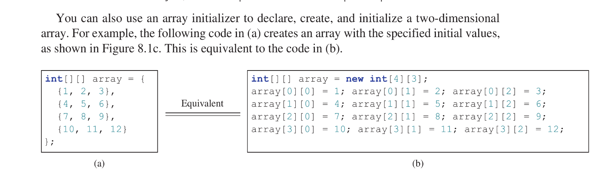

## 8.1 Introduction
Data in a table or a matrix can be represented using a two-dimensional array.  A two dimensional array is an array that contains other arrays as its elements. a 2 dimensional array can be used to store a matrix or table. An example:


```java
double[][] distances = {
	{0, 983, 787, 714, 1375, 967, 1087},
	{983, 0, 214, 1102, 1763, 1723, 1842},
	{787, 214, 0, 888, 1549, 1548, 1627},
	{714, 1102, 888, 0, 661, 781, 810},
	{1375, 1763, 1549, 661, 0, 1426, 1187},
	{967, 1723, 1548, 781, 1426, 0, 239},
	{1087, 1842, 1627, 810, 1187, 239, 0},
};
```
each element in distance is another array.

## 8.2 Two-Dimensional Array Basics
An element in a two dimensional array is accessed via a row and column index.
### 8.2.1 Declaring Variables of Two-Dimensional Arrays and Creating Two-Dimensional Arrays
The syntax for declaring a two-dimensional array is as follows:
```java
elementType[][] arrayRefVar;
```
or
```java
elementType arrayRefVar[][];
```
to access an element in a two dimensional array; 2 subscripts, both of type `int` , are used: the row index and the column index.


to access an index (indexing starts at 0):
```java
type item = array[row][coloumn];
```
#### Note: How declaring and creating a 2D array before initializing is done



### 8.2.2 Obtaining the Lengths of Two-Dimensional Arrays
Since a 2 dimensional array is an array that holds multiple arrays as elements, its length is the amount of individual arrays it holds. Keep in mind that its elements, which are arrays, will also have their own respective lengths independent of the length of the 2 dimensional array they are contained in.

So if an array is declared as such:
```java
int[][] array = array[3][4];
```
`array.length` will be equal to 3 and `array[1]`, `array[2]` and such lengths will be 4;
## 8.2.3 Ragged Arrays
Each row in a two dimensional array is itself an array. Thus the rows can have different lengths. An array of this kind is known as a `ragged array`. 
an example of a ragged array:
```java
int[][] triangleArray = {
	{1, 2, 3, 4, 5},
	{2, 3, 4, 5},
	{3, 4 ,5},
	{4, 5},
	{5}
};
```
if the values in a ragged array is not known in advanced, but the sizes are known—you can create a ragged array with the following syntax:
```java
int[][] array = new int[5][];
array[0] = new int[5];
array[1] = new int[4];
array[2] = new int[3];
array[3] = new int[2];
array[4] = new int[1];
```
#### Note:
* the syntax `new int[5][]` is legal—the first index must be specified. `new int[][]` would be wrong

## 8.3 Processing Two-Dimensional Arrays
Nested for loops are often used to process 2 dimensional arrays.
suppose an array matrix is created as follows:
```java
int[][] matrix = new int[10][10];
```
the following are how it could be processed:
* **Initializing arrays with input values**. the following syntax initializes the array with users input:
```java
java.util.Scanner input = new java.util.Scanner(System.in);
System.out.println("Enter "+matrix.length+" rows and "+ matrix[0].length+" columns: ");

for (int row = 0; row < matrix.length; ++row) {
	for (int column = 0; column < matrix[row]; ++column) {
		matrix[row][column] = input.nextInt();
	}
}
```
* **Initializing arrays with random values**. The following syntax does that:
```java
for (int row = 0; row < matrix.length; ++row) {
	for (int column = 0; column < matrix[row].length; ++column) {
		matrix[row][column] = (int) (Math.random() * 100);
	}
}
```
* **Printing arrays**. To print the individual arrays in a 2 dimensional array it can be done as thus:
```java
for (int row = 0; row < matrix.length; ++row) {
	java.util.Arrays.toString(matrix[row]);
}
```
* **Summing all elements**. Using a variable total to store the sum:
```java
int total = 0;
for (int row = 0; row < matrix.length; ++row) { 
	for (int column = 0; column < matrix[row].length; ++column) {
		total += matrix[row][column];
	}
}
```
* **Summing elements by column**. Here for each column we’ll find the sum and store it in variable total, then print. It is one 
```java
for (int column = 0; column < matrix[0].length; ++column) {
	int total = 0; 
	for (int row = 0; row < matrix.length; ++row)
		total += matrix[row][column];
	System.out.println("Sum of column " + column + " is "
	+ total);
}
```
* **Which row has the largest sum**. 