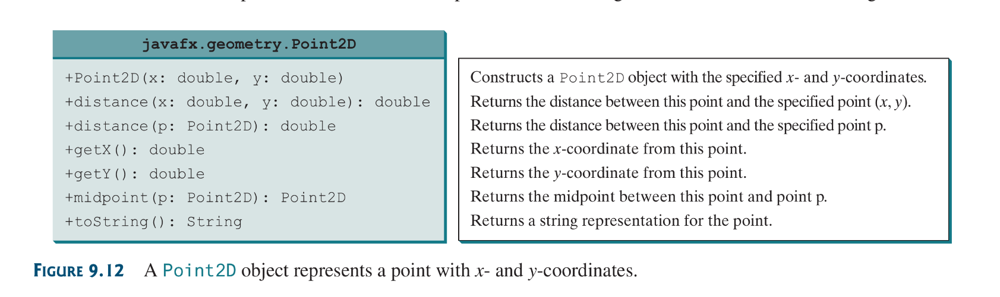
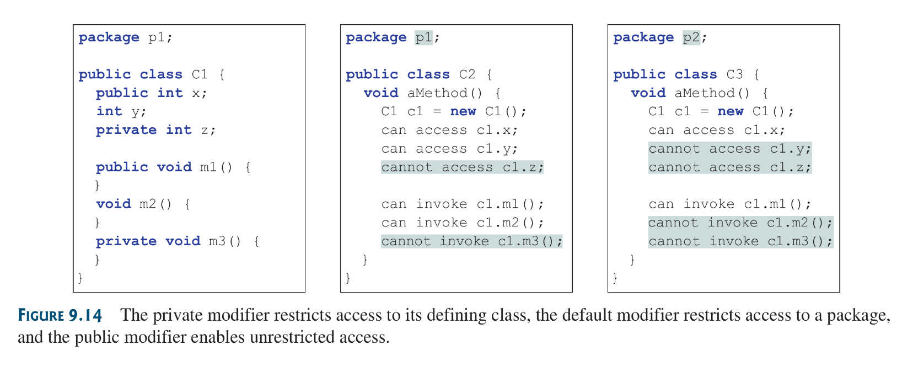
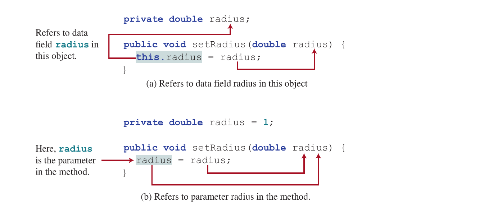

## 9.1 Introduction
Object oriented programming is a technology for developing reusable software.
## 9.2  Defining Classes for Objects
a class defines the properties and behaviors for objects. Object oriented programming (OOP) involves programming using objects. an object is an entity in the real world that can be distinctively identified. 

An Object possess a unique:
* identity 
* state and
* behavior
### 9.2.1 What defines an object?
* **A state**  of an object (also known as its attributes or properties) are represented by data fields with their current value. These **states** are unique data collections an object must possess (as long as such object is a definable entity in the real world)
*  **The behaviors** of an object (also known as it’s actions) are defined by methods. To invoke the method is to ask the object to perform an action.

Object of the same type are defined via a common class.
### 9.2.2 What is a class?
A class is a template, blueprint or contract that defines what an objects states and methods will be, An object on the other hand is an instance of a class.

Many instances of a class (an object) can be created, this process of creating an instance is called *instantiation*.

“The relationship between classes and object is analogous to the relationship between apple-pie recipe and an actual apple-pie”, quoted the book.

### 9.2.3 Constructors and its role in creating new objects
Constructors are special types of methods in a class that are invoked to create a new instance (or objects) of said class.

A constructor can perform any option but its main directive is to perform the initializing actions of the object to be created; such as initializing data fields.


The below image shows how classes are defined; Highlighting the different parts of a class including its data fields, constructors and methods.


The above class does not have a main method so it cannot run, only classes with main methods run and they are referred to as `main classes`.

### 9.2.4 How classes are instantiated with constructors
Say we define a Circle class with Constructors as so:
```java
File Name: TestCircle.java

public class TestCircle {
	public static void main(String[] args) {
		Circle circle1 = new Circle();
		circle1.printRadAndArea();
		
		Cicle circle2 = new Circle(25);
		circle2.printRadAndArea();
		
		circle1.radius = 100;
		circle1.printRadAndArea();
	}
}
class Circle {
	double radius;
	
	Circle() { radius = 1; }
	Circle(double newRadius) {
		radius = newRadius;
	}
	
	double getArea() {}
	double getPerimeter() {}
	double setRadius() {}
	void printRadAndArea() {}
}
```
The above program contains two classes. `TestCircle` is the main class. Its sole purpose is to test the second class `Circle`. Such program that uses the class is known as a *client* to the class. When a program is ran, Java invokes the main method of the main class.

The two classes can be placed in the same file but only one can be a public class. The public class must have the same name as the file name. Each class in the source code will be compiled into a `.class` file.


The main class (`TestCircle`) contains the main method, that creates the `Circle` objects. The `new` operator is used to create an object from the constructor.

if the object to be instantiated is required to posses a specific radius different from the the default value defined in its class; The constructor that takes a new radius is invoked. Such Circle can be instantiated as so:
```java
Circle One = new Circle(45);
```
if is specific value is not defined then it calls the base constructor with no parameters and instantiates a circle object with radius 1:
```java
Circle One = new Circle();
```

Objects, although being instantiated from the same class, are independent of each other. This independence gives each of them a unique identity.

```java
File name: Circle.java

public Class Circle {
	public static void main(String[] args) {
		Circle circle1 = new Circle();
		circle1.print();
		
		Circle circle2 = new Circle(25);
		circle2.print();
		
		Circle circle3 = new Circle(100);
		circle3.print();
		
		circle3.radius = 100;
		circle3.print();
	}
	
	double radius;
	
	Circle () { radius = 1; }
	Circle (double newRad) { radius = newRad; }
	
	double getArea() {
	}
	double getPerimeter() {
	}
	double setRadius() {
	}
	void print() {
	}
}
```
The above code in a rendition of the former class with test class design, in this one the `Circle` class can now test itself and be public because it now a main class with a main method. The above program demonstrates that you can test a class by simply adding a `main` method to the same class.

## 9.4 Constructing Objects Using Constructors
Constructors are special kind of method. They have three peculiarities:
* A constructor must have the same name as the class itself
* Constructors do not have a return type—Not even `void`
* Constructors are invoked using the new operator. when an object is created Constructors play the role of initializing objects
Other things to know about constructors:
* They can be overloaded
* A class normally provides a constructor without arguments such constructors are known as `no-arg constructors`
* A class may be defined without constructors. In this case, a public no.arg constrictor with an empty body is defined in the class. This constructors is called the default constructor: it is provided automatically *only if no constructors are explicitly defined in the class

## 9.5 Accessing Objects via Reference Variables
An objects data and methods can be accessed through the dot `(.)` operator via the objects reference variable. Newly created objects are allocated in the memory. They are accessed via reference variables.

how reference variables are declared:
```java
ClassName objectRefVar;
```

A class is essentially a programmers defined type. A class is a *reference type*, which means a variable of the class type can reference an object of that same class type. For example the variable `myCircle` can reference a `Circle` Object:

```java
Circle myCircle =  new Circle();
```
### Note:
* an object reference variable and an actual objects are different entities;  an object reference variable only holds the reference to that object.
* Arrays are treated as objects in java.

### 9.5.1 Accessing an Object’s Data and Methods
in OOP, an objects *members* refers to its data fields and methods. Its members are accessed using the dot operator:

* `objectRefVar.dataField`: this reference a data field
* `objectRefVar.method(arguments)`: this invokes a method

earlier we spoke of static methods in [Chapter 4. Mathematical Functions, Characters and Strings.](Chapter%204.%20Mathematical%20Functions,%20Characters%20and%20Strings..md), methods that don’t need an instance of the class to be invoked. 

#### 9.5.1.1 Instance Methods and variables
In the opposite spectrum of that there exist *instance methods*, which are methods that require an instance of a class in other to be invoked. Instance methods operate on the instance or objects in which they were invoked by. *instance variables* also exist, follows the same theory as instance methods but they are variables.

#### 9.5.1.2 Anonymous objects
This are objects that have no referencing variable so therefore they cannot be referenced. They are created without explicitly assigning them to a reference variable like so:
```java
new Circle;

or

System.out.print("Area is "+ new Circle(5).getArea());
```

### 9.5.2 Reference Data Fields and the `null` value
It seems that a reference type is simply a type that hold a reference of instantiated object from java classes. reference types can only be types for defined java classes. String type is a reference type because String is a predefined java class.

When a data field of reference type doesn't reference any object, the data field holds the value `null`. `null` is a literal like `true` or `false`, while the latters are boolean literals, `null` is a literal for a reference type. `null` is a reserved word.

Although Java assigns default values to variables and reference types when nothing is assigned to them; It doesn’t do the same for local variables ***inside a method*** , if the variable was declared as a member of the class; it will be assigned a default value.

### Note: NullPointerException
This is a common runtime error. It occurs when you invoke a method on a reference variable with a null value.

### 9.5.3 Difference between Variables of Primitive Types and Reference Types
Every variable represents a memory location that holds a value. For Variables of primitive data types the variable hold the value itself; But in the case of reference types variables: They hold a reference to where an object is located.

When you assign one variable to another, the other variable is set to the same value. For the variable of a reference type, the actual reference it holds is assigned to the other variable, making both of them reference the same object in memory.

## 9.6 Using Classes from the Java Library
The java API contains a rich set of classes for developing java programs

### 9.6.1 The Date Class
Below is its UML description:


### 9.6.2 The Random Class
Below is its UML description:


### Note:
* You can generate random numbers using the `java.security.SecureRandom` class rather than the `Random` class. This is because the random class is deterministic while the `SecureRandom` is, supposedly, non-deterministic and secure.

### 9.6.3 The Point2D Class
Below is its UML Diagram: 



The `Point2D` class is defined in the `javafx.geometry` package which is n the `javaFx` module so to use the class the package `javaFx` would have to be installed.

## 9.7 Static Variables, Constants and Methods
A static variable is shared by all objects of the class. A static method cannot access instance members (instance data fields and methods) of the class.

The data field radius in the Circle class is known as an instance variable. An instance variable is tied to a specific instance of the class. It is not shared among object of the same class.

For instance of the objects were created as follows:
```java
Circle circle1 = new Circle();
Circle circle2 = new Circle();
```
the radius data field of `circle1` and `circle2` are independent of each other with difference values and memory locations.

If we want all instance of the class to share data; a `static variable` is used, also known as class variables. Static variable store values for the variable in a common location. If one object changes the value of a static variable, all the object in the static variable are affected.

Static methods are also supported by java, they can be invoked without an instance of that class. To declare a static member; the`static` modifier is placed in the variable or method declaration like so:
```java
static int numberOfStuffs;

static int getNumberOfStuffs() {
	return numberOfStuffs;
}
```
worth noting: in UML static members are declared by an underlining dash beneath the declaration of the member.

Constants in a class are shared buy all object of the class. Thus, constants should be declared as `final static`:
```java
final static double PI =  3.14159265358979323846;
```
something to note:
* Instance variables and methods can be accessed via reference variables
* Static members on the other hand; can be accessed by both reference variables and the Class name, Hence making them accessible even without having an instance of the class.
* Lastly is better to use `ClassName.methodName(args)` to invoke static methods and `ClassName.staticVariable` to access a static variable; because it makes it easier to spot a static member.

#### Static and Instance members access capabilities
An Instance member can invoke and access both static and instance members. A Static member, on the other hand, can only invoke or access fellow static members. This is because static methods and data fields do not belong to a particular object. 


### 9.7.1 A personal case study:
in the following code: 
```java
public class A {
	int instanceVar = 4; 
	static int staticVar = 2;
	
	public static void main(String[] args) {
		// the assignment and method call below
		// are both illegal because a static method,
		// as the one this comment is being written
		// into, cannot access instance members
		int a = instanceVar;
		instanceMethod();
	}
	public void instanceMethod() {
		// The below statement is will yield legal
		// execution because: instance members, in
		// this case a function, can access static
		// members an its fellow instance members
		instanceVar += staticVar + staticMethod() 
	}
	public static int staticMethod() {
		return 10;
	}
}
```
its is seen that static functions cannot have access to instance members, but instance functions can access both static and instance members.

But there is a way to circumvent this. instead of placing the static function in a situation to access an instance member, what we can do is shift the responsibility of access, towards an instantiated object in the static member. In that case, the instantiated object simply handles the accessing and returns the required data for the static function or member.
```java
public class A {
	int instanceVar = 5;
	static int staticVar = 2;
	
	public static void main(String[] args) {
		A object = new A();
		int b = object.instanceVar;
		object.instanceMethod();
		// the above assignment and invocations are
		// legal because thy were all accessed via
		// an instantiated object. TLDR: access and
		// storage/execution are obviously not 
		// the same.
	}
	public void instanceMethod() {
		instanceVar += staticVar + staticMethod();
	}
	public static int staticMethod() {
		return 10;
	}
}
```

It is bad design to declare a member that should be static as instance; when a member is dependent on an instance it should be declared as an instance member if not, it should always be declared as `static`.

## 9.8 Visibility Modifiers
Visibility modifiers can be used to specify the visibility of a class and its members. 

The `public` visibility modifier can be used for classes, methods and data-fields to denote that they can be accessed from any other classes. if no visibility modifier is used then by default the class, methods and data fields are accessible by any class in the same package. This is known as *package private or package access*.

### Note
* Packages are used to organize classes.
```java
package packageName;
```
* if a class is defined without a package statement it is said to be placed in the *default package*
* Java recommend classes be placed in packages rather than using default packages, however fro simplicity, this book uses the latter.

in java there a 4 visibility modifiers:
* the default modifier or *package private*; has no keyword
* `public`: This modifier denotes access from any other classes
* `private`: this modifier makes methods and data only accessible only from within its own class
* `protected`: will be discussed later apparently 
 


if a class is not defines as public, it can only accessed within the same package. as shown below:


The private modifier restrict private members from being accessed outside the class. However there is no restriction on accessing members form inside the class.

### Thins to note about visibility modifiers:
* Classes (Top level classes to be exact) can only declared with the `public `modifier or the *package private*
* The private modifier applies only to the member of a class, The public modifier can apply to a class or members of a class.
* Using the public and private on local variables would could a compile error.
* using the public and private modifiers on local variable would cause a compile error. Remember, visibility modifiers are only for class members and (sometimes) the classes themselves
* If, in some case, you want a user to be unable to create an instance of a class,you can achieve that by using a *private constructor*,  For example this is used in the java `Math` class; since all members of the math class are all static, it makes no sense to make an instance of the class; a private constructor can be declared thusly:
```java
private Math() {
}
```

## 9.9 Data Field Encapsulation
making data fields private protects data and makes the class easy to maintain. using the `private` modifier is known as *data field encapsulation*.

These are reason data should be encapsulated:
1) to prevent careless tampering of data fields
2) to prevent classes from being difficult to maintain and being vulnerable to bugs.

in most cases, even private data fields need to be accessed and retrieved or even modified to a new value:
*  ***Getters or Accessors:*** getters enables clients retrieve the value of a private data field, they are declares as thus:
```java
public returnType getPropertyName()
```
* ***Setters or Mutators:*** setters enables clients set a new value to a private data field, they are declared as thus:
```java
public void setPropertyName( dataType propertyValue )
```

### listing 9.8 `Circle.java` encapsulated


```java
public class Circle {
	private double radius = 1.0;
	private static int numberOfObjects = 0;

	public Circle() {
		++numberOfObjects;
	}
	public Circle(double value) {
		radius = value;
		++numberOfObjects;
	}
	public double getRadius() {
		return radius;
	}
	public void setRadius(double value) {
		radius = (value >= 0) ? value : 0;
	}
	public static int getNumberOfObjects() {
		return numberOfObjects;
	}
	public double getArea() {
		return (Math.PI * Math.pow(radius, 2));
	}
}
```

### Note:
* To prevent data from being tampered with and to make the class easy to maintain, declare data fields private
* all data fields should be declared private, and all constrictors and methods should be defined public, unless specified otherwise.

## 9.10 Passing Objects to Methods
Passing an object to a method is to pass the reference of the object. Objects are passed just like arrays passing an object is actually passing a reference of the object.

Java uses exactly one mode of passing arguments: *pass-by-value*, in the case of objects the values to be passed is the reference to the actual object in memory.

pass-by-value on reference can be described semantically as *pass-by-sharing*.

## 9.11 Array of Objects
An array can hold objects as well as primitive-type values. For example:
```java
Circle[] circleArray = new Cicle[10];

for (int i = 0; i < circleArray; ++i) {
	circleArray[i] = new Circle();
}
```
### Things to Note:
* An array of objects is actually an *array of reference variables*
* when an array of objects is created using the `new` operator, each element in the array is a reference variable with a default value of `null`
* When working with objects follow the *DCI or DI* rule to prevent referencing `null`objects: DECLARE-CREATE-INITIALIZE or DECLARE-INITIALIZE.

## 9.12 Immutable Objects and Classes
One can define immutable classes to create immutable objects. The contents of immutable objects cannot be changed.

if a class is immutable, then all its date fields must private and it cannot contain a public setter methods for any data fields, But a class with all private data fields and no mutators is not necessarily immutable, because it could be that an accessor or getter returns the reference of private data field, making the data field prone to modification. an example: 
```java
public class Student {
	private int id;
	private String name;
	private java.util.Date dateCreated;

	public Student(int ssn, String nname) {
		id = ssn;
		name = nname;
		dateCreated = new java.util.Date();
	}
	public int getId() {
		return id; 
		// safe: becuase we are returning a primitive
		// data type: so it will pass-by-value.
	}
	public String getName() {
		// also safe becuase by default the String
		// class is immutable.
		return name;
	}
	public java.util.Date getCreatedDate() {
		return dateCreated;
		// issue: the Date class is not immuatble
		// and we just returned a reference to the
		// dateCreated object, meaning clients have
		// the liberty of modifying its value.
	}
}
```
For a class to be immutable, it must meet the following requirements:
* All data fields must be private
* There can’t be any mutator methods for the data fields
* No accessor methods can return a reference to a data-field that is mutable
### 9.12.1 Further discussion of immutable objects
read Supplement 111.U

## 9.13 Scope of Variables
The scope of an instance and static variable is the entire class. regardless of where the variables are declared.

Instance and static variables in a class are referred to as *class variables* or data fields. A variable defined inside a method is referred to as a *local variable*:
* Scope of class variables: entire class regardless where defined. only exception is when a data field is initialized dependent on another data field, that depended upon data field should be declared before the one depending on him.
* Scope of local variables: the method they are defined in.

in a situation where a local variable has the same name as class variable what happens is that, in that method, the local variable takes precedence over and the class variable with the same name is hidden.

## 9.14 The  *`this`* Reference
The keyword this refers to the calling object. it can also be used inside a constructor to invoke another constructor of the same class.

Uses of the `this` keyword:
* The keyword is used to explicitly distinguish instance variables from local variables.
* The `this` keyword is needed to reference a data-field hidden by a method or constructor parameter
* The keyword is used to invoke an overloaded constructor.

### 9.14.1 Using `this` to reference data fields
Its good practice to use the data field as the parameter name in setter method or a constructor to make the code easy to read. In this case we’ll need a way to actually reference the data field in the setter or constructor, the `this` keyword is uses to reference this:
```java
private double radius;

public void setRadius(double radius) {
	this.radius = radius;
}
```



#### Accessing hidden instance and static variables’
* To access a hidden instance variable the `this` keyword is used, because the this keyword reference to the calling object (an instance)
* To access a hidden static variable the syntax : `ClassName.staticVariable` is used to reference
The `this` keyword gives us a way to reference the object that invokes an instance method.

### 9.14.2 Using `this` to invoke a Constructor
The keyword can be used to invoke another constructor of the same class:


#### Note:
* Java requires that, in a constructor, the `this(arg-list)` statement, if to be declared, appear first before any other statements.
* Always create a constructor by calling other constructors that can manage initializing most of the constructors parameters (if they exist). This improves code readability.