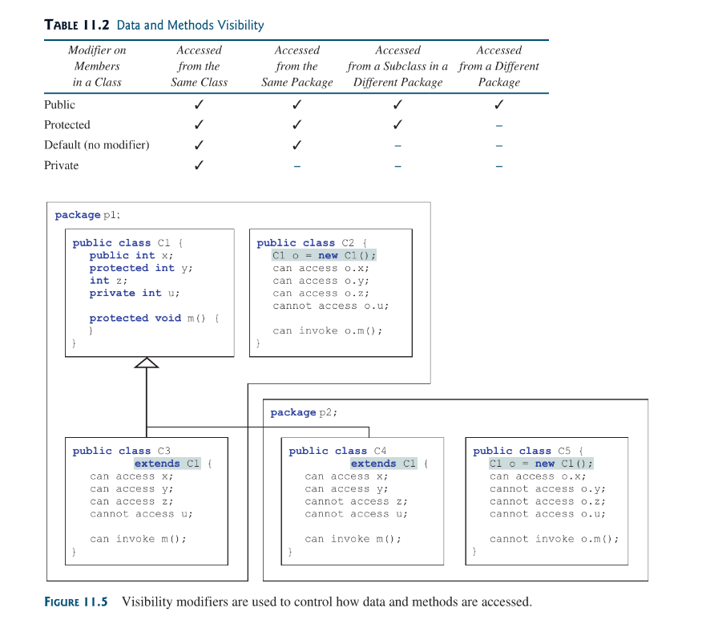

## 11.1 Introduction
OOP allows one to define a anew class from existing classes; this is called *inheritance*.

## 11.2 Super-classes and Sub-classes
Inheritance allows you to define a general class (i.e a superclass) and later extend it to more specialized classes (i.e subclasses). in UML a triangular arrow pointing to the generalize class is used to denote the inheritance relationship between two classes involved. the super class is also referred to as the *parent or base* class and the subclass is referred to as the *child/extended/derived* class.

subclass inherit accessible data-fields and methods from the superclass and may also add new data fields and methods.

the type denoted by a subclass is known as the *sub-type*, while the type denoted by a superclass is known as the *super-type*.

subclass and its superclass are said to form a ***is a*** relationship.
for example: a `Circle` object ***is a*** special type of general `GeometricObject`.

Below is the UML diagram of a `GeometricObject` super class, in addition, a `Circle`  and `Rectangle` subclass which where extended from it.


here are the class of the [GeometricObject](source-files/Chapter-11/GeometricObjects/GeometricObject.java) and its [Circle](source-files/Chapter-11/GeometricObjects/Circle.java) and Rectangle Classes which were extended from it.

as in the codes, the keyword `extend`tells the compiler that a class(subclass) will now inherit from another class(superclass):
```java
public class Circle extends GeometericObject
```
inheriting its methods and data-fields.

It is worth noting that even if a class inherits from another class; the private members of the superclass can only be accessed by the superclass itself despite another class inheriting or being an extension of the superclass. That’s why in the code at line 13 and 12 of the [Circle](source-files/Chapter-11/GeometricObjects/Circle.java) class in its overloaded constructor the filled and color data-field of the Circle class can only be set using the public setter methods declared in the Super Class (GeometryObjects). Trying to access the data-fields without its setters/getters will be illegal, because they where declared as private in the parent class.
```java
public Circle(
	double radius, String color, boolean filled
) {
	this.radius = radius;
	this.color = color // illegal
	this.filled = filled; //illegal
}
```
### Note:
 * private data fields in a superclass are not accessible outside the class, Therefore cannot be used directly in a subclass. However they can be accessed via accessors /mutators defined in the superclass
 * Some languages support multiple inheritance: that is inheriting from several class; java does not support that. Java only support single inheritance; although multiple inheritance can be achieved via interfaces.
## 11.3 Using the `super` Keyword
The keyword super refers to the superclass and can be used to invoke the superclass’s methods and constructors.
This keyword can be used in two ways:
1. To call a superclass constructor
2. To call a superclass method

### 11.3.1 Calling Superclass Constructors
Unlike properties and methods the constructors of a superclass are not inherited by a subclass. They can only be invoked from the constructors of the subclasses using the keyword `super`.
```java
super() or super(arguments)
```

### My dumb logic of how super works in subclass constructors
calling `super()` in the constructor of a subclass creates an object of the superclass with the specified arguments which is then automatically attached to the newly created subclass object via inheritance.

in that way:
```java
public Circle(
	double radius, String color, boolean filled
) {
	this.radius = radius;
	setColor(color);
	setFilled(filled;
}
```
in [Circle](source-files/Chapter-11/GeometricObjects/Circle.java) is the same as:
```java
public Circle(
	double radius, String color, boolean filled
) {
	super(color, filled)
	this.radius = radius;
}
```
You might notice that in the second snippet, `super()` was called before any other statements; this is because, in subclass constructors, the `super()` constructor must be called before any other statements, Or else a compile error will occur. In fact if the `super keyword` is not declared in a subclasses constructors; the compiler automatically places one as the first statement in the constructor.

### Note: CAUTION
* Invoking a superclass constructors **name** in a subclass causes syntax error, the `super()` keyword should be used for that.

### 11.3.2 Constructor Chaining
In any case, constructing an instance of a class invokes the constructors of all the super classes along the inheritance chain.When constructing an object the subclass first invokes the superclass it inherits from and the superclass does the same to its own possible superclass, this process continues until the last constructor along the inheritance hierarchy is called. This process is known as ***constructor chaining***.

#### Note: Design Guide
a no arg constructor for a class should always be provided to make the class easy to extend and avoid errors. 

if a superclass has an explicit argument constructor defined and no no-arg constructor defined, if a subclass extends it and in the process of trying to construct an object a compiler error might be thrown, because the subclass constructor is trying to call the no-arg constructor of its superclass.

### 11.13.3 Calling Superclass Methods
The `super` keyword can also be used to reference a method in the superclass, but in most cases this is not required because a subclass inherits its superclass’s methods. There are some special cases tho when `super` should be used.

## 11.4 Overriding Methods
To override a method, the method must be defined in the subclass using the same signature as its superclass.

For example: the `toString()` method in [GeometricObject](source-files/Chapter-11/GeometricObjects/GeometricObject.java) can be overridden as so in the  [Circle](source-files/Chapter-11/GeometricObjects/Circle.java)  class:
```java
public class Circle extends GeometricObject {
	// other data fields and methods
	
	public String toString() {
		return super.toString() + "\nradius is " +
		radius;
	}
}
```
say there is a subclass of the Circle class, it cannot access the `toString()` method defined in the `GeometricObject` via `super.super.toString()`. This is a syntax error.

There are some points worth noting:
1. The overriding method must have the same signature as the overridden method and same or compatible return type. Compatible means that the overriding methods return type is a sub-type of the overridden methods return type
2. An instance method can be overridden only if it is accessible. Thus a private method cannot be overridden.
3. static methods can be inherited. However a static methods cannot be overridden. If a static method defined in the superclass is redefined in a subclass, the method defined in the superclass is hidden. The hidden static method can be invoked using `SuperClassName.staticMethodName`

## 11.5 Overriding vs. Overloading
Overloading means to define multiple methods with the same name but different signatures. Overriding means same signature with new implementation in subclass.


Things worth noting:
* Overridden methods are in different classes related by inheritance; overloaded methods can be either in the same class, or in different classes related by inheritance
* Overridden methods have the same signature, overloaded methods have the same name but different parameter lists.

### 11.5.1 The `@Override` annotation
To avoid mistakes we can actually tell the compiler that a method is meant to override a method in its superclass, and if it doesn’t (due to some mistake like mistyping the methods name) an error should be thrown. This can be achieved using the `@Override` annotation; just before the overriding methods declaration (on-top of it)
```java
public class Circle extends GeometriObject {
	// Other methods and data fields
	// should be here
	
	@Override
	public String toString() {
		retunr super.toString() +
		"\nradius is " + radius;
	}
}
```
This annotation helps avoid mistakes

## 11.6 The `Object` Class and its `toString()` Method
Every class is in java is descendant of the `java.lang.Object` class. so every class even a newly created one extends the `Object` class by default.

the `toString()` method belong to the `Object` class with the definition:
```java
public String toString()
```
BY default; this methods returns a string consisting of a class name of which the object is an instance, an at sign `“@”` and the objects memory address in hexadecimal.

Most of the time we should override this method to return more helpful strings that better describes our object in the context we like. The Geometric class of this chapter overrides the `toString` method of the object class.

## 11.7 Polymorphism
Polymorphism mean that the ***reference variable*** of a super-type can refer to a sub-type object. 

A subclass is a specialization of its superclass; every instance of a subclass is also an instance of its superclass, but not vice versa. For example: every circle is a geometric object, but not every geometric object is a circle. 

Therefore you can always pass an instance of a subclass to a parameter of its superclass type:
```java
public class PolymorphismDemo {
	public static void main(String[] args) {
		displayObject(new Circle(1, "red", false));
		displayObject(new Rectangle(
			1, 1, "black", true)
		);
	}
	public static void displayObject(GeometricObject
	 object) {
		System.out.println("Created on " +
		 object.getDateCreated() + 
		 ". Color is " +
		 object.getColor()
		);
	}
}
```

## 11.8 Dynamic Binding
A method can be implemented in several classes along the inheritance chain. The JVM decided which method is invoked at runtime.
to explain Dynamic binding lets consider this code:
```java
Object o = new GeometriObject();
System.out.println(o.toString());
```
In this situation what version of `toString()` will be invoked? to answer this question: in Java there are *declared types* and *actual type*. The declared type is the type are reference variable is declared as, while the actual type is the actual class of the object being referenced. 

In this situation `o` declared type is `Object` but its actual type is `GeometricObject`, which `toString()` method to be invoked is determined by `o` actual type. This is known as dynamic binding.

### 11.8.0 Something to Note:
* declared type helps **match** methods: it cannot match what it doesn’t have
* actual type determines the method to be method to be invoked, after matching, via Dynamic Binding

### 11.8.1 How Dynamic Binding works
Suppose `o` is an instance of classes C$1$, C$2$ , …, C$n-1$, C$n$, where C$1$ is a subclass of C$2$ , C$2$ is a subclass of C$3$ and C$n-1$ is a subclass of C$n$ . 

Meaning that C$n$ is the most general class and C$1$ the most specific. In java, C$n$ is the `Object` class.

if `o` invokes a method `p`, what happens is that JVM searches for the implementation of the method `p` in the hierarchy of inheritance **backwards**, from the most specific class (C$1$) to the most general (C$n$ : the `Object` class), in that order, **backwards**, until the **first** implementation of the method `p` is found; then the search stops and that implementation is executed.

## 11.9 Casting Objects and the `instanceof` Operator
one object reference can be type cast into another object reference. This is called casting object.

**Implicit casting**:
```java
Object o = new Student() // Implicit casting
```
although o actual type is a `Student` class; assigning it to an Student reference variable will yield an error:
```java
Student b = o;           // error.
```
This is because although `Student` is always an instance of `Object`, The reverse is not the same. and even though o is clearly a `Student` the compiler doesn’t know that so it throws a compile error. This can be fixed though by explicitly casting.

**Explicit casting**:
```java
Student b = (Student) o:
```

It is always possible to cast an instance of a subclass to a variable of a superclass (*upcasting*), But when casting an instance of s superclass to a subclass (*downcasting*), it must always be confirmed that the object to be cast is an instance of the subclass or else a runtime `ClassCastException` occurs.

### 11.9.1 `instanceof` Operator
One can check if an object is an instance of a class using the `instanceof` operator:
```java
void someMethod(Object object) {
	if (object insatnceof Circle) {
		print( ((Circle)object).getDiameter(); )
	}
}
```
The `instanceOf` operator checks an instance *actual type* and compares. Casting can only done when the source object is an instance of the target class.

### Note: Caution
* the object member access operator(.) has higher precedence than the casting operator.
* Casting a primitive type returns a new value, however
* Casting an object reference does not create a new object.
```java
Object o = new Circle();
Circle c = (Circle) o;
```
in the above code the reference variables point to the same object.

## 11.10 The Object’s equals Method
Like the `toString()` method, the `equals(object)` method is another useful method defined in the `Object` class. This method tests whether two objects are equal.’

The default implementation of the `equals` method in the `Object` class is:
```java
public boolean equals(Object obj) {
	return this == obj;
}
```
one should override this method to best suite the required need.

Note: CAUTION


## 11.11 The ArrayList Class
An ***ArrayList*** object can be used to store a list of objects.
An array-list can be used to store an unlimited number of objects.


The `ArrayList` is known as a generic class with a generic type `E`. you can specify a concrete type to replace E when creating an `ArrayList`. 

its syntax:
```java
ArrayList <E> list = new ArrayList<E>();
```
Examples:
```java
ArrayList <String> cities = new ArrayList<String>();
ArrayList <java.util.Date> dates = 
	new ArrayList<java.util.Date>();
```

The concrete type `E` is no longer required in the constructor since JDK 7, thanks to *type reference*:
```java
ArrayList<E> list = new ArrayList<E>();
```
is the same as:
```java
ArrayList<E> list = new ArrayList<>();
```

### Table 11.1 Difference and similarities between Arrays and ArrayList


The array-list class only store object types; it cannot hold primitive types, the following code will not work:
```java
ArrayList<int> list = new ArrayList<>(); // illegal
```
Thought you could create an array-list of `Integer` Objects (not **int**).

## 11.12 Useful Methods for Lists
* **array to arraylist**: the static method `asList` in the `java.lang.Arrays` class converts an array into an `ArrayList` object and returns it
```java
String arrays = {"red", "blue", "yellow"};
ArrayList<String> list = new ArrayList<>(
	Arrays.asList(arrays)
);
```
* **arraylist to array**: conversely, the `ArrayList` object has an instance method `toArray` that copies its contents into an array:
```java
String[] array1 = new String[list.size()];
list.toArray(array1;
```
* **sort, max, min, shuffle**: in the `java.util.Collections`; there are the `sort`, `max`, `min` and `shuffle` methods that sorts, returns the maximum value, returns the minimum value and shuffles, respectively, an `ArrayList`object.
## 11.13 Case Study: A custom Stack Class
its UML:


its [implementation](source-files/Chapter-11/MyStack.java).

### Note: Design Guide
* in the above implementation; the relationship between `MyStack` and `ArrayList` is [**Composition**](Chapter%2010.%20Object-Oriented%20Thinking.md#10.4.2%20**Aggregation%20and%20Composition**),  Composition essentially means declaring an instance variable for referencing an object. This object is said to be composed. Composition models a *has-a* relationship

## 11.4 The `protected` Data and Methods
a class member declared with the  `protected` visibility modifier **only** grants access to subclasses of the class it belongs to or classes in the same package.

The subclass can be of any package and still be granted access but, if that class is not a subclass and still wants access, it must belong to the same package.



classes can be used in two ways:
1) creating instances and
2) defining subclasses by extending
so: 
* Members should be `private` if they are not intended for use outside the class
* Members should  be `public` if they are intended for the users or client of the class
* Members should be `protected` if they are intended for the extenders of the class, but not for the users or clients of the class.
* `private` and `protected` modifiers can only be used for members of the class.
* a subclass may override a protected method defined in its superclass and change its visibility to public; However a subclass cannot weaken the visibility of of a method defined in the superclass. For example; a method defined as public in a superclass, must also be defined as public in the subclass, since `public` is the most visible modifier it cannot be weakened or reduced in its subclass.

This image shows the spectrum of visibility modifiers by order of increasing visibility:


## Preventing Extending and Overriding 
this is done by using the `final` modifier; a `final` class cannot be extended or inherited from; a `final` method can not be overridden.

A final class:
```java
public final class A {
}
```
A final method:
```java
public class B {
	public final void method() {
	}
]
```

### Note: Modifiers
* the modifiers, `public`, `protected`, `private`, `static`, `abstract` and `final` are used on classes and class members, but the `final` modifier is the only one that can be used on local variables; a `final` local variable is a constant inside a method.
