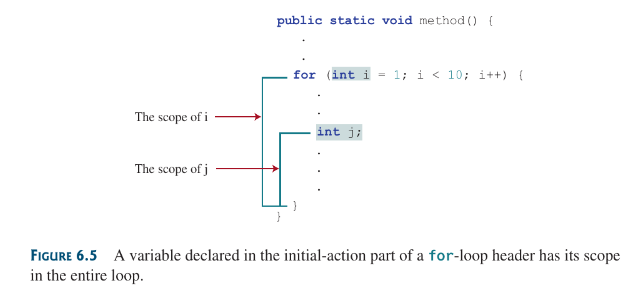

A method is a collection of statements grouped together to perform an operation.

## 6.2 Defining a method
a method definition consists of method name, parameters, return value type and body
syntax for basic method
```java
modifier returnType methodName(List of_parameters) {
	// method body
}
```


a method header specifiers the modifiers, return value type, method name and parameters of the method. methods my return a specific type value/data/object or return `void`.

a void returning method is called a `void method` otherwise its a `value-returning method`  variables defined in the method header are known as `formal parameters or parameters`. they are placeholders for the actual argument to be passed into to be used by the method.

the methods name and its parameter list together constitutes the `methods signature`. parameters are optional.

## 6.3 Calling a method
there are two ways to call a method, depending if the method returns a value or not. This subsection is obvious.

### Note:
* A value returning method can also be called as a statement (just like a void returning value is called), the caller (the function that evokes the method) simply ignores the return value. this is not often done but it is permissible if the caller is not interested in the return value.
* the main method in just like any other method except its called by the JVM to start the program

each time a method is invoked; java takes the parameters and variables of the method and places it in a activation record, this activation record is placed in the `call stack`, and if that method calls another method a new activation record with the called methods parameters and such is created and placed above its callers record in the stack, when the called method finishes execution, it returns to its caller and its record is removed form the stack.

## 6.4 void vs value returning methods
a return statement is not needed for a void method, but it can be used for terminating the method and returning to its caller.

## 6.5 Passing arguments by values
the arguments are passed by value to parameter when invoking a method. When calling a methods use need to provide arguments, which must be given in the same order as their respective parameters in the method signature. This is known as _parameter order association_.

### Note
* arguments must match the parameters in order, number and compatible type as defined in the method signature. compatible types mean you can pass an argument into a parameter without casting.
## 6.6 Modularizing code
Modularizing makes the code easy to maintain and debug and enables the code to be reused. Methods are helpful with this
## 6.7 Case Study: Converting hexadecimals to decimals
this is done via horner’s algorithmn; my implementation:
```java
import java.util.Scanner:

public class HexToDec {
	public static void main(String[] args) {
		System.out.println("input a valid hex: ")
		Scanner input = new Scanner(System.in);
		String hex = input.nextLine();
		System.out.printf("Hexadeciimal %s to Decimal is %s\n", hex, hexToDecimal(hex.toUpperCase) );
	}
	public static int hexToDecimal(String hex) {
		int decimal = 0;
		for (int i = 0; i < hex.length(); i++) {
			decimal = decimal * 16 + hexCharToDec(hex.charAt(i));
		}
		return decimal;
	}
	public static int hexCharToDec(char c) {
		if (c >= 'A' && c <= 'F')
			return 10 + (c - 'A');
		else
			return c - '0';
	}
}
```

## 6.8 Overloading Methods
overloading methods enable you to define the methods with the same name as their parameter list are different. 

Unlike in C++, overloading is somewhat easier, no extra mumbo-jumbo needed, just declare the function again with the same name but with the specified change in the parameter list, method body and possibly return type.

an example:
```java
imagaining this methods are in a class body,
its overload is done as thus:

public static int max(int a, int b) {
	return a > b ? a : b;
}

public static double max(double a, double b) {
	return a > b ? a : b; 
}

public static double max(double a, double b, double c) {
	return max( max(a, b), c );
}
```
### Note
* overloaded methods must have different parameter lists, you cannot overload methods based on different modifiers or return types
* sometimes there are two or more possible matches for the invocation of a method the compiler cannot determine the most specific match. This is referred to as ambiguous invocation. ambiguous invocations cause compiler errors.

## 6.9 The Scope of Variables
the scope of a variable is the part of the program in which the variable can be referenced.
* a variable defined inside a method is known as a local variable.
* parameters are actually local variables too, the scope of a methods parameter covers the entire method
* variable declared in the initial action of a for loop has a scope that covers the entire loop
* however a variable declared inside a for loop has its scope limited in the loop body form its declaration to the end of the block that contains the variable



## 6.11 Method Abstraction and Stepwise Refinement
the key of developing software is to apply the concept of abstraction. This section gives insight on how to apply divide and conquer strategy in developing software—don’t really need to document this.

