JavaFx is  an excellent pedagogical tool for learning OOP. Its excellent example of hoe the object oriented principles are applied.

## 14.2 JavaFx vs. Swing and AWT
Swing and AWT are replaced by the javaFX platform for developing rich GUI applications. 

## 14.3 The Basic Structure of a JavaFX program
the `javafx.application.Application` class defined the essential framework for writing javaFX programs. Every JavaFX program is defined in a class that extends `javafx.application.Application`, an example below:
```java
import javafx.application.Application;
import javafx.scene.Scene;
import javafx.scene.control.Button;
import javafx.stage.Stage;

public class myJavaFx extends Application {
	@Override
	public void start(Stage primaryStage) {
		Button btOK = new Button("OK");
		Scene scene = new Scene(btOK, 200, 250);
		primaryStage.setTitle("MyJavaFX");
		primaryStage.setScene(scene);
		primaryStage.show();
	}
	public static void main(String[] args) {
		Application.launch(args);
	}
}
```
### The `launch` method
The `launch` method is a static method defined in the `Application` class; it launches a standalone JavaFx application. The main method is not needed to launch a javaFx application from the *command line*, but it might be required in an IDE with limited JavaFx Support.

### The `start` method
it is overridden from the `javafx.application.Application` class. The `start` method normally places UI controls in a scene and displays the scene in a stage

The `Button` object is created and placed in the `Scene` object. A scene object is created via:
```java
new Scene(node, width, height);
```

### The `Stage` Object
A `Stage` object is a window. A `Stage` object called a `primary stage` is automatically created by the JVM when the application is launched. You can create additional stages if needed.

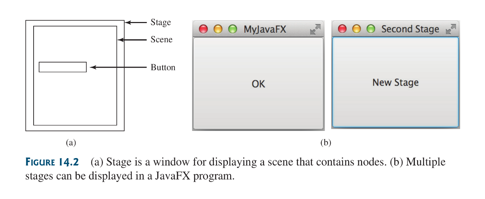

By default; a stage can be resized; to toggle this off: `stage.setResizable(false)`.

## 14.4 Panes, Groups, UI Control and Shapes—The `Node` subtypes
Panes, Groups, controls and Shapes are subtype of `Node`. Container classes can be used to contain nodes (like buttons) and modifying the contained nodes positions and size properties.

These container classes are **Panes**. nodes are places into panes and panes into scenes.

Things to note:
* A **node** is a visual component such as shape, and image-view, a UI control(Button), a group, or a pane.
* A **Shape** refers to a text, line, circle, ellipse, rectangle, arc, polygon, polyline, and so on
* A **UI control** refers to a button, checkbox, radio button, text field, text area, and so on.
* A **Group** is a container that groups a collection of nodes: Transformations or effects can be applied to a group, which automatically applies to all children of the group.
* A **Scene** can be displayed on a stage
* A Scene can contain a *control*, *pane* or *group* but not a *shape* or *image-view*
* Every subclass of the `Node` class has a no-arg constructor for creating a default node.

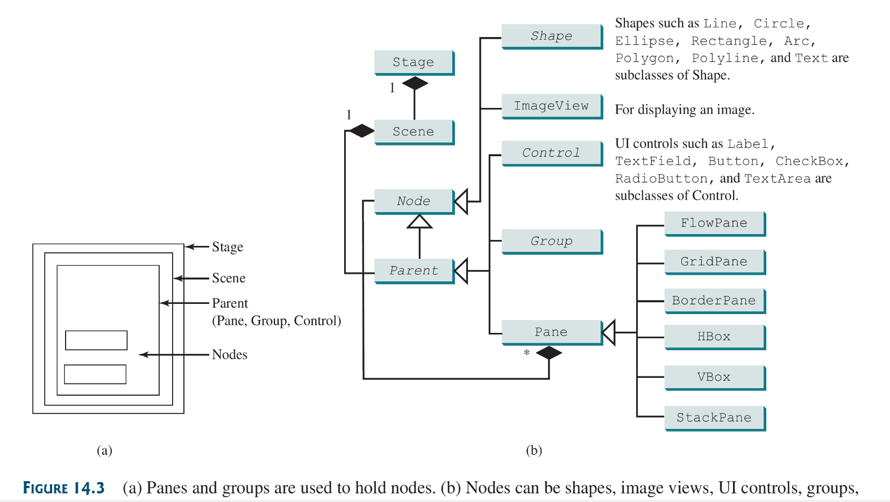

## Listing 14.3 ButtonInPane: explains The `StackPane`
its implementation is  [here](source-files/Chapter-14/ButtonInPane.java).

Things to Note:
* `StackPane.getChildren()` returns an instance of `javafx.collections.ObservableList`, `ObservableList` behaves very much like an `ArrayList`. invoking `add` to this object adds a node or element to the `Pane`.
* `StackPane` places its node in the center of the pane on-top each other.
* `StackPane` respects the nodes preferred size.
* Pane and group both have no-arg constructors and also contructors that add one or more childrenn to the pane or group.
```java
StackPane pane = new StackPane( new Button("CLICK") );
```

## Listing 14.4 ShowCircle : explains `scene.shapes.Circle` and `scene.paint.Color` 
Its implementation is [here](source-files/Chapter-14/ShowCircle.java).

Things to Note:
* The measurement units for graphics in Java are all *pixels*
* `Circle.setStroke()` and `Circle.setFill()` do what thy sound like they do. This methods take in `scene.paint.Color` as argument.
* The java co-ordinate system is used for any Cartesian description:
 
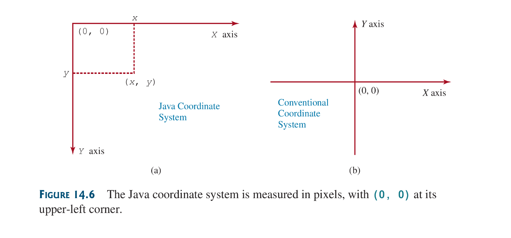

* The `Circle` object, upon the windows first inception, is positioned at the center of the plane, but after resizing the window the circle no longer remains at the center, this is because, to achieve centralization, the circle midpoints must be updated to whatever the altered window’s current center is at any given point in time. This can be achieved via **Property Binding**

## 14.5  Property Binding
You can bind a target object to a source object, A change in the source object will be automatically reflected in the target object. Property binding can be achieved in the [Circle](source-files/Chapter-14/ShowCircle.java) as so:
```java
import a.helluv.shit ;

public class ShowCicleCentered extends Application {
	@Override
	public void start(Stage primaryStage) {
		Pane pane = new Pane();
		
		Circle circle = new Circle();
		circle.centerXProperty().bind(pane.widthProperty().divide(2));
		circle.centerYProperty().bind(pane.heightProperty().divide(2));
		// other initializations and declarations
	}
}
```
the full implementation can be found [here](). A binding property is simply and object that can be bound to a source object, just like the `circle.centerXProperty` and `pane.widthProperty`. Binding, regardless of the property, is bound as so:
```java
target.bind(source);
```

Things to Note:
* The `bind` method is defined in `javafx.beans.property.Property` interface. Object implementing this interface can bind.
* an Observable source object is an instance of the `javafx.beans.value.ObservableValue`. An Observable value is an entity that wraps a value and allows said value to be observed as it changes (if it changes). I feel that objects of this interface can be bounded .

A binding property is an object javaFX defines binding properties for primitive types and string:
* ==Note: for clarity in first glance reading and understanding; any occurrence of `_` in a class name, method or whatever is completely superficial with the intent of clarity in reading. In actual implementations; whatever `Identifier` in use of this clarity tool, said clarity tool, `_`, is not present in the `Identifier`: in summary its just a arbitrary convention designed by me to make future referencing easier.==

* for a `primitiveType_` value, its binding property is of type said `primitiveType_Property`and example: `FloatProperty`, `IntProperty`, `DoubleProperty`
* For string values, its binding property type is `StringProperty`
* These properties are also subtypes of `ObservableValue` therefore they can be used as both source and target in a binding.
* By convention a binding property has a setter, getter and getter method for returning the property itself and example is `Circle`’s `CenterX` binding property; its getter: `getCenterX()`, its setter: `setCenterX()`, its property getter: `centerXProperty()`
* The naming convention of *property getter method* is the name of the property concatenated with `Property`. 
* The property getter method returns a property (actual) object. The `centerXProperty` will return `centerX` of type`DoubleProperty`.
* Numeric binding property classes such as `DoubleProperty` and `IntegerProperty` contain the `add`, `subtract`, `multiply` and `divide` methods for performing computations with that value in the binding property and returning a new observable property.

```java
DoubleProperty centerX = circle.centerXProperty();
DoubleProperty width = pane.widthProperty();
centerX.bind(width.divide(2));
```

* `PrimitiveType_Property` classes are abstract classes, Their concrete subclasses are `Simple_PrimitiveType_Property` for example: `SimpleDoubleProperty`, they are used to create instances of this properties.

### Uni-directional binding and Bi-directional binding
The binding demonstrated in previous examples are all unidirectional; where the binding and modification is one way, usually on the part of the target (the modification that is).

in Bidirectional binding both parties in play listen for changes in each other and update each other according; changes in party one causes changes in party 2 and vice versa. Unlike in uni - where changes in a party B affects party A, but changes in party A remains both oblivious and un-altering to party B.

## 14.6 Common Properties and Methods for Nodes
The `Node` class defined many properties and methods that are common to all nodes. The `style` and `rotate` properties will be discussed here.

JavaFx style properties are similar to CSS used to specify styles in HTML in a web-page. For that reason style properties in JavaFx are called *JavaFX CSS*
### Java CSS and `style` property
Things to note about *Java CSS*:
* in javaFX, a style property is defined with a prefix `-fx-`
* Each node has its own style properties
* Syntax for setting a style is `StyleName:value`
* Multiple styles properties for a node can be set together separated by a semicolon. An example;
```java
circle.setStyle("-fx-stroke: black; -fx-fill: red;");
```
the above statement is equivalent to:
```java
circle.setStroke(Color.BLACK);
circle.setFill(Color.RED);
```
if an incorrect Java CSS is used, the program will compile and run but the styling will be ignored.

### The `rotate` property
its rotates a node by the specified degree. +degree value for clockwise; -degree value for anti-clockwise.
```java
circle.setRotate(20);
```

### Listing 14.7 NodeStyleRotateDemo uses `rotate` and `style` properties
Its implementation is [here](source-files/Chapter-14/NodeStyle.java).

The `Node` class contains useful functions like:
* `contains(double x, double y)`: tests if point(x, y) is inside boundary of node
* `setScaleX(double scale)` and `setScaleY(double scale)`: these methods scale a node.

## 14.7 The `Color` Class
The color class can be used to create colors. The `Colors` class is immutable. The `javafx.scene.paint.Color` is a concrete subclass of `Paint`.

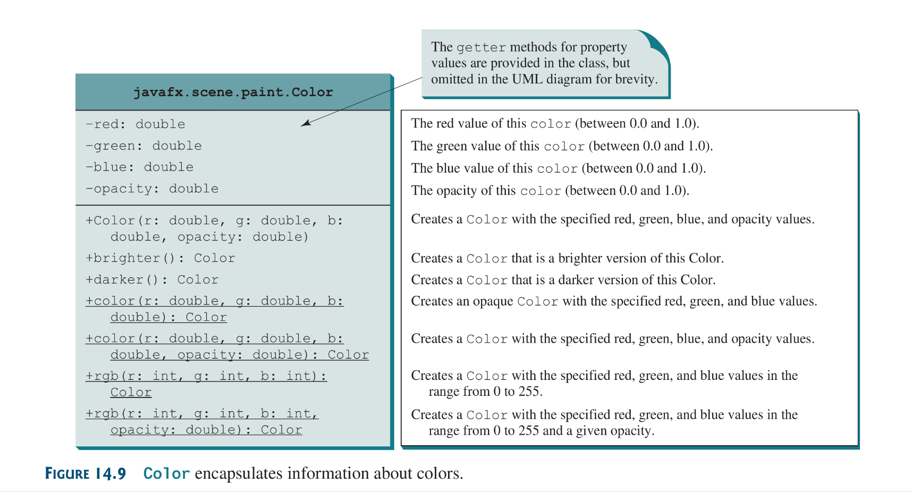

The `Color` class also has a set of already defined standard color constants, e.g `BlACK`, `BEIGE`, `SILVER`, `RED`, etc.

## 14.8 The `Font` Class
A `Font` describes a font name, weight and size. It class path: `javafx.scene.text.Font`. The `Font` object is immutable.

Things to note:
* `Font.getFontNames()`, a static method; returns available fonts as a `List<String>.
* `List` is an interface that defined common methods for lists. `ArrayList` implements it.

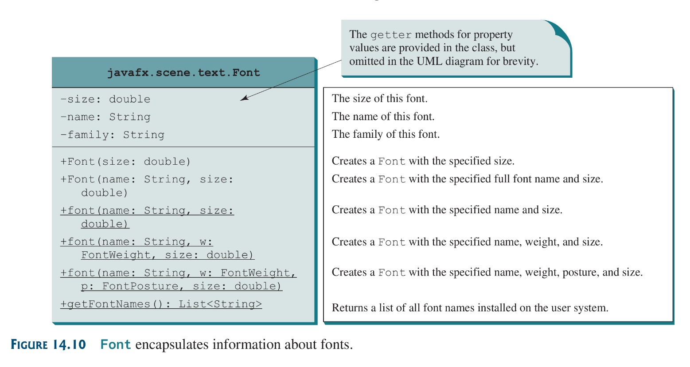

```java
Font font1 = new Font("SansSerif", 16);
Font font2 = Font.font("Times New Roman", FontWeight.BOLD,
	FontPosture.ITALIC, 12);
```

[Here](source-files/Chapter-14/FontDemo.java) is an implementation using font

Things to note:
* `StackPane` places all its nodes in the center and the nodes are places on top of each other; it even does this the window is being resized.
* multiple nodes can be added to a pane via:
```java
pane.getChildren().addAll(node1, node2);
```

## 14.9 The `Image` and `ImageView` Classes
The `Image` class represents a graphical image, and the `ImageView` class is used to display the image.

`Image` path: `javafx.scene.image.Image`
`ImageView` path: `javafx.scene.image.ImageView`

`Image` can be used to either represent a local image in the java directory by specifying its path, or an image on the web by specifying its URL.
```java
Image image1 = new Image("image/us.gif")
Image image2 = new Image("https://site.org/static/image.png");
ImageView imageView = new ImageView(image1);
imageView.setImage(image2);
```

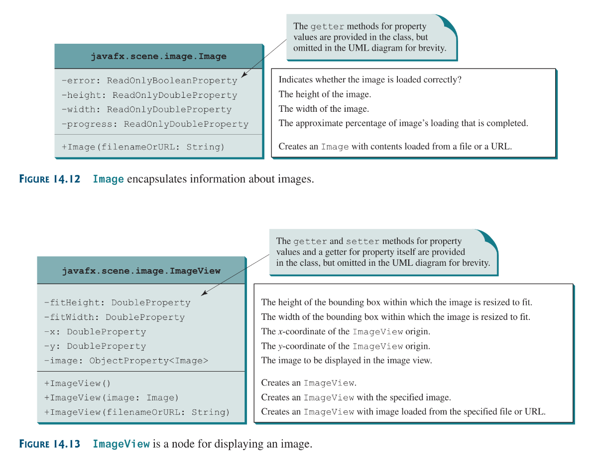

[Here](source-files/Chapter-14/ShowImage.java) is an implementation of `Image` and `ImageView`.

Things to note:
* `Hbox` is a pan that places all nodes horizontally in one row.
* the `setRotate` method is defined in the `Node` class and can used for any node.
* An `Image` can be shared by multiple nodes
* However a node such as `ImageView` cannot be shared. It cannot be placed multiple times into a pane or scene
* ==Image file must be placed in the same directory as the class file.==

## 14.10 Layout Panes and Groups
JavaFX provides many types of panes for automatically laying out nodes in a desired location and size.

Panes are groups are containers for holding nodes. The `Group` class is often used to group nodes and perform transformation and scale as a group.

Something to Note:
* Panes and UI control objects are re-sizable, but group, shape and text objects are not re-sizable
* `Pane` is the base class for all specialized panes

### Panes for containing and organizing Nodes

| Class        | Description                                                                                  |
| ------------ | -------------------------------------------------------------------------------------------- |
| `Pane`       | Base class for layout panes, It contains the `getChildren()` for returning nodes in the pane |
| `StackPane`  | Places nodes on top of each other in center                                                  |
| `FlowPane`   | Places nodes row by row (horizontally) or column by column (vertically)                      |
| `GridPane`   | Places the nodes in a 2 dimensional grid                                                     |
| `BorderPane` | Places nodes in top, right, bottom, left and center regions                                  |
| `HBox`       | Places nodes in a single row                                                                 |
| `VBox`       | Places nodes in a single column                                                              |
### 14.10.1 `FlowPane`
`FlowPane` arranges the nodes in a pane either horizontally (left to right) or vertically (top to bottom)

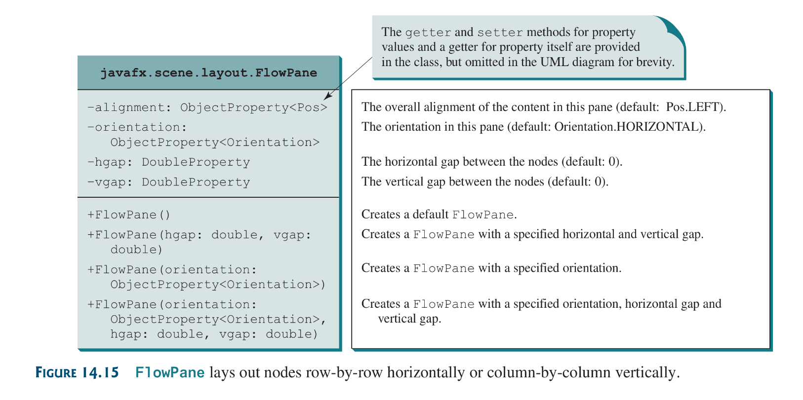

Things to note:
* Orientation can be specifies via the constants: `Orientation.HORIZONTAL`  or `Orientation.VERTICAL`

An implementation can be found [here](source-files/Chapter-14/ShowFlowPane.java)

### 14.10.2 `GridPane`
A `GridPane` arranges nodes in a grid (matrix) formation. The nodes are places in the specified column and row indices.

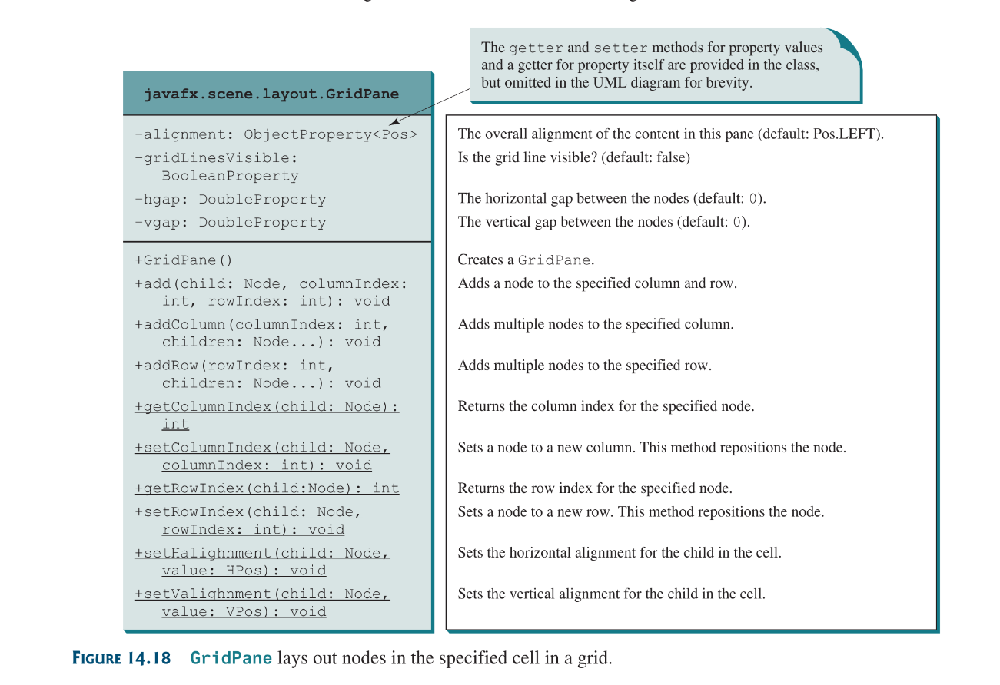

An Implementation can be found [here](source-files/Chapter-14/ShowGridPane.java)

### 14.10.3 `BorderPane`
A `BorderPane` can place nodes in five regions: Top, Bottom, Left, Right and Center.
using `set_Position(node)` where `_Position` are the regions stated earlier. e.g `setTop(node)`.

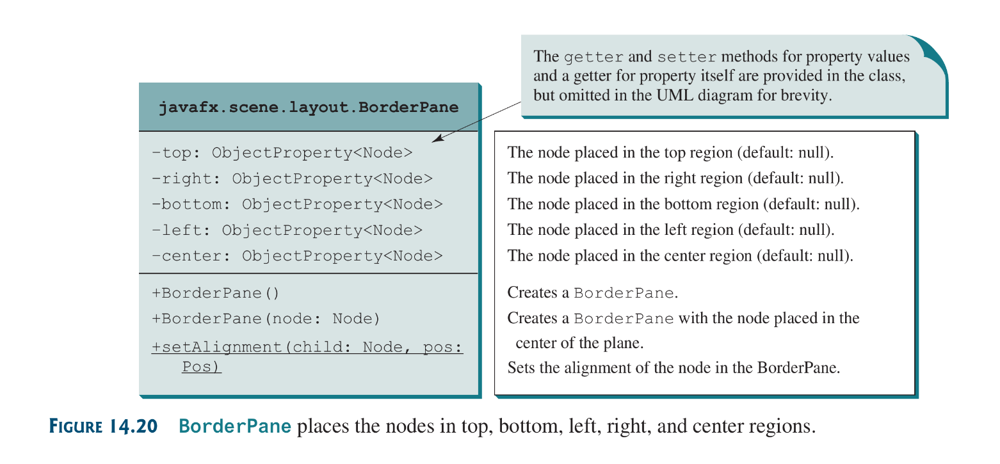

Here is an [implementation](source-files/Chapter-14/ShowBorderPane.java)

## 14.10.4 `HBox` and `VBox`
An `HBox` lays out its children in a single horizontal row. A `VBox` lays out its children in a single vertical column.

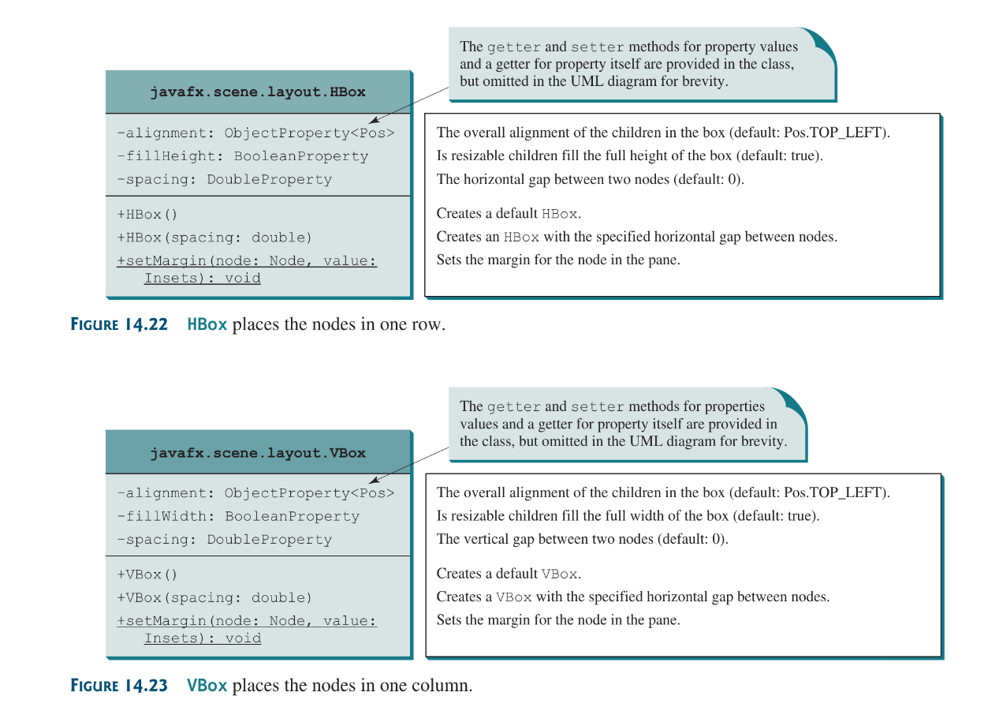

Its implementation: [here](source-files/Chapter-14/ShowHBoxVBox.java)

## 14.11 Shapes
JavaFX provides many shape classes for drawing texts, lines, circle, rectangles, ellipses, arcs, polygons and poly-lines.

### 14.11.2 `Line`
A line connects two points with four parameters: `startX`, `startY`, `endX` and `endY`

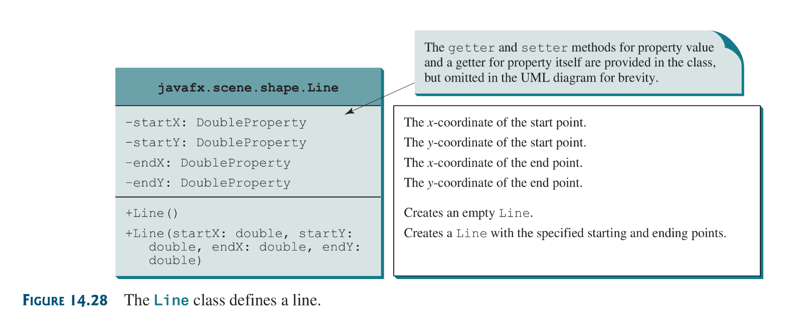

an implementation can be found [here](source-files/Chapter-14/ShowLine.java)

### 14.11.3 `Rectangle`
A rectangle is defined is defined by the parameters `x`, `y`, `width`, `height`, `arcWidth` and `arcHeight`.

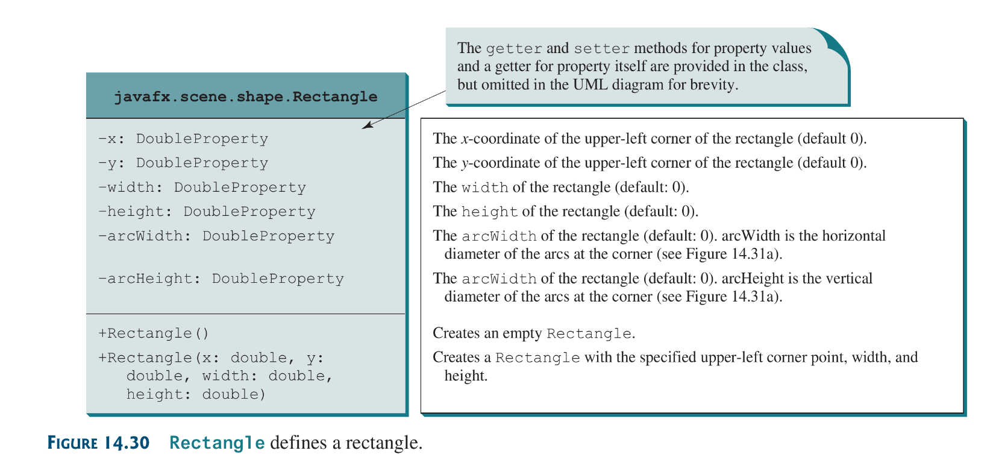

An implementation can be found [here](source-files/Chapter-14/ShowRect.java)

An advantage of `Group` is that you can apply transformations to a set of nodes
```java
group.setScale(2);
group.setScale(2);
```

### 14.11.4 `Circle` and `Ellipse`

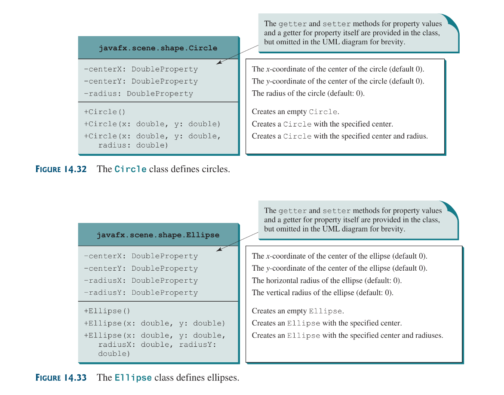

Listing 14.17 [implementation](source-files/Chapter-14/ShowEllipse.java)

### 14.11.6—7 `Arc` , `Polygon` and `Polyline` 
read the book man, i’m tired.

## 14.12 Case Study: The `ClockPane` Class
This study develops a class that displays a clock on a pane. Here is my own implementation: [file](source-files/Chapter-14/ClockPane./ClockPane.java)
i
