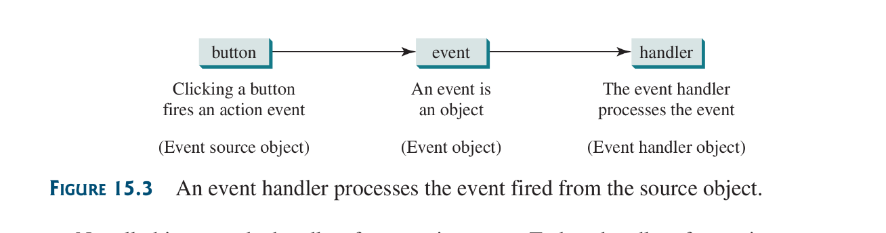
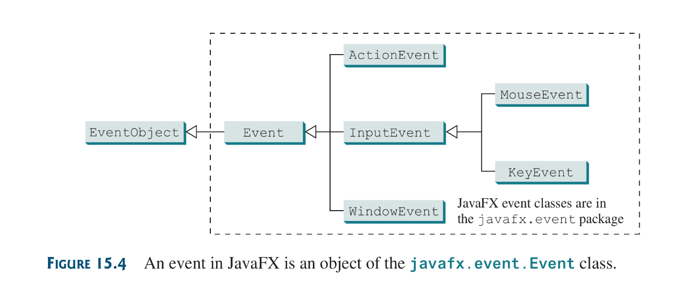
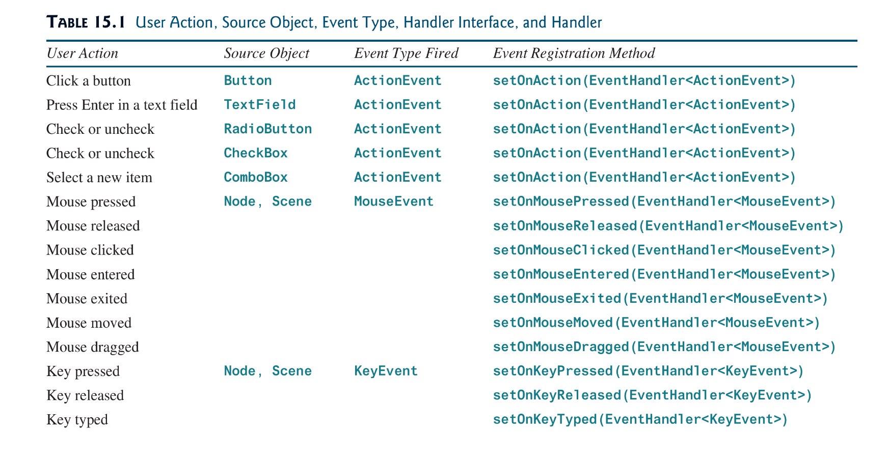
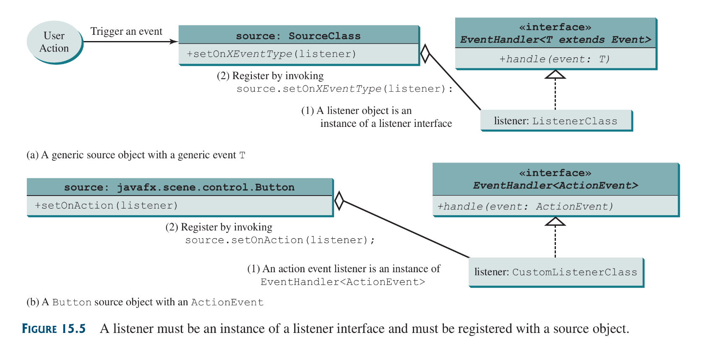
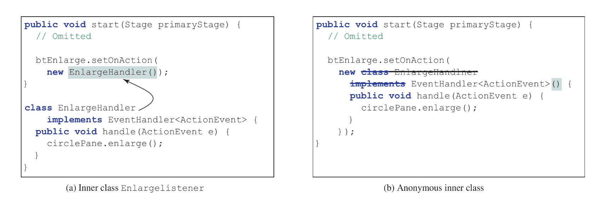
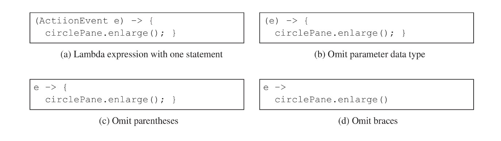

## 15.1 Introduction
You can write code to process events. such as button click, mouse movement and keystrokes. This is *event driven programming*

When a button it fires an *action event*, An object to handle the action is an *event handler*. The button in which the event originates from is called a *event source object*.



Not all objects can be handlers for an action event. To be a handler of an action event, two requirements must be met:
1) The object must be an instance of the `EventHandler<T extends Event>` interface.
```java
EventHandler<T extends Event>
```
2) `EventHandler` object must be registered with the event source object (so it can listen for events) using
```java
source.setOnAction(handler);
```

The `EventHandler<ActionEvent>` interface contains the `handle(ActionEvent)` method from processing action events. Your handler must override this method.

Listing 15.1 implementation; [here](source-files/Chapter-15/HandleEvent.java).

## 15.2 Events and Event Sources
an event is an object created from an event source. Firing an event means to create an event and delegate the handler to handle the event.

An event is an instance of the event class. The root class of the Java event classes is `java.util.EventObject`. The root class  of the JavaFx event class is `javafx.event.Event`.

 

You can identify the source object of an event using the `getSource()` instance methods in the `EventObject` class.
The subclasses of `EventObject` deal with specific types of events, such as window events, mouse events and key events.

If a component can fire an event any subclass of that event can fire the same event.



## 15.3 Registering Handler and Handling Events
A handler is an a object that must be registered with an event source object and its must be an instance of an appropriate event-handling interface.

Java uses a delegation based model for event handling: an object fires an event and the object interested in the event handles it.

For an object to be the handler of an event of a source object; 2 things are required:
1) The handler must be an instance of the corresponding event-handler interface.
2) The handler object must be registered by the source object.

for example; since the `Button` fires an `ActionEvent` its handler must be of type `EventHandler<ActionEvent>` so it can handle the action using its instance method `void handle(ActionEvent e)`



The event object contains information pertinent to the event.

An Implementation [here](source-files/Chapter-15/ControlCircle.java)

## 15.4 Inner Classes
an Inner class, or nested class,  is a class defined within the scope of another class. Inner classes are useful fro defining handler classes.

An inner class may be used just like a regular class. Normally its defined only for the use of the outer class.

An inner class has the following features:
1) An inner class is compiled into a class named `OuterClassName$InnerClassName.class`
2) An inner class can reference the data and methods defined in the outer class in which it nests, so there is **no need** of passing objects by reference to the inner class via its constructor for access.
3) An inner class can be defined with a visibility modifier subject to the same visibility rules applied to a member of the class.
4) An inner class can be defined as `static`. A `static` inner class can be accessed using the outer class name
5) A `static` inner class cannot access non-static members of the outer class.
6) Objects of an inner class are usually created in the outer class. However, its possible to create an instance of an inner class from another class.
7) ==To create and instance of a ***non static*** inner class. ***An instance of the outer class needs to created first*** then the inner class is created via this syntax:==
```java
OuterClass.InnerClass innerObject = outerObject.new InnerClass();
```
8) ==If the inner class is static, an instance can be created as so:==
```java
OuterClass.InnerClass innerObject = new OuterClass.InnerClass()
```

When Inner class should be used:
* To combine dependent classes into a primary class, This reduces the number of source files. An makes them easier to organize due to their naming convention `OuterClass_$InnerClass_.class`
* Another practical use is avoiding class-naming conflicts
* A handler class is designed specifically to create a handler object for a GUI component (e.g a button). The handler class will not be shared by other applications and therefore appropriate to be defined inside the main class as an inner class.

## 15.5 Anonymous Inner-Class Handlers
An anonymous inner class is an inner class without a name. It combines defining an inner class and creating an instance of the class into one step.



The syntax for an anonymous inner class is:
```java
new SuperClassName/InterfaceName() {
	// implement, override methods in superclass or interface
	
	// Other methods if necassary
}
```

Since an anonymous inner class is a special kind of inner class, it is treated like an inner class with the following features:
* An anonymous inner class ***must always*** extend a superclass or implement an interface, but it cannot have an explicit `extends` or `implements` clause.
* An anonymous inner class must implement all the abstract methods in the superclass or in the interface.
* An anonymous inner class always uses the no-org constructor from its superclass to create an instance. If an anon inner class implements an interface, its constructor is `Object()`
* An anonymous inner class is compiled into a class named `OuterClassName$n.class` where `n` is order number, starting from 1, of the anonymous classes created in the Outer class.

## Listing 15.4
Implementation [here](source-files/Chapter-15/AnonymousHandler.java). A benefit of an anonymous inner class is that they can access local variables

## 15.6 Lambda Expressions
lambda expressions can be used to greatly simplify coding for event handling.

lambda expressions creates anonymous instances of *SAM* interfaces: *Single Abstract Method* Interface. *SAM* interfaces are interfaces with a single method in their definition which must be abstract.

How lambda expressions works is that :
1) it is invoked as an argument to a method and from said method, it can infer what type class is to be instantiated due to the type of object the invoking methods requires as an argument
2) Once the class type has been inferred the lambda checks if said interface is a *Single Abstract Method* interface, if its not—compiler errors out
3) Now that the class type has been inferred and it has located the only method in it, it relies on provided parameter list of the single abstract method, and uses the declared statement(s) in the lambda-expressions *body*, to instantiate an anonymous inner class with an overridden single abstract method. In which the definition of the overridden single abstract method is gotten from the statements previously declared in the lambda-expressions statement-body.
4) in the lambda-expression the *Single Abstract Method* parameters are also declared, so they can be referenced in the lambda-expression body which is also the body of the to-be overridden *Single Abstract Method*
5) The data type in the lambda-expression body may be explicitly declared or implicitly inferred by the compiler

Lambda expressions can be viewed as an anonymous class with a concise syntax. For the compiler to understand lambda expressions, the interface must contain exactly one abstract method (*Single Abstract Method interface*).

Syntax rules for lambda:
A lambda expression comprises of 3 syntax elements
1) the parameter list
2) The, what i like to call, lambda operator: `->`
3) lambda-expressions body. Which could be either:
	1) an `expression` 
	2) or a group of blocked `statements`

Basic lambda syntax:
```java
(type1 param1, type2 param2, ..., typeK paramK) -> statement
// no semicolon after statement
```
or
```java
(type1 param1, type2 param2, ..., typeK paramK) -> { statements; }
```

4) The data type may be explicitly declared or implicitly inferred by the compiler
5) parentheses can be omitted if there is only one parameter without explicit data type
6) curly braces can be omitted if there is only ones statement in the lambda-expression body



*SAM* interfaces are also known as *functional interfaces*, their instances are also known as a  *functional object*. Since lambdas are squarely on defining a function, a lambda expression is also called a *lambda function*

Other things to note about lambdas:
1)  lambdas do not create inner anonymous classes, or classes even.
2) The compiler treats lambda expressions **as if it is** an object created from an anonymous inner class
3) lambdas created instances of already existing interfaces types with modified characteristics

[Listing 15.5](source-files/Chapter-15/LambdaHandler.java) and [Listing 15.6](source-files/Chapter-15/TestLambda.java)
Things i noticed:
1) the annotation: `@FunctionalInterface` tells the compiler that the interface is a functional interface /*SAM* interface
2) when using an expression in lambda-expressions body, the compiler can automatically infer if that expression is to be returned or just computed depending on the Interfaces method definition. So, i feel, in some cases there is no need to add the `return` keyword; since the compiler can infer when to return by itself.
3) i will stick to placing body declarations and return expressions in brackets in a lambdas-expression body but if i’m sure the interfaces method is not returning anything and i have a single expression i will not place it into a bracket. So as not to confuse myself

## 15.7 Case Study: Loan Calculator
[File](source-files/Chapter-15/LoanCalculator.java)
## 15.8 and 15.9 Mouse Events and KeyEvents
Consult the book. I’m tired
## 15.10 Listeners for Observable Objects
