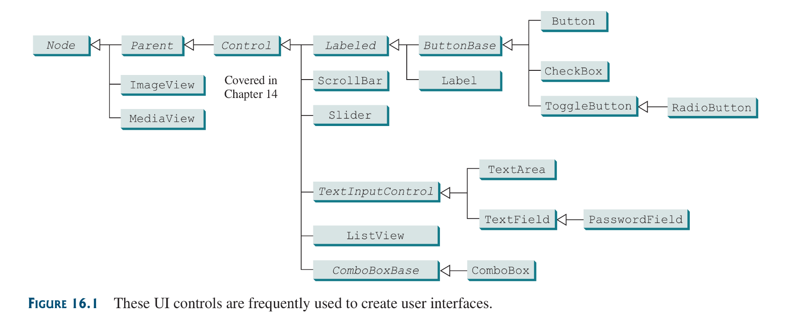
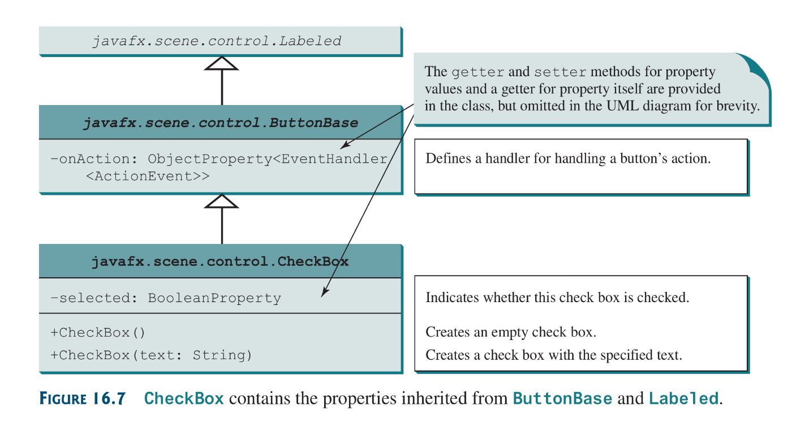

JavaFX provides many UI controls for developing a comprehensive user interface.

This chapter explore other UI controls that aren’t the generic ones discussed about in previous chapters.



## 16.2 Labelled and Label
A `Label` is a display area for a short text, a node, or both. It it’s often used to label other controls (usually text-fields).

A Label and buttons share many common properties. These common properties are defined in the `Labeled` class.

```java
import javafx.application.Application;
import javafx.stage.Stage;
import javafx.scene.Scene;
import javafx.scene.control.Label;
import javafx.scene.layout.StackPane;
import javafx.scene.layout.HBox;
import javafx.scene.shape.Ellipse;
import javafx.scene.paint.Color;
import javafx.scene.image.Image;
import javafx.scene.image.ImageView;
import javafx.scene.control.ContentDisplay;

public class LabelWithGraphic extends Application {
	
	@Override
	public void start(Stage primaryStage) {
		
		Image img = new Image("imgs/lady.png");
			
		Label label = new Label("Ophelia", new ImageView(img));
		label.setStyle("-fx-border-color: green; -fx-border-width: 2");
		label.setContentDisplay(ContentDisplay.BOTTOM);
		label.setTextFill(Color.RED);
		
		Ellipse ellipse = new Ellipse(50, 50, 50, 25);
		StackPane stackPane = new StackPane(ellipse, 
			new Label("ellipse"));
		Label label2 = new Label("A pane inside a label", stackPane);
		label2.setContentDisplay(ContentDisplay.BOTTOM);
		
		HBox box = new HBox(20);
		box.getChildren().addAll(label, label2);
		
		Scene scene = new Scene(box);
		primaryStage.setTitle("Labels with graphic nodes");
		primaryStage.setScene(scene);
		primaryStage.show();
	}
}
```

## 16.4 `CheckBox`
A `CheckBox` is used for the user to make a selection. It provides the `selected` property to indicate whether a check box is selected. It also inherits properties such as `onAction, text, graphic, alignment, graphicTextGap, textFill and contentDisplay` From `ButtonBase` and `Labeled`.



## 16.7 `TextArea`
A `TextArea` enables the user to enter multiple lines of text. If you want the UML refer to the book. [File](source-files/Chapter-16/DescriptionPane.java)

## 16.8 `ComboBox`
A combo box, also known as a choice list or drop-down list, contains a list of items from which the user can choose. Combo box is a generic class that specifies what type of object the box should hold as a list, similar to `ArrayList`.

File with its usage: [here](source-files/Chapter-16/ComboBoxDemo.java)

## 16.9 `ListView`
A `ListView` is a control that basically performs the same function as a combo box, but it enables the user to choose a single value or multiple values.

File with its usage: [here](source-files/Chapter-16/ListViewDemo.java)

## 16.10-16.11 `ScrollBar` and  `Slider`
`ScrollBar` is a control that enables the user to select form a range of values. Check the text for the rest.
File for used to implements scrollbar: [file](source-files/Chapter-16/ScrollBarDemo.java)

`Slider` follows  the same principle as scrollbar just more fancier. if you want to understand it more check its UML in the text or search for its contract online.

## 16.2 Case Study: Developing a Tic-Tac-Toe Game
This section develops a program for playing tic-tic-toe game.

My implementation: [file](source-files/Chapter-16/TicTacToe.java)

This Blasted chapter is done.
