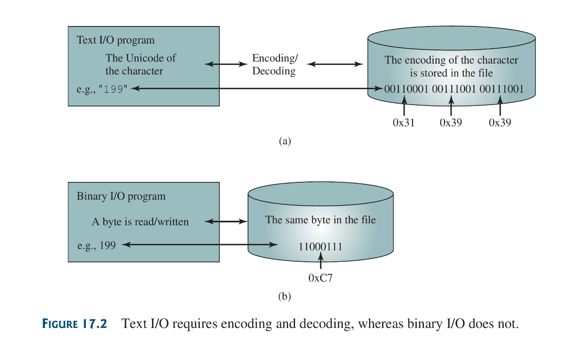
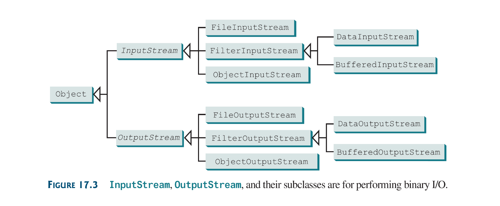
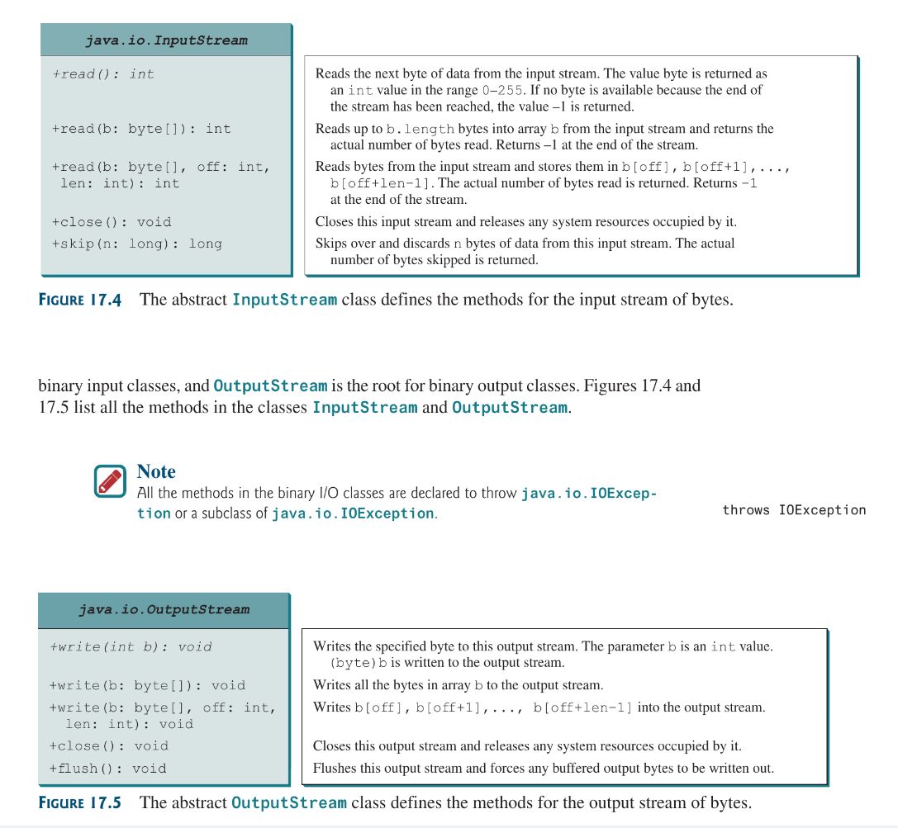
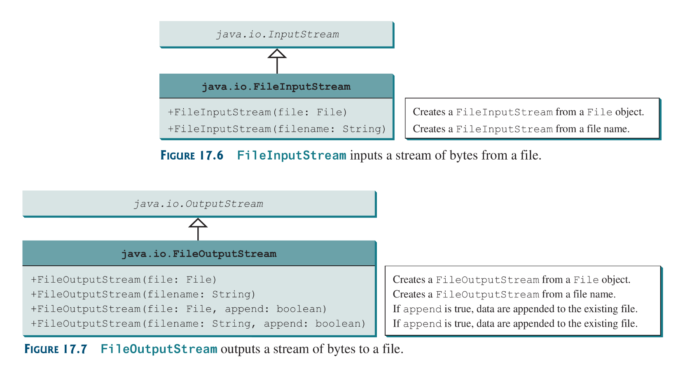
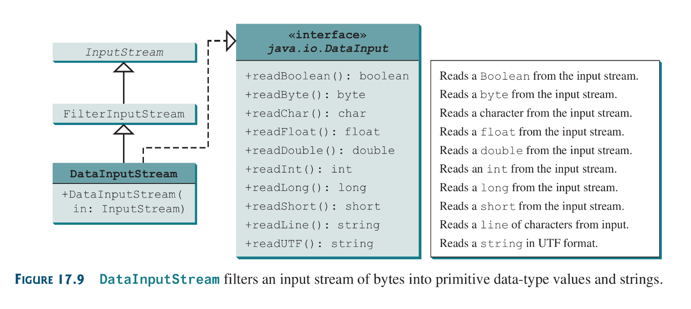
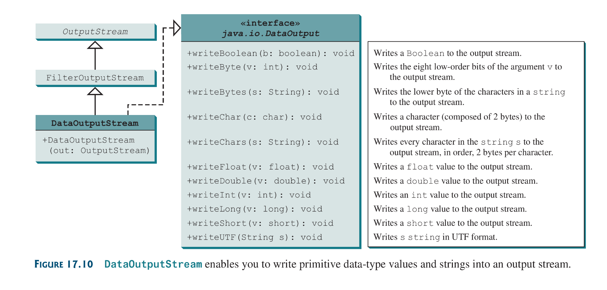
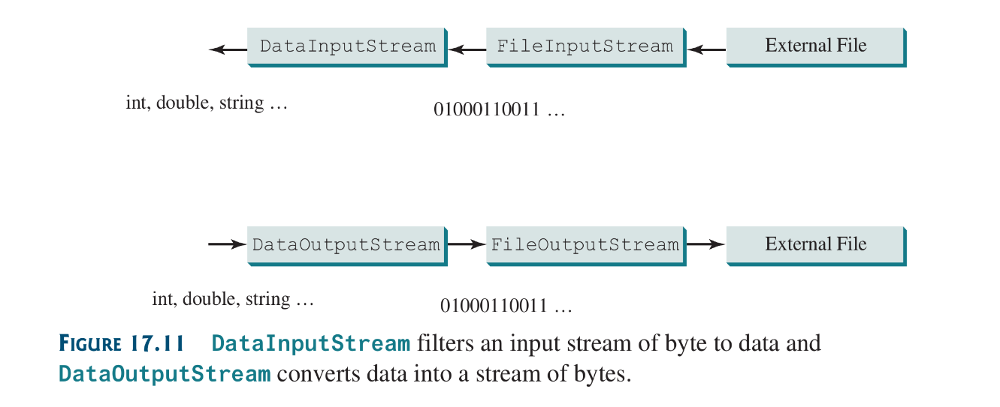
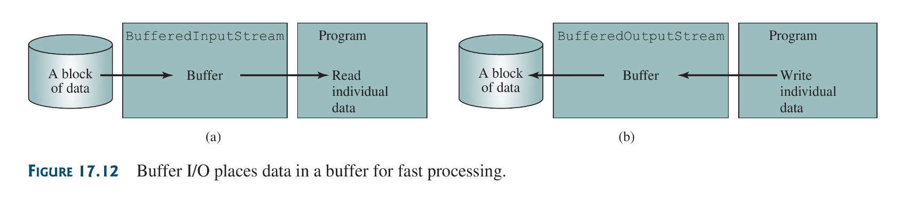
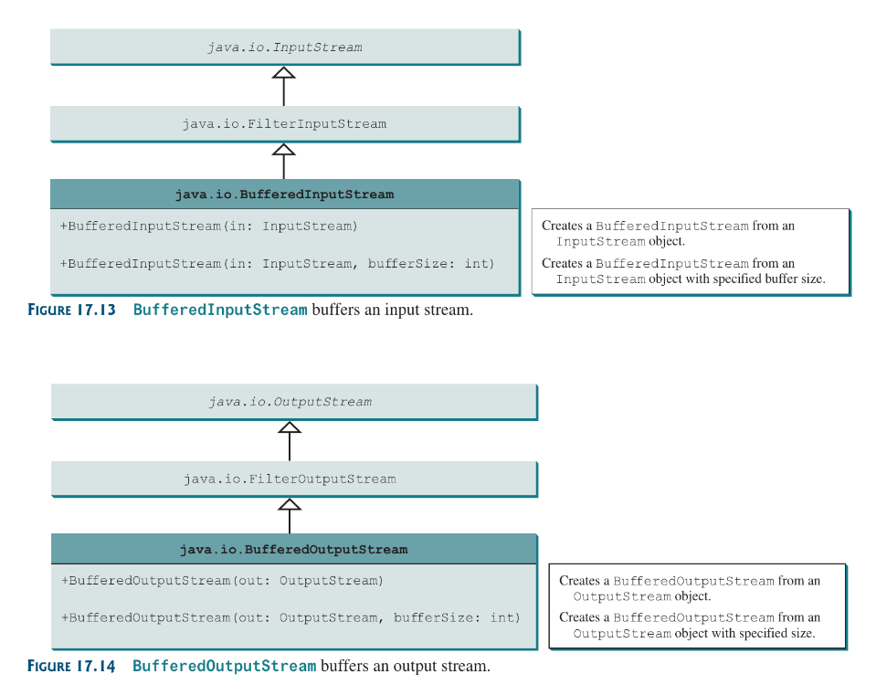
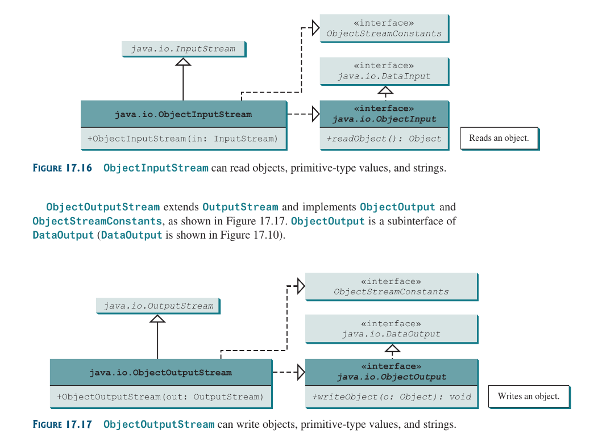

## 17.1 Introduction
Java provides many classes for performing text I/O and binary I/O. Binary files are efficient to process than text files, thats an advantage they have.

## 17.2 How is Text I/O handled in Java?
Text data are read using the `Scanner` class and written using the `PrintWriter` class.

An *input class* contains methods to read data, and an *output class* contains methods to write data. The *Input Object* reads a stream of data form a file and an *Output Object* writes a stream of data to a file.
## 17.3 Text I/O vs Binary I/O
Binary I/O does not involve encoding or decoding and thus is more efficient than text I/O. Text I/O on the other hands is created due to layer of abstraction composed of binary instructions to encode and decode characters or data so they can be written or read to or from their target. Binary I/O does not posses this tether.



Binary I/O does no posses the need for encoding and decoding, therefore does not require conversions. If you write a numeric value to a file using binary I/O the exact value in the memory is copied into the file.

## 17.4 Binary I/O Classes
The abstract `InputStream` is the root class for reading binary data, and the abstract `OutputStream` is the root class for writing binary data.





### 17.4.1 `FileInputStream/FileOutputStream`
they are used for reading/writing files from/to files. All the methods in these classes are inherited from `InputStream` and `OutputStream`, `FileInputStream`/`FileOutputStream`s do not introduce new methods. 

While constructing a `FileOutputStream`, if the file being demanded by the constructor does not exist, the class creates one (a file that is). If the file already exists the first two constructors will delete the content of the file. To retain the current contents of the file and just append new data into the file, use the last two constructors passing `true` to the append parameter.



Things to Note:
1) Almost all the methods in the I/O classes throw `java.io.IOException`, so its users should either declare that they might throw such exception (if in a method) or use a try-catch block 
2) The `FileInputStream` method `read()` returns -1 if the content of the file has been read completely and nothings left. 

### Listing 17.1 `TestFileStream.java`
```java
import java.io.*;

public class TestFileStream {
	public static void main(String[] args) throws IOException {
		try (FileOutputStream output = new FileOutputStream("file.dat")) {
			for (int i = 1; i != 11; ++i)
				output.write(i);
		}
		try (FileInputStream input = new FileInputStream("file.dat")) {
			int value;
			while ((value = input.read()) != -1)
				System.out.print(value + " ");
			System.out.println();
		}
	}
}
```

Things to Note:
1) This program uses try-with-resources and create input and output streams so they will be automatically closed after they are used.
2) Remember: only objects that implement from the `AutoClosable` interface can uses the try-with-resources block; because they possess the `close()` method, that closes are resource.
3) Not closing a stream can cause corruption.
4) An instance of `FileInputStream` can be used as an argument to construct a `Scanner` Object
5) Likewise, an instance of a `FileOutputStream` can be used as an argument to construct a `PrintWriter` Object.
6) I noticed that `FileOutputStream and Input` only `read()` and `write()` integers of byte sizes, i mean, to use c++ terms, an unsigned int of size 8 bits:`uint_8`. So any read and write with an integer value above the maximum value a byte can hold (0-255), *Bound Wrapping* will occur.
```java
new PrintWriter(new FileOutputStream("file.dat", true));
```

### 17.4.2 `FilterInputStream`/`FilterOutputStream` (FilterStreams)
*Filter streams* are streams that filter bytes for some purpose. The basic byte input stream provides a `read` method that can be used only for reading bytes. If ones wants to read/write types that are not bytes, one needs a *filter stream* class to wrap the byte input stream. using a filter class enables use to read integers, doubles and strings instead of bytes and characters.

When we need to process primitive numeric types, we use `DataInputStream` and `DataOutputStream` to filter bytes.

### 17.4.3 `DataInputStream`/`DataOutputStream` extends FilterStreams
`DataInputStream` reads bytes from the stream and converts them into appropriate primitive-type values or strings, And the same logic applies for `DataOutputStream` but in reverse. These classes extends `FilterInputStream() / FilterOutputStream` and implements the `DataInput / DataOutput` interfaces



primitive values are copied from memory to the output without any conversions.

### Characters and Strings in Binary IO
A Unicode characters consists of 2 bytes.
Things to note: 
1) `writeChar(char c)`:  writes **a** unicode character to output
2) `writeChars(String s)`: methods writes the unicode for each character in the string s to the output.
3) `writeBytes(String s)`: writes lower byte of the unicode for each character in the string s to the output. The high byte of the unicode is discarded, this  method is more suitable for strings that consists of ASCII characters since Ascii characters are store in the lower byte of a unicode.
4) if there are no ascii characters the `writeChars()` should  be used.
5) `writeUTF(String s)`: writes a string using UTF encoding
 


## creating `DataInputStream/DataOutputStream`
Below are their constructors:
```java
public DataInputStream(InputStream instream);
public DataOutputStream(OutputStream outstream)
```

a test
```java
import java.io.*;

public class TestDataStream {
	public static void main(String[] args) throws IOException {
		try(DataOutputStream writer = new DataOutputStream(
			new FileOutputStream("temp.dat")
		)) {
			writer.writeUTF("Dubem");
			writer.writeDouble(17.3);
			writer.writeUTF("Naomi");
			writer.writeDouble(14.6);
		}
		try (DataInputStream input = new DataInputStream(
			new FileInputStream("temp.dat")
		)) {
			System.out.println(input.readUTF() + 
			" " + input.readDouble());
			System.out.println(input.readUTF() +
			" " + input.readDouble());
		}
	}
}
```



### Detecting the End of a File
The `EOFException` thrown when a file being read has reached its *End of File*, can be used to detect when a file has reached its end, and can no longer be read.

## 17.4.4 `BufferedInputStream` and `BufferedOutputStream`
They speed up input and output by reducing number of disk reads and writes. How they operate are: 
* while reading; the whole block of data is loaded from the disk to memory as a buffer at once. Then the program reads, the data, from memory. (`BufferedInputStream`)
* while writing: the individual data are first written into the buffer in memory, when the buffer is full, all data in the buffer are then written to the disk at once. (`BufferedOutputStream`)



the Buffer class do not contain new methods, they inherit all the methods from the `input/outputStream` classes. what the do is automatically manage a buffer behind the scene an perform the automatic reading and writing of data on demand.



Things to note:
1) You should always uses Buffer Streams to improve performance, for small files the difference might be negligible, but for larger files (<100mb) you will notice substantial increase in performance

```java
DataOutputStream output = new DataOutputStream(new BufferOutputStream(
	new FileOutputStream("file.dat")));
DataInputStream input = new DataInputStream(new BufferInputStream(
	new FileInputStream("file.dat")));
```

## 17.5 Case Study: Copying Files
```java
import java.io.*;

public class Copy {
	public static void main(String[] args) throws IOException {
	
		if (args.length != 2) {
			System.out.println("Usage: java copy srcFile tgtFile");
			System.exit(1);
		}
		File sourceFile = new File(args[0]);
		if (!sourceFile.exists()) {
			System.out.println("source file does not exist");
			System.exit(2);
		}
		File targetFile = new File(args[1]);
		if (targetFile.exists()) {
			System.out.println("target file already exists");
			System.exit(3);
		}

		try (
			BufferedInputStream input = 
			new BufferedInputStream(new FileInputStream(sourceFile));
			BufferedOutputStream output =
			new BufferedOutputStream(new FileOutputStream(targetFile));
		) {
			int r, numberOfBytesCopied = 0;
			while (r = input.read()) {
				output.write( (byte)r );
				++numberOfBytesCopied;
				System.out.println(numberOfBytesCopied + " bytes copied");
				System.out.println("\033[H\033[2J");
				System.out.flush();				
			}
			System.out.println(numbersOfBytesCopied + " bytes copied");
		}	
	}
}
```

## Object I/O
`ObjectInputStream` and `ObjectOutputStream` can be used to read /write serializable objects. They allow us to perform reads and writes for objects and, in addition, primitive-value and strings.

 `ObjectInputStream`’s contain all the functions of `DataInputStream`. It extends `InputStream` and implements `ObjectInput` and `ObjectStreamConstants`. `ObjectInput` is a sub-interface of `DataInput`.
 


To create an Object Stream; their constructors:
```java
public ObjectInputStream(InputStream in);
public ObjectOutputStream(OutputStream out)
```

an example of the usage of object stream classes can be found here: [file](source-files/Chapter-17/TestObjectInputStream.java)

### 17.6.1 The `Serializable` Interface
Not every object can be written to an output Stream. Object that can be written are said to be *serializable*. For an object class must implement the `java.io.Serializable` interface to be serializable.

The `Serializable` interface is a marker interface ( it has no methods ), so a specified implementation is not needed to be declared to handle the a objects serialization.

What happens is that once an object implements the `Serializable` interface it enables the Java Serialization mechanism to automate the process of handling its serialization.

The process of writing objects to the output stream by *Java Serialization Mechanism* is known as *object serialization* which is implements in `ObjectOutputStream`.

The process of reading objects is known as *object deserialization* which is implemented by the `ObjectInputStream`.

Trying to serialize an object that does not implement the `Serializable` interface would cause a `NotSerializableException`.

Things to Note:
1) if an object is an instance of Serializable but contains non-serializable instance data field, it cannot be serialized. To enable the object to be serialized. its non-serializable data fields would have to be marked with the `transient` keyword. This keyword tells the JVM to ignore them while writing the object to an object stream. 
```java
public class C implements java.io.Serializable {
	private int v1;
	private static double v2;
	private transient A v3 = new A();
}
class A { } // not serializable.
```
2) Trying to serialize an object with a non-serializable data field which is also unmarked of the `transient` keyword will throw a `java.io.NotSerializableException`
3) static data fields are ignored in the process of serialization.
4) an Object written more than once; will not be duplicated. This is because with every first serialization of an object, a serial number is created for that write. The contents and serial number are both written to the output stream. After the first time only the serial number is written so when read back each they refer to the actual object that was first serialized.

### 17.6.2 Serializing Arrays.
An array is serializable if all its elements are serializable. An entire array can be saved into a file using `writeObject` and later restored using `readObject`

```java
// note code might be incorrect (written for illustrative purposes)
import java.io.*;

public class ArraySerialize {
	public static void main(String[] args)
	throws IOException, ClassNotFoundException {
	
		int[] numbers = {1, 2, 3, 4, 5};
		int[] numbersRef;
		
		try ( 
			ObjectOuputStream writer = new ObjectOutputStream( 
			new FileOutputStream("array.dat", true))
		) 
			writer.writeObject(numbers);
		
		try (
			ObjectInputStream reader = new ObjectInputStream(
			new FileOutputStream("array.dat"))
		)
			numbersRef = (int[]) reader.readObject();
		
		System.out.println(numbers);
	}
}
```

## 17.7 Random-Access Files
Java provides the `RandomAccessFile` class to allow data to be read from and written to  at any locations in the files.

The previous streams we’ve encountered before now are known as *read-only* or *write-only* streams. These streams are called *sequential streams*.
* A file opened with a sequential stream is known as a *sequential access* file
* their contents cannot be updated

Luckily Java provides `RandomAccessFile` class to allow date to be read from and written to at any locations in the file. A file instance of this class is known as a *random-access file*.
* Random access files implements the `DataInput` and `DataOutput` interfaces.

When creating a Random access file; one of two modes can be specified: `r` for read-only, `rw` specifies that the stream allows both read and write.

```java
RandomAccessFile raf = new RandomAccessFile("test.dat", "rw");
```

