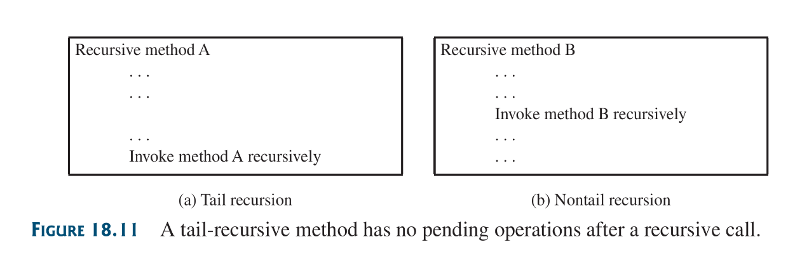

Recursion is a technique that leads to elegant solutions to problems that are difficult.

## Listing 18.1 Computing Factorial
```java
import java.util.Scanner;

public class Factorial {
	public static void main(String[] args) {
		Scanner input = new Scanner(System.in);
		int n = input.nextInt();
		long nfac = factorial(n);
		System.out.printf("n: %d, factorial: %l", 
		n, nfac);
	}
	private static long factorial(int n) {
		if (n == 0) // base case
			return 1;
		else
			return n * factorial(n -1 );
	}
}
```

More elaborate implementation of factorial: [here](source-files/Chapter-18/Factorial.java)

Things to Note:
1) Its simpler and more efficient to implement factorial via a loop
2) Recursion without a base case leads to infinite recursion

There are 2 forms of recursion:
* direct: as seen above
* indirect: when method A invokes method B, which indirectly invokes method A again.

## 18.4 Problem Solving Using Recursion

All recursive methods possess the following characteristics
* The methods is implemented using an `if-else` or `switch`statement that leads to different cases.
* One or more base cases (the simplest case) are uses to stop recursion
* Every recursive call reduces the original problem, bringing it increasingly closer to a base case until it becomes that case.
Solving with recursions usually involves breaking problems into sub-problems. Each sub-problem is that same problem but smaller in size.

## 18.5 Recursive Helper Methods
A recursive helper method is recursive methods called by another method to help it solve a problem.

## Case Study: Directory size 
```java
import java.io.File;
import java.util.Scanner;

public class DirectorySize {
	public static void main(String[] args) {
		System.out.print("Enter Directory: ");
		Scanner input = new Scanner(System.in);
		String directory = input.nextLine();
	    long size = getSize(new File(directory));
	    System.out.printf("%d bytes. %.2fMB.\n", size, size*1e-6);
	}
	private static long getSize(File file) {
		long size = 0;
		if (file.isDirectory()) {
			File[] files = file.listFiles();
			for (int i = 0; files != null && i < files.length; ++i)
				size += getSize(files[i]);
		} else {
			size += file.length();
		}
		return size;
	}
}
```

## Case Study: Sierpinski Triangle
```java
import javafx.application.Application;
import javafx.scene.Scene;
import javafx.geometry.Point2D;
import javafx.geometry.Pos;
import javafx.scene.control.Label;
import javafx.scene.control.TextField;
import javafx.scene.layout.BorderPane;
import javafx.scene.layout.Pane;
import javafx.scene.layout.HBox;
import javafx.scene.paint.Color;
import javafx.scene.shape.Polygon;
import javafx.stage.Stage;

public class SierpinskiTriangle extends Application {

	@Override
	public void start(Stage primaryStage) {
		SierpinskiTrianglePane tPane = new SierpinskiTrianglePane();
		TextField tfOrder = new TextField();
		tfOrder.setOnAction( e -> 
			tPane.setOrder(Integer.parseInt(tfOrder.getText())) 
		);
		tfOrder.setPrefColumnCount(4);
		tfOrder.setAlignment(Pos.BOTTOM_RIGHT);

		HBox orderBox = new HBox();
		orderBox.getChildren().addAll(new Label("Set Order: "), tfOrder);
		orderBox.setAlignment(Pos.CENTER);

		BorderPane container = new BorderPane();
		container.setCenter(tPane);
		container.setBottom(orderBox);

		Scene scene = new Scene(container);
		primaryStage.setTitle("Sierpinski Triangle");
		primaryStage.setScene(scene);
		primaryStage.show();

		tPane.widthProperty().addListener( ov -> tPane.paint() );
		tPane.heightProperty().addListener( ov -> tPane.paint() );
	}

	static private class SierpinskiTrianglePane extends Pane {

		private int order = 0;
		SierpinskiTrianglePane () {}

		public void setOrder(int order) {
			this.order = order;
			paint();
		}

		protected void paint() {
			Point2D p1 = new Point2D(getWidth()/2, 10);
			Point2D p2 = new Point2D(10, getHeight() - 10);
			Point2D p3 = new Point2D(getWidth() - 10, getHeight() - 10);
			this.getChildren().clear();
			displayTriangles(order, p1, p2, p3);
		}

		private void displayTriangles(int order, Point2D p1, 
			Point2D p2, Point2D p3) 
		{
			if (order == 0) {
				Polygon triangle = new Polygon();
				triangle.getPoints().addAll(
					p1.getX(), p1.getY(),
					p2.getX(), p2.getY(),
					p3.getX(), p3.getY()
				);
				triangle.setStroke(Color.BLACK);
				triangle.setFill(Color.WHITE);
				this.getChildren().add(triangle);
			}
			else 
				Point2D p12 = p1.midpoint(p2);
				Point2D p23 = p2.midpoint(p3);
				Point2D p31 = p3.midpoint(p1);

				displayTriangles(order - 1, p1, p12, p31);
				displayTriangles(order - 1, p12, p2, p23);
				displayTriangles(order - 1, p31, p23, p3);
			}
		}
	}
}

```

[file](source-files/Chapter-18/SierpinskiTriangle.java)
## 18.9 Recursion vs. Iteration
Recursion is an alternative form of program control, its is essentially repetition without a loop. Recursion bears substantial overhead; because with every call of a method a layer is added on the stack with memory allocated for its details of implementation and for its execution. So multiple recursive iterations results to multiple memory allocated layers in the calling stack, which will result to extra consumption of computational resources. This can require a considerable amount of time to complete the execution of a recursive function call and also, increase performance overhead, due to how much of computational resources will be required.

Recursive programs can run out pf memory, causing a `StackOverflowError`. Rule of thumb is that iteration should always be preferred whenever applicable except in situations in which the solution to a problem can be better modeled using an intuitive recursive function design.

## 18.10 Tail Recursion
A tail recursive method is efficient. A recursive method is said to be tail  recursive if there is no pending operations to be performed on return from a recursive call.



