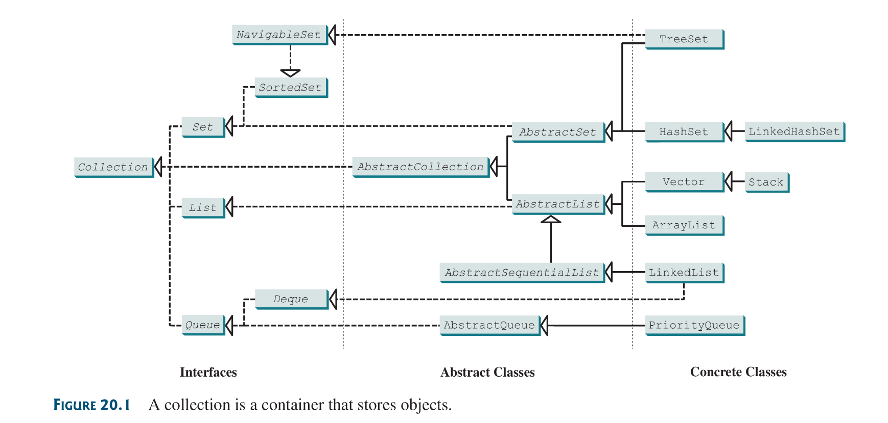

Choosing the best data structures and algorithms for a particular task is one of the keys to developing high performance software.

Data structures provided by Java:
* Lists
* Vectors
* Stacks
* Queues
* Priority queues
* Sets and,
* Maps

This data-structures are commonly known as *Java Collections FrameWork*.

## 20.2 Collections
The `Collection` interface defines the common operations for lists, vectors, stacks, queues, priority queues and sets.

The java collection framework provides two types of containers:
* One for storing a collection of elements simply called a *Collection*
* The other, for storing key/value pairs is known as a *Map*

Different collections ans their utility:
* `Set`s: store a group of non-duplicate elements
* `List`s: store an ordered collection of elements
* `Stack`s: store objects that are processed in a last-in, first out fashion.
* `Queue`s: store objects that a processed in a first-in, first-out fashion.
* `PriorityQueue`s: store objects that are processed in the order of their priorities.

The common operations these structures share are defined interfaces. Their implementation can be evoked via concrete classes.

Note:
* All the interfaces and classes defines in the Java Collection Framework are grouped in the `java.util` Package.
 

The `Collection` interfaces is the root interface for manipulating a collection of objects. The `AbstractCollection` class provides partial implementation for the `Collection` interface. It implements all the methods in `Collection` except the `add`, `size`  and `iterator` methods. These are implemented in the concrete subclasses.
: