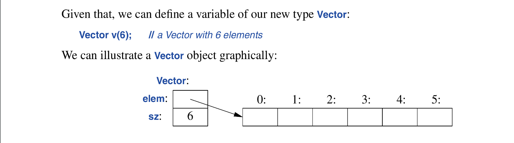

This section will cover:
* Structures
* Classes
* Enumerations
* Unions

> Declarator operators are operators used in declarations

## 2.1 Introduction
Types that can be built from the fundamental types, the `const` modifier and the declarator operators; ***built in types***.

C++ built in types and operations are rich but low-level; making it harder to use them to design advanced software.

C++ augments the the built in types and operation with a sophisticated set of *abstraction mechanisms* out of which programmers can build such high-level facilities.

This abstraction mechanisms exist to allow programmers design and implement their own types.

Types built out of other types using c++ abstraction mechanisms are called *user-defined types*. They are referred to as *classes* and *enumerations*.

User defined types can be built from built in types or other user defined types.

## 2.2 Structures
First step in building a new type is often organizing the elements it need into a data structure, a `struct`:
```c++
struct Vector {
	double* elem; // pointer to elements
	int sz;       // number of elements.
};
```
A variable of vector can be defined as so:
```c++
Vector v;
```
However with such design v is not of much use, because `v’s elem` pointer doesn’t point to anything. Lets give it something to point to:
```c++
void vector_init(Vector& v, int s)
{
	v.elem = new double[s];
	v.sz = s;
}
```
now v’s `elem` points to an array and v’s `sz` hold the size. In the `vector_init` function `vector& v` indicates that we pass be using a non-const reference, making it possible for the function to modify the `v`.

## The `new` operator and `delete` operator
The `new` operator allocates memory from an area called the free store (also known as *dynamic memory* and *heap*). Objects allocated from the free store the free store, independent of their scope, “lives” until they are destroyed using the `delete` operator.

An example of the usage of the Vector type is shown below:
```c++
double read_and_sum(int s)
{
	Vector v;
	vector_init(v, s);
	
	for (int i=0; i != s; ++i)
		cin>>v.elem[i];
	
	double sum = 0;
	for (int i=0; i != s; ++i)
		sum += v.elem[i];
	
	return sum;
}
```
The rest of this chapter an the next two gradually improve `Vector` as an example of languages features and techniques.

The standard library types have lower-case names, so as to distinguish them from the types used to illustrate design and implementations techniques (like the user-defines `Vector` struct here), Bjarne capitalizes them.

Things to note about structs:
1) the dot`.`  is used to access `struct` members through a name (and through a reference)
2) While `->` is used to access `struct` members through a pointer

## 2.3 Classes
According to Bjarne—A tighter connection between the representation and the operations is needed for a user-defines types to have all the properties expected of a real type, An the language mechanism used to achieve such a structure is a *class*.

A class has a set of *members*, which can be data, function or type members. The interface of a *class* is defined by its `public` members, and its `private` members are accessible only through that interface.

conventionally in c++; we place the `public` declarations first and the `private` later
an Example:
```c++
class Vector {
public:
	Vector(int s): 
		elem{new double[s]}, sz{s} {}   // construct a vector
	double& operator[](int i) { return elem[i]; }
	int size() { return sz; }
private:
	double* elem;
	int sz;
};
```



The vector object is a handle containing a pointer to some elements in memory and the number of elements (`sz`). However the Vector object itself is always the same size. This is the basic technique for handling varying amounts of information in c++: a fixes size handle referring to a variable amount of data “elsewhere”.

Here is an example  of its usage: [read_sum_vectors.cpp](src/chapter-02/read_sum_vectors.cpp)

in the above snippet you can see that the representation of a `Vector` is only accessible through the `public` members: `Vector()`, `operator[]()`, and `size()`.

“There are some limitations to this `Vector` class”, Bjarne explains, There is no error handling, similarly there is no mechanism to “give back” the array of doubles acquired by `new`; a *destructor* does that.

Massive take-away:
* There is no fundamental difference between a struct and a class; a struct is simply a class with members public by default. Constructors and member functions can be defines for a struct.

## 2.4 Enumerations
C++ support a simple for of user-defined type for which we can enumerate the values:
```c++
enum class Color { red, blue, green };
enum class Traffic_light { green, yellow, red };

Color col =  Color::red;
Traffic_light light = Traffic_light::red;
```
Enumerators (e.g `red`) are in the scope of their `enum class`, meaning: `Color::red` is different from `Traffic_light::red`.

Enumerations are used to represent a small set of integers values; they are used to make code more readable and less error-prone.

The `class` after the `enum` specifies that an enumeration is strongly typed and that its enumerators are scoped. This enables us prevents accidental misuse of constants belonging to different enumerations:

```c++
Color x1 = red:                     // ERROR: whhich red?
Color x2 = Traffic_light::red;      // ERROR: red is not of type Color
Color x3 = Color::red;              // LEGAL: OK
auto x4  = Color::red;              // LEGAL: Color::red is Color
```

We also cannot implicitly mix `Color` and integer values, even though the underlying type of an `enum class` is `int`:
```c++
int i = Color::red;                  // ERROR: Color::red is not an int
Color c = 2;                         // Init. error: 2 is not a Color
```

But sometimes we want to initialize an enum with its underlying type (by default its `int`), and its allowed if declared explicitly:
```c++
Color x = Color{5};   // LEGAL: but verbose
Color y {6};          // also LEGAL
```
similarly we can convert an enum value to it’s underlying value:
```c++
int x = int(Color::red);
```

### Major Notes on `enum class`:
1) By default, an `enum class` has assignment, initialization and comparisons defined and only those.
2) But since its a user-defined type, we can define operators for it
```c++
traffic_light& operator++(traffic_light& t)
{
	switch(t) {
	case traffic_light::green   :   return t=traffic_light::yellow;
	case trafiic_light::yellow  :   return t=traffic_light::red;
	case traffic_light::red     :   return t=traffic_light::green;
	}
}

auto signal = traffic_light::red;
auto next_signal = ++signal;
```
3) if the scope of the enumeration name becomes to tedious we can abbreviate it as using the `using` keyword:
```c++
traffic_light& operator++(traffic::light& t)
{
	using enum Traffic_light;
	
	switch(t) {
	case green       :       return t = yellow;
	case yellow      :       return t = red;
	case red         :       return t = green;
	}
}
```

4) if we don’t need the strongly typed and strongly scoped feature `enum class` provides we can simply remove the `class` and simply declare it as an `enum`; now the enumerators belong to the scope that the `enum` was declared in and not it can implicitly convert to its underlying type when needed, since its no longer strongly typed.
```c++
enum Color { red, green, yellow };
int color = green;       // color now has the value 1
```
enumerators value start from 0 an increase by one for each additional enumerator.

## 2.5 Unions
A `union` is a struct in which all its member are allocated in the same address so that the `union` occurs occupies as much space as its largest member. Naturally a `union` can only hold the value of ***a*** member at a time. Unions help minimizes memory usage by only holding the value of what is needed

AN example use case of a union is a situation in which a specific type of data should be held (or interacted with) depending on the state of an established constraint, like so:
```c++
enum class Type { ptr, num };

struct Entry{
	string name;
	Type t;
	Node* p;        // only to be used when t==ptr
	int i;          // only to be used when t==num
}

void f(Entry* pe)
{
	if (pe->t == Type::num)
		cout << pe->i;
}
```
in this scenario a constraint is established that Entry’s `p` should only be used when Entry’s `t` is of value `ptr`  and the same logic for Entry’s `i` if Entry’s `t` is `num`. The above program is inefficient because depending on the value of Entry’s type the member of Entry that does not align with the current state of the established constraint occupies memory that will not be used; wasting space. This limitation is solved using a union.

> A unions members are all allocated at the same address and can only hold the value of a member at a time

Unions solution:
```c++
enum class Type { ptr, num }

Union Value {
	Node* p;
	int i;
};

struct Entry {
	string name;
	Type t;
	Value v;   //use v.p if t==Type::ptr; use v.i if t==Type::num
};
```
This kind of optimization is important for applications that hold large amounts of memory so that compact representation is critical.
C++ does not keep track of what type of value is held by a union; so that task should be handled by the programmer:
```c++
void f(Entry* pe){
	if (pe->t == Type::num)
		cout << pe->v.i;
}
```
Maintaining correspondence between a *tag*(or *discriminant*, in this case `t`)  and the actual type held by a union is error-prone. We can avoid by enforcing correspondence by encapsulating the access of the union member (in this case `Value v`) with a member function that uses the union correctly.

The above union declaration is a `naked` union and its use should be minimized.

### The `variant`; unions quasi-killer
The standard library type, `variant` can be used to eliminate most direct uses of unions. A `variant` stores a value of ***one*** of a set of alternative types. for example: `variant<Node*, ptr>` can either hold either a `Node*` or an `int`:
```c++
struct Entry {
	string name;
	variant<Node*, int> v;
};

void f(Entry* pe)
{
	if (holds_alternative<int>(pe->v)) // does pe-> hold an int?
		cout << get<int>(pe->v);       // get it and print it
	
	if (holds_alternative<Node*>(pe->v))
		// handle Node
}
```
for many uses, a `variant` is simpler and safer to use than a `union`.

## Advice:
1) Organize related data into structures (`structs` or `classes`)
2) represent distinction between interface and implementation using a `class`
3) `struct`s are simply classes with its members public by default.
4) Define constructors
5) use enumerations to represent set of named constants
6) Prefer `enum class` over “plain” `enums` to prevent suprises
7) avoid “naked” unions, wrap them in a class.
8) prefer `std::variant` to “naked `unions`”

