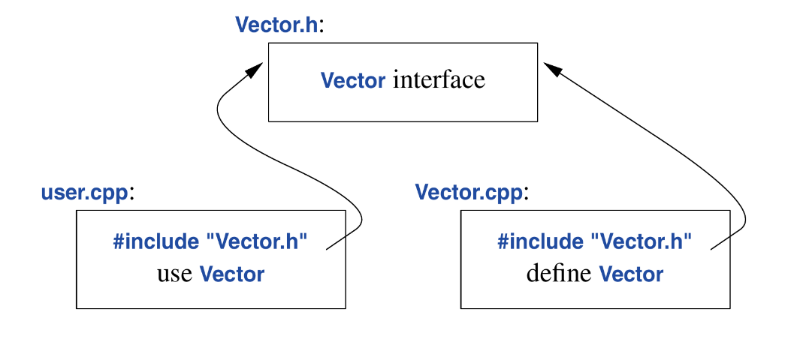

This chapter covers:
* Separate Compilation
	* Header Files; Modules
* Namespaces
* Function Arguments and Return Values
	* Argument Passing; Value Return; Return Type Deduction; 
	 Suffix Return Type; Structured Binding

A C++ program consists of many separately developed parts such as functions , user-defined types, class hierarchies and templates. Defining the interactions between such parts is key towards developing a c++ program.

Bjarne states that the first and most important step is to distinguish between implementation and interface.

C++ represents interfaces using declarations. A *declaration* specifies all that is needed to use a function or type.

For example, this is a “contract“ of declarations, this “contract” specifies what is needed to use these functions and types, these contract, to my understanding, satisfies the “interface“, Bjarne speaks of:
```c++
double sqrt(double);    // interface of square root function

class Vector {          // what is needed to use Vector; interface.
public:
	Vector(int s);
	double& operator[](int s);
	int size();
private:
	double *elem;
	int sz;
}
```
Bjarne states that the key point of this is that, the *definition* of a function, (the function body) can be elsewhere (separate from its interface)

Their definitions (located elsewhere), will look like this:
```c++
double sqrt(double d)                  // definiition; implementation.
{
	// implementation as found in math text.
}

Vector::Vector(int s)                  // constructor definition
	: elem{new double[s]}, sz{s}
{
}

double& Vector::operator[](int s)      // subscripting definition
{
	return elem[i];
}

int Vector::size()                     // size function definition
{
	return sz;
}
```
we must define Vectors functions but not `sqrt`; because its already part of the standard library.

> *There can be many declarations for an entity, such as a function, but only one definition*

## 3.2 Separate Compilation
C++ supports the notion of separate compilation where user code sees only the declarations of the types and functions used, This can be done in two ways:
* *Header files*: Place declarations in separate files, called header files, and textually `#include` a header file where its declarations are needed.
* *Modules*: Define module files, compiler them separatly, and import them where needed, Only explicitly, `export`ed delarations are seen by code `import`ing the `module`.
Either approach can be used to organize a program into a set of semi-independent code fragments.

## 3.2.1 Header Files
We can place declarations in header files`.h`, then include that header files into the their implementations `.cpp`, and them allow a user to include their declaration wherever they are needed. An example:

Vector.h:
```c++
class Vector {
public:
	Vector(int s);
	double& operator[](int s);
	int size();
private:
	double elem*;
	int sz;
};
```
Vector.cpp:
```c++
#include "Vector.h"        
// get the Vectors interface so they can be defined

Vector::Vector(int s)
	:elem{new double[s]}, sz{s}
{}

double& Vector::operator[](int s)
{
	return elem[s];
}

int Vector::size()
{
	return sz;
}
```
user.cpp:
```c++
#include "Vector.cpp"
#include <cmath>

double sqrt(const Vector& v)
{
	double sum = 0;
	for(int i=0; i!=v.size(); ++i)
		sum += std::sqrt(v[i]);
	return sum;
}
```


Bjarne explains that “best approach to program organization is to think of said program as set of modules with well defined dependencies.”

According to him, header files represent that modularity through files and then exploit that modularity through separate compilation and goes into details why

issues like:
1) Compilation time issues due to the redundant nature of headers when included in numerous translation units
2) Dependencies can affect or modify each other solely due to the order they were declared in; which is very error prone.
3) Inconsistencies defining entities since their, interface and definitions are usually in separate files
4) And lastly since some headers include other header ,this leads to code bloat which can make the user of such entity unknowingly or knowingly dependent on their implementation details

> a .`cpp` file that is compiled by itself (including the `h` files its `include`s) is known as a *translation unit*

His solution was c++20 new feature ***Modules***

## 3.2.2 Modules
This is C++20 way of representing modularity. An example of its usage:
```c++
export module Vector;

export class Vector {
public:
	Vector(int s);
	double& operator++(int s);
	int size();
private:
	double elem*;
	int sz;
}

Vector:Vector(int s) : elem{new double[s]}, sz{s}
{}

double& Vector::operator++(int s)
{
	return elem[s];
}

int Vector::size()
{
	return sz;
}

export bool operator==(const Vector& v1, const Vector& v2)
{
	if (v1.size() != v2.size())
		return false;
	for (int i=0; i!=v1.size(); ++i)
		if (v1[i] != v2[i])
			return false;
	return true;
}
```
This defines a `module` called `Vector`, which exports the class `Vector`, all its member functions, and a non member function defining operator `==`.

To use this module, we export it where needed:
```c++
import Vector;
#include <cmath>

double sqrt_sum(Vector& v)
{
	double sum = 0;
	for (int i=0; i!=v.size(); ++i)
		sum += std::sqrt(v[i]);
	return sum;
}
```
`import` and classic `#include` can be used together.
According to Bjarne; the difference between `import`-ing and `include`-ing is not just syntactic but:
1) A module is compiled once (solving the compilation time issue headers cause)
2) Two modules can be imported in any other without changing their meaning
3) `import` is not transitive.

> Read Appendix A to get `import`

Graphically, the program fragment of how import functions can be represented below:


The compiler separates, a module’s interface, specified by the `export` specifier, from its implementation details. This the `Vector` interface is generated by the compiler and never explicitly named by the user.

> A module will only grant access to `exported` declarations.

For example:
```c++
export module vector_printer;
import std;

export
template <typename T>
void print(std::vector<T>& v)   // this the only function seen by users
{
	cout << "{\n";
	for (const T& val; v)
		cout << " " << val << "\n";
	cout << '}';
}
```

by importing this module; we don’t automatically gain access to all of standard library, even though it was imported in the module.

## 3.3 Namespaces
Namespaces is a mechanism that c++ offers that says “hey!, this names belong together and shouldn't clash with other names”. 

Its simple a mechanism that prevents identifier conflicts.

An example; a custom defined `complex`:
```c++
namespace My_code {
	class complex {
		// math textbook implementation
	};
	complex sqrt(complex);
	// implementation
	int main();
}

int My_code::main(){
	complex s {1, 3};
	auto root = sqrt(s);
	std::cout << '{' << root.real() << ',' << root.imag() << '}';
}

int main(){
	My_code::main();
}
```
In this program we can see that there is no conflict with the complex name in standard library and our custom one; different namespaces. Namespace help us create scopes that we can use to even implement functions that share the same name as a global functions’, like the `My_code::main()` function.

Accessing a name in a namespace by qualifying it with the namespace name (e.g `std::`) can be tedious, especially if the name of the namespace is long. This hassle can be circumvented using the `using-declaration`.

## Using-declaration: brings a name from a namespace into scope
in this example a name in a namespace is brought into the functions scope:
```c++
void my_code(vector<int>& v1, vector<int> v2)
{
	using std::swap;   // My_code names can now be accessed without ::
	swap(x, y);
	other::swap(x, y); // different from std::swap.
}
```
The `using` declaration brings the names of a namespace into the scope the `using` declaration was declared.

## Using-directive: brings all names in a namespace into scope
To gain access to all names in a namespace (like that std namespace); the using directive should be used.
```c++
using namespace std;
```

***A `using` directive makes unqualified names from a named namespace accessible from the scope the directive was placed in.***

an example:
```c++
export module vector_printer;
import std;
using namespace std;

export
template <typename T>
void print(vector<T>& v)
{
	cout << "{\n";        // the std::
	for (const T& elem : v)
		cout << " " << elem << '\n';
	cout << '}';
}
```

## 3.4 Function Arguments and Return Values
Function call is the recommended and primary method of passing information across a program.

“There are several ways information can be passed via function”, bjarne states. Ways such as; global variables and shared states. Global variables are a highly error-prone, so bjarne discourages its use.

A state should only typically be shared only between function jointly implementing a well defined abstraction.

Since information must be shared through functions; our key concerns should be:
1) is the object copied or shared`
2) if shared, is it mutable?
3) is an object moved?, leaving an empty object behind?

The default behavior of both argument passing and value return in functions is “making a copy”; but this can optimized as “moves” instead of copies.

## 3.4.1 Argument Passing
When we care about performance, (usually) pass small values by-value and larger ones by-reference. “small” means something that is cheap to copy (Although this depends on the machines architecture). 

A good rule of thumb is “the size of two or three pointers or less”.

If we want to pass by reference but don’t need to modify the argument, we ***pass-by-const-reference***; this is by far the most common case in ordinary good code; fast and not error-prone.

### Default function argument
It is not uncommon for a function argument to have a default value. we can specify such a default by using a *default function argument* For example:
```c++
void print(int value, int base=10);

print(x, 16);
print(x, 60);
print(x)      // uses the default base: decimal
```
This is notationally simpler to overloading.

## 3.4.2 Value Return
Once we compute a result, we need to get the result out of the function and back to the caller. These is how we should handle returns:
1) if the value is cheap to copy or a small object; pass-by-value is ideal.
2) We return by reference only when we want to grant a caller access to something that is not local to the function. 
3) A local variable disappears when the function returns, so we should not return a pointer or reference to it; fortunately c++ compilers catch this error

How can we pass large amounts of information out of a function? consider:
```c++
Matrix operator+(const Matrix& x, const Matrix& y)
{
	matrix res;
	// for all res[i, j] = x[i, j] + y[i, j]
	return res;
}

Matrix m1, m2;
Matrix m3 = m1+m2;     // no copy
```
A matrix might be very large and expensive to copy; so we don’t copy. What we can do is give `Matirx` a **move** constructor (will be explained in chapter 6.2.2); This cheaply moves the `Matrix` out of the `operator+()`.

The compiler has a way on optimizing away copy and constructing the `Matrix` where needed, even without explicitly defining a **move** constructor. This is called *copy elision*.

We should not regress to use manual memory management
```c++
Matrix* operator+(const Matrix& x, const Matrix& y)
{
	Matrix* res = new Matrix();
	// for all res[i, j] = x[i, j] + y[i, j];
	return res;
}

Matrix m1, m2;
Matrix* m3 = m1+m2;
// use m3
delete m3;
```
This method is very error-prone (but quite popular in older code)

## 3.4.3 Return Type Deduction
The return type of a function can be deduced from its return value:
```c++
auto mul(int i, double j) { return i*j; }
```
auto here means “deduce the return type”

## 3.4.4 Suffix Return Type
C++ allows adding return type after the argument list where we want to be explicit about the return type; in this case, this makes `auto` mean “the return type will be mentioned later or be deducted”

An example:
```c++
auto next_elem() -> Elem*;
auto exit(int) -> void;
auto sqrt(double) -> double;
```
This notation really makes Bjarne’s d^*ck* real hard for some reason.

## 3.4.5 Structured Binding
A function can return a single value, but that single value can be class member with many members. This allows us to elegantly return many values. An example:
```c++
struct Entry {
	string name;
	int value;
};

Entry read_entry(istream& is)
{
	string s;
	int i;
	is >> s >> i;
	return {s, i};
}

auto e = read_entry(cin);
cout << e.name << ',' << e.value << '\n';
```
here`{s, i}` is used to construct the Entry return value. We can also “unpack” an Entry’s members into local variables:
```c++
auto [n, v] = read_entry(cin);
cout << "(" << n << "," << v << ")\n";
```

The mechanism for giving local names to members of a class object is called structured binding.

Another example:
```c++
map<string, int> m;
// fill m up.
for (const auto [key, value]: m)
	cout << key << ' : ' << value << '\n';
```
When structured binding is used for a class with no private data; it is easy to see how the binding is done: there must be the same number of names defined for the binding as there are data members in the class object.

The use of structured binding is all about how best to express an idea.

It is also possible to handle classes where access is through member functions. But Bjarne explains the process of how to do so is beyond the scope of his book. An example tho:
```c++
complex<double> z = {1, 2}
auto [real, imag] y = z + 2;    // real becomes 3, imag stays 2
```

## 3.5 Advice
1) Distinguish between declarations *(interfaces)* and definitions *(implementations)*
2) prefer `modules` over `headers` where modules are supported
3) User headers to emphasize interfaces and logical structure
4) Avoid non-inline function definitions in headers.
5) use namespaces to express logical structure
6) use `using` directives for transition, for  foundational libraries pt within a local scope
7) Don’t put a `using`-directive in a header file.
8) pass “small” values by value; pass “large” values by reference
9) Prefer pass-by-`const`-reference over plain pass-by reference
10) Return values as function-return values (rather than by out-parameters)
11) Don’t overuse return-type deduction
12) Don’t overuse structured binding; a named return type.