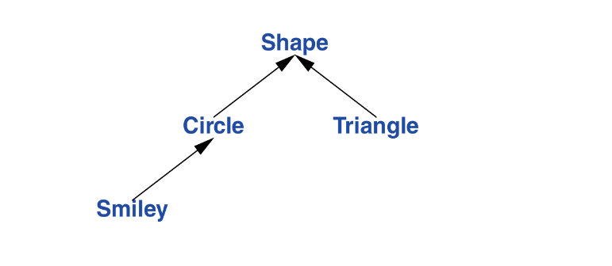

This chapter covers:
* Classes
* Concrete types
	* An arithmetic type: A container; initializing containers
* Abstract types
* Virtual functions
* Class Hierarchies
	* Benefit, Navigation and avoiding resource leaks 

This chapter and the next three aim at given use an idea of C++ support for abstraction and resource management.

## 5.1.1 Classes
The central language feature of C++ is the *class*, It is a user defined type provided to represent an entity in the code of a program. A program built out of a well-chosen set of classes is far easier to understand and get right than one that builds everything directly in terms of the built in types.

Here Bjarne considers the basic support of the three important kinds of classes:
* Concrete classes
* Abstract classes
* Classes in class hierarchies

## 5.2 Concrete Types
The basic idea of *concrete classes* is that they behave “just like built in types”. 

The defining characteristics of a concrete type is that its representation is part of its definition,  for example the `vector` class, its representation is only one ore more pointers to data stored elsewhere, but that representation is present int each object of the concrete class.

It allows us to:
1) Place objects of concrete types in the stack, in statically allocated memory, and in other objects
2) Refer to objects directly (and not just through pointers or references).
3) Initialize objects immediately and completely (constructors)
4) Copy and Move objects

It representation can be encapsulated, but its is present. Therefore if the representation changes in any significant way, a user must recompile.

To increase flexibility, a concrete type can keep major parts of its representation in the *free store* (dynamic memory, heap) and access them through that part stored in the class object itself.

## 5.2.1 An Arithmetic Type
```c++
class complex {
	double re, im;                   // representation: two doubles
public:
	complex(double x, double y): re{x}, im{y} {}
	complex(double x): re{x}, im{0} {}
	complex(): re{0}, im{0} {}
	
	double real() const { return re; }
	void real(double x) { re = x; }
	double imag() const { return im; }
	void imag(double x) { im = x; }
	
	complex& operator+=(complex z)
	{
		re+=z.real();
		im+=x.imag();
		return *this;
	}

	complex& operator+=(complex z)
	{
		re-=z.real();
		im-=z.imag();
		return *this;
	}

	complex& operator*=(complex);    // define this elsewhere
	complex& operator/=(complex);    // define this elsewhere
}
```
This is a simplified version of the standard-library `complex`. It definition itself contains only the operations requiring access to the representation.

Functions defined in a class are inlined by default. It is possible to explicitly request `inline` by preceding a function declaration with the keyword `inline`. In addition, the std `complex` has that functions showed here declared `constexpr` so that we can do complex arithmetic at compile time.

Copy assignment and copy initialization are implicitly defined.

A constructor that can be invoked without an arguments is called a *default constructor*;  e.g. `complex() : re{0}, im{0} {}`.

The `const` specifiers on the functions returning the real and imaginary parts indicate that these functions do not modify the object for which they are called.

A `const` member function can be invoked for both `const` and `non-const` objects, But a `non-const` member functions can only be invoked for `non-const` objects. An example:
```c++
complex z = {1, 0};
const complex cz {1, 3};
z = cz;                  // OK: assigning to a non-const variable
cz = z;                  // ERROR: assignment to a const
double x = z.real();     // OK: complex::real() is a const
```
Many useful operations do not require direct access to the representation of `complex`, so they can be defined seperately from the class definition:
```c++
complex operator+(complex a, complex b) { return a+=b; }
complex operator-(complex a, complex b) { return a-=b; }
complex operator-(complex a) { return {-a.real(), -a.imag()}; }
complex operator*(complex a, complex b) { return a*=b; }
complex operator/(complex a, complex b) { retuurn a/=b; }
```
Bjarne uses the fact that arguments passed by value are copied. Therefore the callers objects remained unmodified regardless if the functions arguments are modified.

The definitions of `==` and `!=`:
```c++
bool operator==(complex a, complex b) { 
	return a.real()==b.real() && a.imag()==b.imag(); 
}
bool operator!=(complex a, complex b) { return !(a==b); }
```

The complex class can be use as so:
```c++
void f(complex z)
{
	complex a {2.3};
	complex b {1/a};
	complec c { a+z*complex{1,2,3} };
	if (c!=b)
		c = -(b/a)+2*b;
}
```
Overloaded operators should be used cautiously and conventionally. It is not possible to change the meaning of an operator for built in types, so you cant redefine + to subtract `ints`.

## 5.2.2 A Container
A container is an object holding a collection of elements. The `Vector` class we built is not an unreasonable containers, its handles a lot of things well. However its does have a fatal flaw: it allocated elements using new but never de-allocates them. Since c++ does not provide a garbage collector it can lead to memory exhaustion.

### Destructors
We need a mechanism to ensure that the memory allocated by the constructor is deallocated; this mechanism is a *destructor*:

A destructor name is the complement operator `~` followed by the name of the class: its is complement of the constructor.

```c++
class Vector {
public:
	Vector(int s): elem{new double[s]}, sz{s}
	{
		for(int i=0; i!=s; ++i)
			elem[i] = 0;
	}
	
	~Vector() { delete[] elem; }
	
	double& operator[](int i);
	int size() const;
private:
	double* elem;
	int sz;
};
```
plain `delete` deletes an individual object; `delete[]` deletes an array.

This destruction of an object is all don without the intervention by users of `Vector`. The users simply create and use `Vector`s as much as they would built-in-types. For example:
```c++
void f(int c)
{
	Vector v(n);
	// use v
	{
		Vector v2(2*n);
		// use v and v2 
	} // v2 is destroyed here
	// use v
} // v is destroyed here
```
This technique of acquiring resources in a constructor and releasing them in a destructor is known as *Resource Allocation Is Initialization* **RAII**.

## 5.2.3 Initializing Containers
More elegant ways of initializing a container, like vector instead of making a fixed array and initializing those later, they are:
* *initializer-list constructor*: initialize with a list of elements.
* `push_back()`: Add a new element at the end of (at the back of) the sequence.
These can be declared like this:
```c++
class Vector {
public:
	Vector();                               // dflt: init an empty list
	Vector(std::initializer_list<double>);  // init with list of doubles
	void push_back(double);                 // add element at end, increasing size by one
}
```
a `push_back`is useful for input of an arbitrary number of elements:
```c++
Vector read(istream& is)
{
	Vector v;
	for (double d; is>>d;)
		v.push_back(d);
	return v;
}
```
returning a potentially huge amount from `read` could be expensive. we can guarantee the return is cheap by defining a *move constrctor* (chapter 6):
```c++
Vector v = read(cin);    // no copy here: move constructor established
```
The way `std::vector` makes `push_back()` and operations that change the vectors size efficient is presented in chapter 12.

### List initialization
`std::initializer_list`is used to define the initializer-list constructor is a standard-library type known to the compiler.

When we use a `{}`-list, such as `{1,2,3,4}`, the compiler will create an object of type `initializer_list` to give to the program.
```c++
Vector v1 = {1, 2, 3, 4, 5};
Vector v2 = {1.23, 3.45, 6.7, 8};
```
Vectors initializer list constructor might be defined like this:
```c++
Vector::Vector(std::initializer_list<double> lst)
	: elem{new double[lst.size()]}, sz{ static_cast<int>(lst.size()) }
{
	copy(lst.begin(), lst.end(), elem);
}
```

### Checked and Unchecked casts
* `static_cast` does not check the value it is converting; the programmer is trusted to use it correctly. Explicit type conversions (often called casts) are best avoided. Try to use unchecked casts only for the lowest level of a system. They are error prone
* other casts are `reinterpret_cast` and `bit_cast` for treating an object as sequence of bytes
* `const_cast`’s “cast away const”, whatever that means.

## 5.3 Abstract Types
An *abstract type* is a type that completely insulates a user from implementation details. To do that , we decouple the interface from the representation and give up genuine local variables.

Since we don’t know anything about the representation of an abstract type (not even its size), we must allocate objects on the free store and access them through references or pointers.

if we where to design an abstract version of `vector` and call it `container`, well first have to define the interface of the class:
```c++
class Container {
public:
	virtual double& operator[](ins s) =0;   // pure virtual function
	virtual int size() const =0;
	virtual ~Container() {}
};
```
This is a pure interface to a specific containers defined later. 
### `virtual`
The word `virtual` means “may be **redefined** later in a class derived from this one.”  A function declared `virtual` is a virtual function. A class derived from `Container` provides an implementation for the `container` interface.

Virtual function suffixed with `=0` notation says the function is *pure virtual*: some class derived from `Container` ***must*** define the function. Thus its not possible to define an object that is just a container. An example:

```c++
Container c;           // ERROR: an abstract class can't have an object
Container* p = new Vector_Container(10);  // Ok container is an interface for Vector_Container
```
  This container can be used like this:
  ```c++
  void use(Container& c)
  {
	  const int sz = c.size();
	  for (int i=0; i!=sz; ++i)
		  cout << " " << c[i];
  }
  ```
### Polymorphic type
A type that provides the interface to a variety of their classes is often called a *polymorphic type*.

The `Container` class does not have a constructor. After all, it does not have any data to initialize.

The abstract class `Container` defines only an interface and no Implementation. For `Container` to be useful, we have to implement a container that implements the functions required by its interface.

To do this we use a concrete class `Vector`:
```c++
class Vector_container : public Container {
public:
	Vector_container(int s): v(s) {}
	~Vector_container() {}
	
	double& operator[](int i) override { return v[i]; }
	int size() const override { return v.size(); }
private:
	Vector v;
};
```
`:public` can be read as “is derived from” or “is a subtype of”. The use of base class and derived class is commonly known as *inheritance*.

We can use the explicit `override` to make the compiler enforce that said function must override its base class’s implementation. This enforcement helps us notice things like declaration (syntax-semantics-related) mistakes. This is useful in large class hierarchies.

The destructor `~Vector_container` overrides the base class destructor (`~Container`). This member destructor `~Vector()` is implicitly invoked by the class destructor `~Vector_container()`

Since the `use()` has a an argument of the polymorphic type `Container` it can be used with any class implementing the container interface: like the `list_container` class:
```c++
class List_container : public Container {
public:
	List_container(std::initializer_list<double> l) : list{ls} {}
	~List_container() {}

	double& operator[](int i) override;
	int size() const override { return list.size(); }
private:
	std::list<double> list;       // std list of doubles
}

double& List_container::operator[](int i)
{
	for(auto& x: list) {
		if(i==0)
			return x;
		--i;
	}
	throw out_of_range("List container");
}
```
A function can create both the `List_container` and `Vector_container` and `use()` can operate on them with no issues:
```c++
void h()
{
	List_container l = {1.0, 2.0, 3.0, 913.7};
	Vector_container v = {22.1, 323.4, 131.1};
	
	use(l); // LEGAL
	use(v); // also LEGAL
}
```
`use(Container&)` doesn’t care what kind of container is fed into its as long as it implements the `Container` interface.

## 5.4 Virtual Functions
This is just Bjarne rambling on how his brilliant design of `virtual` functions makes his d^ck hard.

## IMPORTANT NOTE
Because of abstract methods cannot be instantiated themselves as objects the only way for us to interact with object that inherit said abstracts class interface, using the abstract class name as a point of reference, are by pointer dereferencing and referencing.

## 5.5 Class Hierarchies
A class hierarchy is a set of classes ordered in a lattice created by derivations. An example:

To represent this diagram in code:
```c++
class Shape {
public:
	virtual Point centre() const =0;
	virtual void move(Point to) =0;
	virtual void draw() const =0;
	virtual void rotate(int angle) =0;
	
	virtual ~Shape() {}
}
```
Nothing (except the location of the pointer to the **vtbl**) is common for every shape. so we can write general functions manipulating vectors of pointers to shapes:
```c++
void rotate_all(std::vector<Shape*> shapes, int angle)
{
	for (auto p: shapes)
		p->rotate(angle);
}
```
To define a particular shape like a `Circle` we could go about it like this:
```c++
class Circle: public Shape {
public:
	Circle(Point p, int rad) : x{p}, r{rad} {}

	void move(Point to) override { x = to; }
	Point center() const override { return x; }
	void draw() const override;
	void rotate(int) override {}
private:
	Point x;
	int r;
}
```
we can build the hierarchy further by defining the similey class:
```c++
class Smiley: public Circle {
public:
	Smiley(Point p, int r): Circle{p, r}, mouth{nullptr} {}
	~Smiley()
	{
		for(auto p: eyes)
			delete p;
		detele mouth;
	}
	
	void move(Point to) override;
	void draw() const override;
	void rotate(int) override;
	
	void add_eye(Shape* eye)
	{
		eyes.push_back(eye);
	}
	
	void set_mouth(Shape *s);
	virtual void wink(int i);
private:
	vector<Shape*> eyes;
	Shape* mouth;
}
```
Now we can define `draw()`:
```c++
void Smiley::draw() const
{
	Circle::draw();
	for (auto p: eyes)
		p->draw();
	mouth->draw();
}
```

## 5.5.1 Benefits from Hierarchies
A class hierarchy offers two kinds of benefits:
* *Interface inheritance*: polymorphic advantages
* *Implementation inheritance*: smiley using circles constructor

Concrete types act as built in type. classes in class hierarchies are a different: we tend to allocate them on the free store using `new` and we access them using pointers and references.

Objects are constructed “bottom up” (base first) by constructors and destroyed “top down” (derived first) by destructors.

This is a function that reads data describing shapes from an input stream and constructs the appropriate `Shape` objects:
```c++
enum class Kind { circle, triangle, smiley };

Shape* read_shape(istream& is)
{
	// read shape header from us and find its Kind K
	switch(k) {
	case Kind::circle:
		// read circl data
		return new Circle{p,r};
	case Kind::triangle:
		// read triangle data
		return new Triangle{p1, p2, p3};
	case Kind::smiley:
		Smiley *ps = new Smiley{p, r};
		ps->add_eyes(e1);
		ps->add_eyes(e2);
		ps->set_mouth(m);
		return ps;
	}
}
```
a program can use that shape reader as so:
```c++
void user()
{
	std::vector<*Shape> v;
	
	while(cin)
		v.push_back(read_shape(cin));
	
	draw_all(v);
	rotate_all(v, 45);
	
	for(auto p: v)
		delete p;
}
```
because shapes destructor is virtual , `delete` invokes the destructor for the most derived class.
## 5.5.2 Hierarchy Navigation
In a situation we are using a polymorphic clas reference to refer to objects derived from said polymorphic class (like `Shape` is to `Circle`). Since a polymorphic reference has no idea of the actual concrete type it holds, How can we ask a question like: “is this `Shape` a kind of `Smiley`?”. using the `dynamic_cast` operator we can answer said question:
```c++
Shape* ps { read_shape(cin) };

if (Smiley* p = dynamic_cast<Smiley*>(ps)) {// does ps point to a smiley?
	// its a smiley
	// do something
}
else {
	// not a smiler
}
```
the  `dynamic_cast` returns `nullptr` if our question turns out “falsey” at runtime.

### using `dynamic_cast` to test object types
We use `dynamic_cast` to an pointer; when the pointer to an object to a different derived class is a valid argument.

When a different type is unacceptable, we can simple `dynamic_cast` to a reference type. If the object is not of the expected type it `throws` a `bad_cast` exception:
```c++
Shape *ps {read_shape(cin)};
Smiley& s = dynamic_cast<Smiley&>(*ps); // somewhere,catch std::bad_cast
```
operations similar to `dynamic_cast` are known as “is kind of” and “is instance of” operations.

## 5.5.3 Avoiding Resource Leaks
A *leak* is the conventional term for what happens when we acquire a resource and fail to release it. It should be avoided because a leak makes the leaked resource unavailable to the system.

Leaks can eventually lead to slow down or even crashes to a system as the system as the system runs out of needed resources.

Pointer to objects allocated on the free stores is dangerous; a plain pointer should not be used to represent ownership.
```c++
void user(int x)
{
	Shape* p = new Circle{Point{0,0}, 10};

	if (x<0) throw Bad_x{};   // potential leak;
	if (x==0) return;         // potential leak;

	delete p;
}
```
This program will leak unless x is positive. That’s why assigning a `new` object to a “naked pointer” is highly error prone.

A simple solution is using the standard `unique_ptr` rather than a naked one when deletion is required.

### `unique_ptr`
`unique_ptr` is pointer that implicitly deletes the object it points to (with the help of the compiler) once the pointer goes out of scope. It is just as efficient as a naked pointer managed efficiently (deleting objects when necessary).

Due to the logic `unique_ptr` abide by: we don’t need to define a destructor for `Smiley`.
```c++
class Smiley: public Circle {
	//
private:
	vector<unique_ptr<Shape>> eyes;
	unique_ptr<Shape> mouth;
}
```

## Advice:
1) concrete types are the simplest kind of class and should be preferred over more complicated classes and plain data structures.
2) Concrete types should be preferred over class hierarchies for performance critical components
3) Make a function a member only if it needs direct access to the representation of a class.
4) User nonmember functions for symmetric operators
5) resource acquired by constructors should be released by destructors
6) use resource handles and RAII to manage resources
7) Access polymorphic objects through pointers and references
8) Abstract classes don’t need constructors
9) A class with a virtual function should have a virtual destructor
10) use `dynamic_cast` where class hierarchy navigation is unavoidable
11) use `dynamic_cast` to reference when failure to find the required class is considered a failure
12) use `dynamic_cast` to a pointer when failure to find the required class is considered a valid alternative
13) use `unique_ptr` or `shared_ptr` to avoid forgetting to `delete` objects created using `new`

