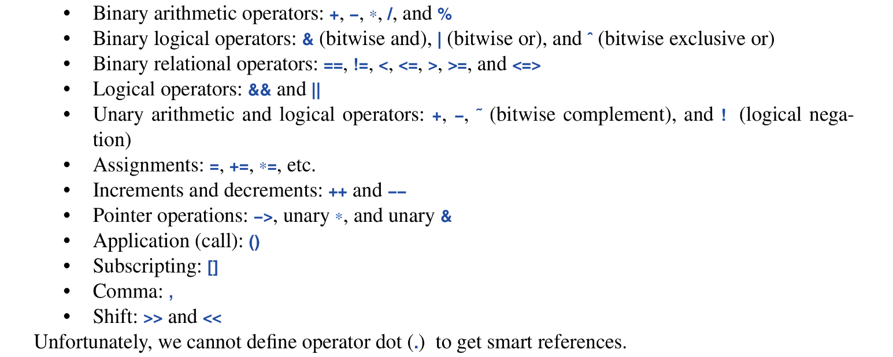

Some operations, such and initialization, copy and move are fundamental in the sense that language rules make assumptions about them. Other operation such as `==` and `<<`, have conventional meanings that are perilous to ignore.

## 6.1.1 Essential Operations
Constructors, destructors, and copy and move operations for a type are not logically separate and should be defined as a matched set or suffer logical or performance issues.

If a class `X` has a destructor that performs a non-trivial task, the class likely need the full complement of functons:
```c++
class X {
public:
	X(Sometype);             // ordinary constructor
	X();                     // default constructor
	X(const X&);             // copy constructor
	X(X&&);                  // move constructor
	X& operator=(const X&&); // copy assignment: cleanup target and copy
	X& operator=(X&&);       // move assignment: cleanup target and move
	~X();                    // destructor: cleanup
}
```
There are five situations in which an object can be copied or moved:
* As the source of an assignment
* As an object initializer
* As a function argument
* As a function return value
* As an exception

An assignment uses a copy or move assignment operator. In principle other use cases use a copy or move constructor. However a copy or move constructor is often opitmized to construct the object used to initialize right into the target object.


Except for the default constructor the compiler these special member functions will  be created by the compiler as needed. If we want to be explicit about generating default implementations we can declare such as so:
```c++
class Y {
public:
	Y(Sometype);
	Y(const &Y) = default;   // i really do want the default copy const.
	Y(Y&&) = default;        // and the default move one
}
```
If you explicit about some defaults, others will no be generated.

### The rule of Zero
A good rule of thumb is to either define all of the essential operations or none (using default for all).

To complement the `=default`, there exists `=delete` to indicate that an operation is not to be generated. A base class in a class hierarchy is the classic example where we don’t want to allow member.wise copy. A `=delete` makes an attempted use of the `deleted` function a compile-time error, it can be used to suppress any function.

## 6.1.2 Conversions
A constructor taking a single argument defines a conversion from its argument type. For example: 
```c++
conplex z1 = 3.14; // becaome {3.14, 0.0}
```
this implicit conversion is sometimes ideal but not always Like in the case of the Vector class:
```c++
Vector x = 7; // OK, x has 7 elements
```
although this is legal its is somewhat unfortunate and illogical. To avoid implicit conversion of constructor arguments, we can mark a constructor as `explicit` to only allow explicit declarations that voids implicit conversions:
```c++
class Vector {
public:
	explicit Vector(int x);
};
```
Now if we do this:
```c++
Vectot v1(7);      // LEGAL: explicitly initialized
Vector v2 = 7;     // ERROR: implicit conversions not allowed.
```

## 6.1.3 Member Initializers
When a data member of a class is defined, we can supply a default initializer called a *default member initializer*. An example:
```c++
class complex {
	double re = 0;
	double im = 0;
public:
	complex(double r, double i) : re{r}, im{i} {}
	complex(double r) : re{r} {}
	complex() {} // default complex: {0,0}
}
```
The default value is used wherever a constructor doesn’t provide a value.

## 6.2 Copy and Move
By default objects can be copied. This is true for all types, but the default meaning of copy is member-wise copy. When we design a class, we must always consider if an how an object might be copied. For simple concrete types, member-wise copy is often the right semantics for copy but for sophisticated concrete types, such as `Vector`, member-wise copy is not the right semantics for copy.

## 6.2.1 Copying Containers
When a class is *resource handle*;  member-wise copy destroys the invariant the class must abide by (being an **ONLY** an interface to access some elements), This is because in member-wise cope, but the original container an its copy would point to the same elements in memory, making both the copy and the original modify each other; This completely destroys the logic of a resource handle. An example:
```c++
void bad_copy(Vector& v1)
{
	Vector v2 = v1;
	v2[1] = 19;     // v1[i] is also 19 now
	V1[7] = 2;      // v2[7] is also 7 now
}
```
The fact that `Vector`  has a destructor is a string hing that default member-wise copy semantics is wrong. We need to define a better copy semantics.

Copying of an object of a class defined by two member functions, the:
* *copy constructor* and
* copy assignment
suitable definition of both of them to enable proper copy semantics can be defines as follows:
```c++
Vector (const& Vector v2) : elem{new double[v2.sz]}, sz{v2.sz} {
	for(int i=0; i!=sz; ++i)
		elem[i] = v2.elem[i];
}

Vector& Vector::operator=(const Vector& v2)
{
	double* p = new double[v2.sz];
	for (int i=0; i!=v2.sz; ++i)
		p[i] = v2.elem[i];
		
	delete[] elem;
	sz = v2.sz;
	elem = p;
	return *this;
}
```

## 6.2.2 Moving Containers
Copying can be cost for large containers, so a performance effective way to handle a situation as so it by **moving**. We can define move constructors as so:
```c++
class Vector {
	Vector(const Vector& a);
	Vector& operator=(const Vector& a);

	Vector(Vector&& a);
	Vector& operator=(Vector&& a),
};
```
The compiler will chose a move constructor to implement the transfer of a return value out of a function.

The move constructor is trivial to define:
```c++
Vector::Vector(Vector&& a): elem{a.elem}, sz{a.sz}
{
	// leave Vector a in a destructable state
	a.elem = nullptr:
	a.sz = 0;
}
```
`&&` means “rvalue reference”; an rvalue is an ephemeral object that has no identity, a temporary object that cannot be assigned to. Its is intended as a complement to “lvalue” which is a value that can be assigned to (values that stay at the LHS of an assignment, so in conjunction, an “rvalue” is a value at that stays at the RHS of an assignment).

an rvalue reference is a reference to something that *nobody else can assign to*, so we can safely “steal” its value.

A move constructor doesn't take `const` argument: after-all its intention is to move resources out of its argument and modify her into a destructible state.

a move operation is invoked when an rvalue reference is used as an initializer or as the right hand-side of an assignment. After a move, the moved from object should b e in a state that allows a destructor to be run. A moved-from object also allows assignment. This is because a move operation reverts its moved-from object to its un-initialized state which is pretty similar (even logically equivalent) to a destructible state (since there’s nothing to lose, all it had has been stolen).

When the programmer knows that a value is not to be used again, and the compiler can’t be expected to be smart enough to know said value should be moved, we can be specific;
```c++
Vector f()
{
	Vector x(1000);
	Vector y(2000);
	Vector z(3000);
	z = x;                 // copy assignment operation invoked
	y = std::move(x);      // since x is an rvalue; we can cast it into
	                       // an rvalue to enable the move assignment 
	                       // operation to run.
	return z;              // we get a move
}
```
`std::move` doesn’t move anything it simply casts an lvalue to an rvalue reference `T&&`.

Things to note about move operations:
* Their constructors are only invoked with rvalue references (and i think returns cast them into that too)
* if a move constructor/assignment is declared for a class and its copy constructor/assignment mechanism is not defined the copy methods are defined as `=delete`d
* same logic above applies when copy mechanism is defined but move mechanism remains undefined
* a move operation cannot occur if a member of the class is defined as a `const`
* a move operation should always leave its moved from object in a destructible state which is synonymous to an uninitialized state.
* All five resource control units:
	* copy constructor
	* copy assignment operator
	* move constructor
	* move assignment operator
	* destructor
	Should be though of as a unit; ideally if a class defines one of them, the rest should also be defined. (except in novel cases)
* Somewhat unrelated but; an lvalue reference cannot be bound to an rvalue.

## 6.3 Resource Management
By defining resource control units; we can provide complete control of the lifetime of a contained resource. A move constructor allows an object to move simply and cheaply form one scope to another. That way objects that we cannot or would not want to copy out of a scope can be simply and cheaply moved out instead.

in many languages resource management is primary delegated to a garbage collector. in C++, you can plug in a garbage collector. However its smarter to consider garbage collectors as the last resort after cleaner more general and better localized alternatives to resource management has been exhausted. The ideal will be not to create any garbage.

Nowadays, since systems are being designed towards a more distributed architecture, localized garbage collection has become very crucial and for efficient software.

Also memory is not the only resource. A resource is anything that has to be acquired, used and then released. Such as memory, locks, sockets, file handles and thread handles. 

A resources that is not just memory is called a *non-memory resource*.

Before resulting to garbage collection felix, systematically use resource handlers: let each resource have an owner in some scope and by default be released at the end of its owner’s scope; This is known as *RAII (Resource Acquisition is Initialization)* 

## 6.4 Operator Overloading
In c++ we can overload operators. It is not possible to define new operators and it is strongly advised to defined operators with conventional semantics.

We can define operators for user-defined types (classes and enumerations)


An operator can be defined as a member function:
```c++
class Matrix {
	Matrix& operator=(const Matrix& a) // assign a to *this return
	// reference to *this
};
```
Alternatively most operators can be defined as free-standing functions.
It is conventional to define operators with symmetric operands as free standing functions so both operands are treated identically. To gain good performance from returning a potentially large object such as `Matirx` we relay on move semantics.

## 6.5 Conventional Operations
Some operations have conventional meanings when defined for a type. These conventional meaning are often assumed by programmers and libraries, so its wise when designing new classes to conform to them

## 6.5.1 Comparisons (relational operators)
* The spaceship operator `<=>` is a law onto itself; its rule differ from those for all other operators. BY defined the default spaceship operator the other relational operators are implicitly defined.
An example:
```c++
class R {
	auto operator<=>(const R& a)const =default;
};

void user(R r1, R r2)
{
	bool b1 = (r1<=>r2) == 0;  // r1 == r2
	bool b2 = (r1<=>r2) < 0;   // r1 < r2
	bool b3 = (r1<=>r2) > 0;   // r1 > r2
}
```
`<=>` implements a three way comparison. a negative return value means less than, 0 means equal and a positive value means greater than. if `<=>` is defined as non-default, `==` is not implicitly defined, but `<` and other relational operators are.

For example:
```c++
struct R2 {
	int m;
	auto operator<=>(const R2& a) { a.m == m ? 0 : a.m < m ? -1 : 1; }
};

void user(R2 r1, R2 r2)
{
	bool b4 = (r1==r2);  // ERROR: no defined
	bool b5 = (r1<r2);   // okay
}
```
MAN ILL DEAL WITH THIS LATER.

## 6.5.2 Container Operations
Unless there’s a good reason not to most containers should be designed implementing the same handles std containers do.

The standard library containers obtain the number of elements they contain by calling the `size()` method.

However rather than traversing containers using indices `0` to `size()` standard algorithms rely on the notion of sequences delimited  by pairs of iterators:
```c++
for (auto p=c.begin(); p!=c.end(); ++p)
	*p = 0;
```
Here `c.begin()` is an iterator pointing to the first element of c and `c.end()` points to one-beyond-the-last element of `c`.

These `begin()` and `end()` functions are also used by the implementation of the range for, so we can simplify loops over a range:
```c++
for(auto& x: c)
	x=0;
```
The *iterator model* allows for great generality and efficiency of containers.  Container operations will be explained in details at chapter 12 & 13.

## 6.5.3 Iterators and “smart pointers”
* Access: `*`, `->` for class and `[]` for containers
* Iteration/navigation: `++` (forward), `--`(backward), `+=, -=, +,`and `-`
* Copy and/or move: `=`

## 6.5.4 Input and Output operations
For pair of integers `<<` means left-shift and the obvious for right shift. However for `iostreams` they are the output and input operators, they can be overloaded to fit the need of our own custom designed streams

## 6.5.5 `swap()`
Read in book.

## 6.5.6 `hash<>`
The standard library `unodered_map<K,V>` is a hash table with k as the key type and V as the value type. To use a type `X` as a key, we must define `hash<X>`.

## 6.6 User defined Literals
we can provide literals for user defined types. This is done by defining the meaning of a suitable suffix to a literal, so we can get:
* `123s` is `second`-s
* `12.7i` is `imaginary`
although the above example is to demonstrate how the result of user defined literals, we can get literals in the standard library that can actualize the given examples above by using suitable headers and namespace.

Literals with user-defined suffixes are called *user defined literals* ***UDLs***. Such literals are defined using *literal operators*. A literal operator converts its argument type followed by a subscript into its return type.

An example:
```c++
constexpr complex<double> operator""i(long double imag)
{
	return {0, imag};
}
```
* `operator""` indicated that we are defining a literal operator
* The `i` after the *literal indicator*, is the suffix to which the operator gives meaning
* the return type, specifies the type of the resulting literal.

## Advice
* design constructors, assignments and destructors as a matched set of operations.
* Define all essential operations or non
* by default declare single argument constructors `explicit`
* provide string resource safety
* Manage all resources - memory and non memory using RAII
* overload operations to mimic conventional usage.
* if you define `<==>` as non default also define `==`

This chapter was hell.