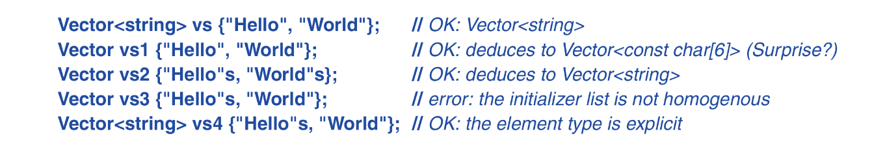

A template is a class or function we parameterize with a set of types or values. Templates are use to model a generalized object or entity.

## 7.2 Parameterized Types
We can generalize our vector class as so:
```c++
template <typename T>
class Vector {
private:
	T* elem;
	int sz;
public:
	explicit Vector(int s);
	~Vector() { delete[] elem; }
	
	// copy and move operations.
	
	T& operator[](int i);             // non-const vecs.
	const T& operator[](int i) const; // const vecs.
	int size() const { return sz; }
};
```
using `class` to introduce a type parameter is equivalent to using `typename`, so line 1 can be written as `template <class T>`

The member functions can be defined similarly as:
```c++
template <typename T>
Vector<T>::Vector(int s)
{
	if(s<0)
		throw length_error("Vector constr.: -ve size");
	elem = new T[s];
	sz = s;
}

template <typename T>
const T& Vector<T>::operator[](int s) const
{
	if (s < 0 || s >= sz)
		throw out_of_range("Vector::operator[]");
	return elem[s];
}
```
Given these definition of the vector class we can define vectors as so:
```c++
Vector<char> vc(200);
Vector<list<int>> vli(45);
```

## Grant container `range-for-loop` feature
To support the range-for-loop of our `Vector`, we must define suitable `begin()` and `end()` functions:
```c++
template <typename T>
T* begin(Vector<T>& x)
{
	return &(x[0]);
}

template <typename T>
T* end(Vector<T>& x)
{
	return &x[0]+x.size();  // one pointer past last element.
}
```
Given those we can write:
```c++
void write2(vector<string>& vs)
{
	for(auto& s: vs)
		cout << s << '\n';
}
```
Templates are compile-time mechanism, so their use incurs no run-time overhead compared to hand crafted code.

## 7.2.1 Constrained Template Arguments
Often , template will make sense only for template arguments that meet a certain criteria. For example , `Vector` class offer copy operation and so template argument types that do no support such operations will render the `Vector` class errorneous. 

To solve this we must specify that `Vectors` template arguments is not just a `typename` but an `Element` that satisfies the requirements for a `Vector` class:

```c++
template <Element T>
class Vector {
private:
	T* elem;
	int sz;
}
```
in `template<Element T>` ; `Element` is a predicate that checks whether T has all the properties that a `Vector` requires. Such a predicate is called a *concept*.

A template argument in which argument for which a concept is specified is called a **constrained argument**.

It is a compile error to try to use a template with a type that does not meet its requirements. For example:
```c++
Vector<int> v1;     // Ok we can copy int.
Vector<thread> v2;  //ERROR; we can't copy a standard thread.
```
C++ did not officially support concepts before c++20.

Concepts lest the compiler do type checking at the point of use. giving better error messages far earlier than is possible with unconstrained template arguments.

## 7.2.2 Value Template Arguments
In addition to type Arguments, a template can take Value arguments:
```c++
template <typename T, int N>
struct Buffer{
	constexpr int size() { return N; }
	T elem[N];
}
```
Template Value arguments allow us to create things like arbitrarily sized buffers with no use of the free store:
```c++
Buffer<char, 1024> glob;

void fct()
{
	Buffer<int, 10> buf;
}
```
Unfortunately for obscure technical reasons, a string literal cannot yet be a template value argument. Fortunately a workaround is defined below:
```c++
template<char* s>
void out() { cout << s; }

void use() {
	out<"Straightforward use">();  // ERROR
	// string literal cannot be value arg.

	char[] str = "Workaround use";
	out<str>(); // LEGAL: writes.
}
```

## 7.2.3 Template Argument Deduction
When defining a type as an instantiation of a template we must specify its template argument:
```c++
pair<int, double> p = {1, 5.2};
```
having to specify the template argument types can be tedious; fortunately the constructor can deduce the template arguemnts type from an initializer:
```c++
pair = {1, 5.2};
```
an example with containers:
```c++
template <typename T>
class Vector {
public:
	Vector(int);
	Vector(initializer_list<T>);
	// ..
};

Vector v1 {1, 2, 3};          // type deducted
Vector v2 = v1;               // type deducted fromm v1
auto p = new Vector{1, 2 ,3}; // p is Vector<int>
Vector<int> v3(1);            // here we need to be 
// specific about the template argument type since this
// object is constructed using the Vector(int) constr.
```
Although  type argument deduction eliminate syntactical annoyances, it is not a panacea, it can cause surprises in some cases:



if elements of an initializer list have different types, we cannot deduce a unique element type so we get an ambiguity error. Consider:
```c++
template <typename T>
class Vector {
public:
	Vector(initializer_list<T>);
	
	template<typename Iter>
		Vector(iter b, iter e);
	
	struct iterator { using value_type = T; /*...*/ };
	iterator begin();
};

Vector v1{1, 2, 3, 4, 5};                  // element type: int
Vector v2(v1.begin(), v.begin()+2);        // ambiguous
Vector v3(9, 17);                          // ambiguous
```
We could resolve these using *concepts* but for compatibility with older code: we can add a *deduction guide*:
```c++
template<typename Iter>
	Vector(Iter b, Iter e) -> Vector<typename Iter::value_type>;
```
Now we have:
```c++
Vector v1{1, 2, 3, 4 ,5};              // element type is int
Vector v2(v1.begin(), v1.begin()+2);   // pair of iters. of elem type int
Vector v3{v1.begin(), v1.begin()+2};   // elem type is v2::iterator.
```
Type deduction in this case works because we established that when iterators are used as arguments while `()`constructing a vector: The type of the Vector to be constructed is type of the elements the iterator iterates.

It works in this scenario because we have defined that an iterator posses an aggregated relationship with what type of element the iterator iterates.

Also the `{}` initialization syntax always prefers the `initializer_list` constructor if present. That’s why `v3`is a vector of iterators: `Vector<Vector<int>::iterator>`

## 7.3 Parameterized Operations
There are three ways of expressing an operation parameterized by types or values:
* A function template
* A function object: an object that can carry data and be called like a function
* A lambda expression: a shorthand notation for a function object'

## 7.3.1 Function Templates
an example:
```c++
template<typename Sequence, typename Value>
Value sum(const Sequence& s, Value v)
{
	for(const auto& x: s)
		v+=x;
	return v;
}
```
It can be used as so:
```c++
void user(Vector<int>& vi, list<double>& ld, vector<complex<double>>& vc)
{
	int x = sum(vi, 0);
	double d = sum(vi, 0.0);
	double dd = sum(ld, 0.0);
	auto z = sum(vc, complex{0.0, 0.0});
}
```
This `sum()` is a simplified version of the standard-library `accumulate()`

## 7.3.2 Function Objects
A particular useful kind of template is the *function object* (sometimes called a *functor*); It define objects that can be called like functions:
```c++
template<typename T>
class Less_than {
	const T val;
public:
	Less_than(const T& v): val{v} {}
	bool operator()(const T& x) const { return x<val; }
}
```
The function called `operator()` implements the *application operator*, also called “function call” or just “call”.
We can define named variables of type `Less_than` for some arg types:
```c++
Less_than lti {42};
Less_than lts {"Backus"s};
Less_than<string> lts2 {"Naur"};
```
we can call such an object, just like a function call:
```c++
void fct(int n, const string& s)
{
	bool b1 = lti(n);      // true if n<42
	bool b2 = lts(s);      // true if s<"Backus"
}
```
Function objects are widely used as arguments to algorithms, they can serve as a predicate to a set of values.
```c++
template <typename C, typename P>
int count(const C& container, P predicate)
{
	int count = 0;
	for(const auto& x: container)
		if (predicate(x)) 
			++count;
	return count;
}
```
A *predicate* is something that we can invoke to return true or false. An example:
```c++
void f(const Vector<int>& vec, const list<string>& lst, 
		int x, const string& s)
{
	cout << "number of values less than " << x << ": " << 
		count(vec, Less_than{x}) << '\n';
	cout << "number of values less than " << s << ": " <<
		count(lst, Less_than{s}) << '\n';
}
```
Since simple object functions inlining are also simple, it makes it far more efficient than an indirect function call. The ability to carry data plus their efficiency makes function objects particularly useful as arguments to algorithms.

## 7.3.3 Lambda Expressions
There is a notation for conveniently generating function objects:
```c++
void f(const Vector<int>& vec, const list<string>& lst, 
		int x, const string& s)
{
	cout << "number of values less than " << x
		 << ": " << count(vec, [&](int a){ return a<x; })
		 << "\n";
}
```
The notations `[&](int a){return a<x;}` is a *lambda expression*. It generates a function object similar to `Less_than<int>(x)`.
### Lambda capture list
* the `[&]` is a capture list that specifies that all local names used in the lambda body will be accessed through references.
* `[&x]` only captures x via reference.
* `[x]` captures x via value passing (by copying)
* `[]` captures nothing
* `[=]` captures all local name via value
* `[this]`: captures the current object via reference
* `[*this]`: captures the current object as a copy
* `[i, this]` capture multiple objects

## 7.3.3.1 Lambdas as function arguments
Using lambdas can be convenient and terse, but also obscure. For non-trivial actions (say more than a simple expression), It is preferable to name the function object.

In scenario in which we need a set of actions applied to a set of data, in a fashion that allows us to arbitrary plug in the action like some sort of module, function objects can help us separate the traversal of the datum in said data-set from the actual action that is taken upon each datum. Separating the action of traversal and the action of datum-dependent compute into two demi-independent entities; increasing modularity.

An example:
```c++
template <typename C, typename Oper> 
void for_each(C& c, Oper op)
{
	for(auto& x: c)
		op(x);
}

void user()
{
	Vector<unique_ptr<Shape>> v;
		while(cin)
			v.push_back(read_shape(cin));
	for_each(v, [](unique_ptr<Shape>& s){ s->draw(); });
	for_each(v, [](unique_ptr<Shape>& s){ s->rotate(45); });
}
```
Like a function, lambdas can be generic:
```c++
template <class S>
void rotate_and_draw(Vector<S>& v, int r)
{
	for_each(v, [](auto& ps){ ps->rotate(r); ps->draw(); });
}
```
because pf the auto in function object parameter, this function object is a *generic lambda*. When needed we can constrain the parameter with a concept. Bjarne poorly explains this.

## 7.3.3.2 Lambdas for initialization
Using a lambda, we can turn any statement into an expression. This is mostly used to provide an operation to compute a value as an argument value, but the ability is general.

Consider:
```c++
enum class init_mode { zero, seq, cpy, patrn};

void user(init_mode m, int n, vector<int>& arg, Iterator p, Iterator q)
{
	vector<int> v;
	// messu initialization code:
	switch(m){
	case zero:
		V = vector<int>(n);
		break;
	case cpy:
		v = arg;
		break;
	case seq:
	};
	
	if(m==seq)
		v.assign(p, q)
}
```
This example is not atypical, although it performs its task, it’s method of doing so is unsightly and prone to bugs (bjarne listed them).

Lambdas solve these issues:
```c++
void user(init_mode, int n, vector<int>& arg, Iterator p, Iterator q)
{
	vector<int> v = [&]{
		switch(m) {
			case zero : return vector<int>(n);
			case seq  : return vector<int>(p,q);
			case cpy  : return arg;
		}
	}();
}
```

## 7.3.3.3 Finally
In cases that we need to do some cleanup that is not associated with a single object, or with an object that does not have a destructor (e.g because it is a type shared with C program) we can define a function, finally that takes an action to be executed on the exit from the scope, using lambdas:
```c++
void old_style(int n) {
	void* p = malloc(n*sizeof(int));
	auto act = finally([&]{ free(p); });
	// ..
	// p is impliciltu freed upon scope exit
}
```
the finally function is a trivial one:
```c++
template <typename F>
struct Final_action {
	F act;
	explicit Final_action(F f): act{f} {};
	~Final_action() { act(); }
};

template <class F>
[[nodiscard]] auto finally(F f)
{
	return Final_action{f};
}
```
the `[[nodiscard]]` attribute ensures that users do not forget to copy a generated `Final_action` into the scope for which the action is intended. There is a `finally()`  in the Core Guidelines Support Library (the GSL)

## 7.4 Template Mechanisms
To define good templates, we need some supporting language facilities:
* Values dependent on a type: *variable templates*
* Aliases for types and templates: *alias templates*
* A compile-time selection mechanism: `if constexpr`
* A compiler-time mechanism to inquire about properties of types and expression: `requires-` expression
in addition `constexpr`functions and `static_asserts` often tale part in template design and use.

## 7.4.1 Variable Templates
Here is an example of a constant variable template \[Garicia, 2015]:
```cpp
template <class T>
	constexpr T viscosity = 0.4;
template <class T>
	constexpr space_vector<T> external_acceleration = {T{},T{-9.8},T{}};

auto vis2 = 2*viscosity<double>;
auto acc = external_acceleration<float>;
```
Here `space_vector` is a three dimensional vector.

Naturally we can use arbitrary expressions of suitable types as initializers:
```c++
template<typename T, typename T2>
constexpr bool Assignable = is_assignable<T&,T2>::value;

template<typename T>
void testing()
{
	static_assert(Assignable<T&,double>, "can't assogn a double to a T");
	static_assert(Assignable<T&,string>, "can't assign a string to T");
}
```
The standard library uses variables templates to provide mathematical constants, such as `pi` and `log2e`.

## 7.4.2 Aliases
It is often useful to introduce a synonym for a type or a template. For example, `size_t` **maybe**:
```c++
using size_t = unsigned int;
```
The actual type named `size_t` is implementation-dependent. so in another implementation of `size_t` maybe an `unsigned long`. The alias `size_t` allows a programmer to write portable code.

It is common to provide an alias for the types related to their template, an example:
```c++
template<typename T>
class Vector{
public:
	using value_type = T;
	//..
};
```
This `value_type` alias helps us give a name for the type of the classes element, in this case the class is an element and with this we can write code that follow this convention:
```c++
template<typename C>
using Value_type = C::value_type;

template<typename Container>
void algp(Container& c)
{
	Vector<Value_type<Container>> vec;
	//..
}
```
Aliasing can help us define new templates bu biding some or all template arguments:
```c++
template <typename Key, typename Value>
class Map {
	//..
};

template <typename Value>
using string_map = Map<string, Value>;

string_map<int> m;  // m is a map of int values accessed by string keys.
```

## 7.4.3 Compile-Time `if`
Only the selected branch of an `if constexpr` is checked by the compiler. This offers optimal performance and locality of the optimization. An example:
```c++
template <typename T>
void update(T& target)
{
	//..
	if constexpr(is_trivially_copyable_v<T>)
		simple_and_fast(target);  // for plain data
	else
		slow_and_safe(target); // for complex types. !Checked by compiler
}
```
The reason for why the `if constexpr` is a useful concept is explained in the book. I do understand it but i want my notes to be shorter so i won’t go into the details (I know writing that i want shorter notes with a manic repetitive re-explanation of myself continuously saying i want shorter notes defeats the logic of actually wanting to write shorter notes so i’ll just stop now).

## Advice
* Use templates to express algorithms that apply to many argument types
* Use templates to express containers
* Templates are type safe, but for unconstrained template checking happens too late
* Let constructors or function templates deduce class template argument types
* Use function objects as arguments to algorithms
* Use a lambda if you need a simple function object in one place only
* A virtual function member cannot be a template member function.
* Use finally to provide `RAII` for types without destructors that require cleanup
* Use template aliases to simplify notation and hide implementation details
* Use `if constexpr` to provide alternative implementation without run-time overhead.
