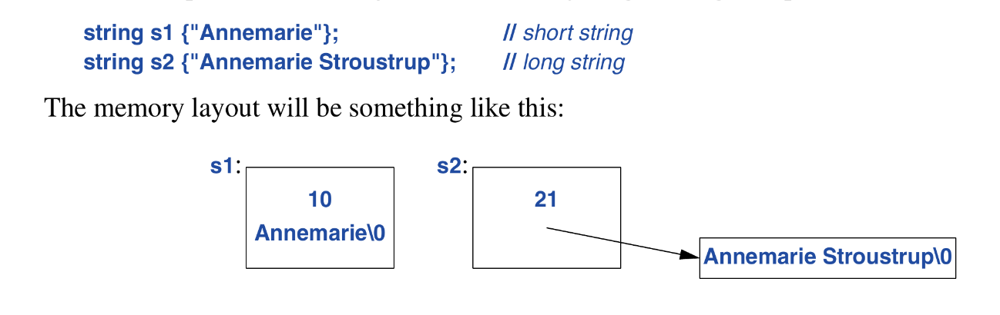
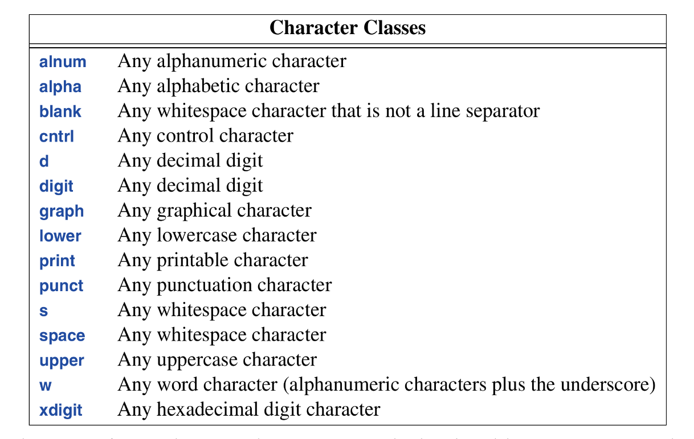
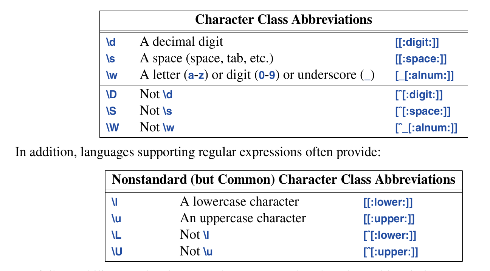

Text manipulation is large part in c++ progams and the c++ library offers `string` type to save users from C-style pointer manipulation tactics.

A `string_view`allows us manipulate a sequence of characters however they may be stored. 

In addition support regex operations.

## 10.2 Strings
A `string` type is a `regular` type for owning and manipulating a sequence of characters of various character types.

*  String types can concatenate:
```c++
string compose(const string& name, const string& domain)
{
	return name + '@' + domain;
}
```
`+` with strings performs concatenation. The string has a move constructor so returning large strings by value is effcient.

* Strings also support the `+=` operation
```c++
string s1 = "This is a "s;
s1 += "concatenated string"s
```

* Strings are mutable: In addition to `=` and `+=`, sub-scripting (using`[]`) and sub-string operations are supported. For example:
```c++
string name = "Felix Leander Ike O.";

void m3()
{
	string s = name.substr(6, 7);  // s = "Leander"
	name.replace(0.5, "nicholas");
	name[0] = toupper(name[0]);
}
```

| string operation | description                                                                                                                                                                                                                             |
| ---------------- | --------------------------------------------------------------------------------------------------------------------------------------------------------------------------------------------------------------------------------------- |
| `substr()`       | → returns a string that is a copy of the sub-string indicated by its arguments. The first argument is an index into the `string`, the second the length of the substring.                                                               |
| `replace()`      | → replaces a substring with a value. first and second arguments specifies  start and end index of substring, third argument is the replacement string. the replacement string need not be the same size of the to-be-replaced substring |
| toupper()        | → kind descriptive nigga                                                                                                                                                                                                                |
|                  |                                                                                                                                                                                                                                         |
* Strings can be compared to each other
```c++
string incantation;

void respond(const string& answer)
{
	if(answer == incantation){
		//.. perform magic
	}
	else if (answer == "yes") {
		//..
	}
	//..
}
```
* C++ also support C-style strings (a zero terminated array of `char`), `string` offers only read-only access to its contained characters via `c_str()` and `data()`
```c++
void print(const string& s)
{
	printf("For people who like printf: %s\n", s.c_str());
	cout << "For people who lie streams: " << s << '\n';
}
```
* String literals by definition is `const char*`. To get a literal of type `std::string` use an `s` suffix:
```c++
auto cat = "Cat"s;   // an std::string
auto dog = "Dog";    // a C styles string (const char*)
```

## 10.2.1 `string` Implementation
These days, `string` is usually implemented using the *short string optimization*. That is, short string values are kept in the string object itself, and only longer strings are placed on the free store. The number of characters for what constitutes a short string is platform specific, but “about 14 characters” isn’t a bad guess, usually, above that is considered a long string.



To handle multiple character sets, `string` is really an alias for a general template `basic_string` with the character type `char`:
```c++
template<typename Char>
class basic_string {
	//..
};

using string = basic_string<char>;
```
Meaning, we can arbitrarily define strings for specified character types. for example assuming we have a character type `Jchar` we can write:
```c++
using Jstring = basic_string<Jchar>;
```
now we can perform string operations on `Jstrings`.

## 10.3 String Views
A `string_view` gives access to a contiguous sequence of characters. The characters can be stored in many possible ways (`string`, C-style strings, etc.). A string-view acts like a pointer or reference in that it does not own the characters it points to.

String view UML constructors (not all):
```c++
+string_view(begin: iterator, size: int) : string_view.
+string_view(string).
```

A significant restriction of `string_view` is that it is a read-only view of its characters. 

Usage of string views:
```c++
string cat(string_view sv1, string_view sv2)
{
	string res {sv1};
	return res += sv2;
}

string king = "Harold";
auto s1 = cat(king, "William");
auto s2 = car(kinf, king);
auto s2 = cat("Edward", "Stephen"sv);
auto s4 = cat("Canute"sv, king);
auto s5 = cat({&king[0], 2}, "Henry"sv);
auto s6 = cat({&king[0], 2}, {&king[2], 4});
```

To make the string view literal `sv` we have to bring it into scope via:
```c++
using namespace std::literals::string_view_literals;
```
literal `"Edward"sv`, a `string_view` literal, length is computed at compile time. Meanwhile, “Edward” since its just a `const char*` and doesn’t come with an attribute that enables its length to be calculated at compile time; we'll have to iterate over it to find its length.

### String views defines a range
so we can traverse it’s characters as so:
```c++
void print_lower(string_view sv1)
{
	for(char ch: sv1)
		cout << tolower(ch);
}
```

`string_view` should be thought of as some kind of pointer; to be used; it must point to something:
```c++
string_view bad()
{
	string s = "Once upon a time";
	return {&s[5], 4}; // ERROR: bad
	// returning a pointer to an object about to be destroyed.
}
```

## 10.4 Regular Expressions
In `<regex>` the std library provides support for regular expressions in the form of the `std::regex` class and its supporting functions. We can define a pattern as so:
```c++
regex pat {R"(\w{2}\s*\d{5}(-\d{4})?)"};
```
This is a regex object to match the *US postal code pattern*.

To express a pattern we use a **raw string literal** starting with `R"(` and terminated by `)"`. This allows backlashes and strokes to be used directly in a string. They are suitable for regex because regex patterns tend to contain a lot of backslashes and “special” characters.

in `<regex>`, the standard library provides support for regular expressions:
* `regex_match()`: match a regular expression against a string (of known size)
* `regex_search()`: search for a string that matched a regular expression in an (arbitrarily long) stream of data.
* `regex_replace()`: search for strings that match an expression in an (arbitrarily long) stream of data and replace them.
* `regex_iterator`: Iterate over matched and sub-matches.
* `regex_token_iterator`: Iterate over non-matches.

## 10.4.1 Searching
simplest way of using a pattern is to search for it in a Stream:
```c++
int lineno = 0;
for(string line; getline(cin, line);) {
	++lineno;
	smatch matches;
	
	if (regex_match(line, matches, pat))
		cout << lineno << ':' << matches[0] << '\n';
}
```
`regex_search(line, matches, pat)`: searches the `line` for anything that matches the regular expression stored in `pat` and if it find any matches, it stores them in `matches`. `matches` variable is of type `smatch` which is a vector of regex “matches” of type `string`. The first element of `smatches` is a complete match of the regex pattern. To be more elaborate:
```c++
void use()
{
	ifstream in {"file.text"};
	if (!in) {
		cerr << "no file\n";
		return;
	}
	
	regex pat {R"(\w{2}\s*\d{5}(-\d{4})?)"};
	
	int lineno = 0;
	for (string line; getline(in, line)) {
		++lineno;
		smatch matches;
		if (regex_search(line, matches, pat)) {
			cout << lineno << ": " << matches[0] << '\n';
			if (matches.size()>1 && matches[1].matched)
				cout << '\t' << macthes[1] << '\n';
		}
	}
}
```
`matches[0]` is match of the whole pattern and `matches[1]`  is the optional for digit sub-pattern `(-\d{4})?`.

## 10.4.2 Regular Expression Notation
The syntax of regular expressions is based on special characters:

| Regular  Expression  Special  Char    | -acters                                          |
| ------------------------------------- | ------------------------------------------------ |
| .     Any single character (wildcard) | \       Next character has a special meaning     |
| \[     Begin character class          | \*      Zero or more (suffix operation)          |
| \]     End character class            | \+     One or more (suffix operation)            |
| \{     Begin count                    | ?      Optional (Zero or one) (suffix operation) |
| \}     End count                      | \|       Alternative (or)                        |
| \(     Begin grouping                 | \^      Start of line; negation                  |
| \)     End grouping                   | $      End of line                               |


For example to specify “A line that begins with zero or more As followed by one or more Bs followed by an optional C” its pattern will be:
```regex
^A*B+C?$
```
A part of a pattern is considered a sub-pattern (which can be extracted separately from an `smatch`) if it is enclosed in parentheses. An example:
```regex
\d+-\d+             // no  subpatterns
\d+(-\d+)           // one subpattern
(\d+)(-\d+)         // two subpatterns
```
A pattern can be optional or repeated (default is exactly once) by adding a suffix:

| Repetition                                              |
| ------------------------------------------------------- |
| `{ n }`                Exactly n times                  |
| `{ n, }`              n or more times                   |
| `{n, m}`              At least n and at most m times    |
| `*`                       Zero or more, that is, `{0,}` |
| `+`                       One or more, that is, `{1,}`  |
For example:
```regex
A{3}B{2,4}C*
```
This pattern roughly translates to “i will match any string beginning with 3`A`s followed by at least 2 but not more than 4 `B` characters and then can either be followed by nothing or multiple instances of a `C` character ( must be 1`C` or more)”.

The suffix `?` after any repetition notation (`?, *, +, and {}`) makes the pattern matcher “lazy” or “non-greedy”. That is when looking for a pattern, it will look for the shortest match rather than longest. By default a pattern matcher always look for the longest match; this is known as the *Max Munch Rule*. Consider: 
```text
ababab
```
the pattern `(ab)+` should match `ababab` (the whole string), but when we make it “lazy” → `(ab)+?`: it only matches `ab`.

The most common character classification have names:



in regex, a character name must be bracketed by `[: :]` example → `[:digit:]` → matches a digit. For them to be used the must also be enclosed with a `[]` pair defining a character class.

I feel →  a character class is a group of characters enclosed within `[]`;  we can use a class can define what characters we want said class to match. To negate the characters while defining the class, inside the enclosed bracket, the first character to be declared should be the negation character `^`. Examples:
```regex
[aeiou]      // class that matches the english vowel
[^aeiou]     // class that matches whatever is NOT an english vowel
[a^eiou]     // class that matches the english vowel and character ^
```

Several character classes are supported by shorthand notation:



For full portability, use the character class names rather than abbreviations.

==An Example==: consider writing a pattern that describes C++ identifiers: an underscore or a letter followed by a possibly empty sequence of letters, digits, or underscores:
```regex
[[:alpha:]_][[:alnum:]_]*              // valid: but messy
([[:alpha:]|_])([_[:alnum:]])*         // valid: also messy
[[:alpha:]_]\w*                        // valid.
```

Here is a function that returns if a string is a valid c++ identifier:
```c++
bool is_identifier(const string& s)
{
	regex pat {R"([[:alpha:]̣_]\w*)"};
	return regex_match(s, pat);
}
```
A group (sub-pattern) potentially to be represented by a `sub_match` is delimited by parentheses. If you need parentheses that should no define a sub-pattern, use `(?:` rather than plain `(`. For example:
```c++
(\s|:|,)*(\d*)       // two sub-patterns
(?:\s|:|,)*(\d*)     // one sub-pattern
```
groups cannot be nested. For a more exhaustive presentation of regular expressions, see [¹Friedl, 1997]

## 10.4.3 Iterators
We can define a `regex_iterator` for iterating over a sequence of characters finding matches for a pattern. More specifically we can use an `sregex_iterator` which is basically `regex_iterator<string>`:
```c++
void test()
{
	string input = "aa as; asd ++e^asdf asdfg";
	regex pat {R"(\s+(\w+))"};
	for (sregex_iterator p(input.begin(), input.end(), pat); 
		p!=sregex_iterator{}; ++p )
	{
		cout << (*p)[1] << '\n';
	}
}
```
this output:
``` 
as
asd
asdfg
```

## Advice
* The default regular expression notation is that of ECMAScript (Javascript)
