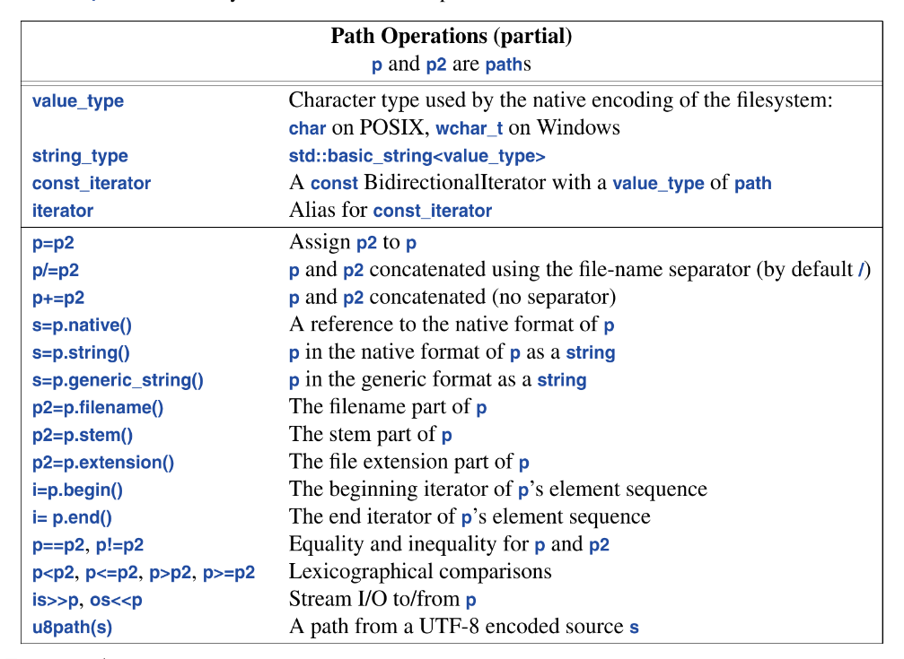
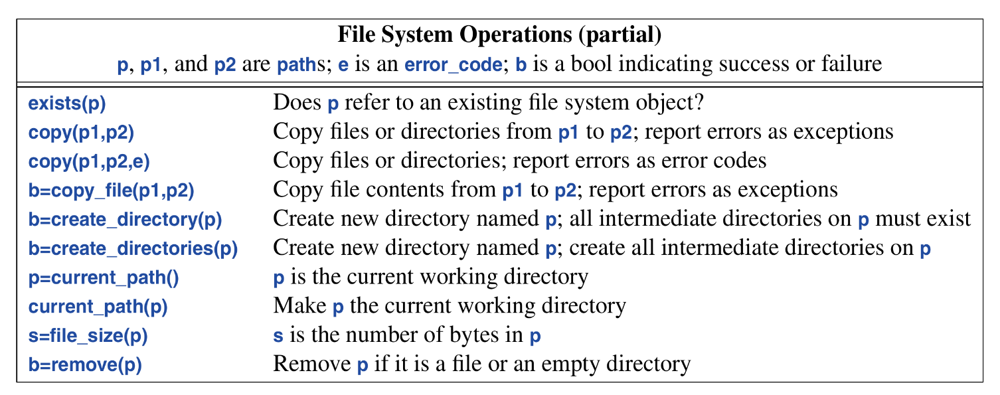

The I/O stream contains formatted and unformatted buffered I/O of test and numeric values. It is extensible to support user-defined types and is type safe.

An `ostream` converts typed objects to a stream of characters (bytes). An `istream` converts a stream of characters (bytes) to a typed objects.

Operation on these streams are type-safe, type-sensitive and extensible to handle user-defined types just like inbuilt types.

The I/O stream classes all have destructors that free all resources owned (such as buffers and file handles). They are examples of `RAII`.

## 11.2 Output
In `<ostream>` the I/O stream library defines output for every built-in type.  `cout` is the standard output stream and `cerr` is the standard stream for reporting errors-
```c++
cout << "This is Output " << 1 << '\n';
```
It use the operator `<<`, that roughly translates to “put to”
## 11.3 Input
In `<instream>`, the standard library offers `istreams`. Just like `ostream`, `instream` deal with character string representation of built-int types and can easily be extended to cope with user defined types.

It uses the operator `<<` which roughly translates to “get from”, the type of the value at the rhs of the operator determines what input is accepted. 

Both input and output operations can be chained.

When reading a number the initial whitespace is skipped and the read of the integer is terminated by any character that is not a digit.

Often we want to read a sequence of characters, a convenient way is to read into a `string`:
```c++
cout << "enter your name: ";
string str;
cin >> str;
cout << "hello " << str;
```
By default when reading a string, whitespace characters, such as a space or newline, terminates the read.

To read a whole line we use the `getline()` functions:
```c++
cout << "please enter your name\n";
// input was "Eric Boudoir is king"
string str;
getline(cin, str);
cout << "Hello " << str << '\n';
// output will be "Eric Boudoir is king"
```
The newline that terminated the line is discarded, so `cin` is ready for the next input line.

Using formatted I/O operations is usually error-prone, more efficient and less code than manipulating characters one by one. We can do formatting to and from memory using `stringstreams`.

## 11.4 I/0 state
An `iostream` has a state that we can examine whether an operation succeeded. The most common use is to read a sequence of values:
```c++
vector<int> read_ints(istream& is)
{
	vector<int> res;
	for (int i; is>>i;)
		res.push_back(i);
	return
}
```
when an `istream` (and also `ostream`) undergoes some input operation it returns itself and “itself” posses a boolean state with every operation than can be checked as a conditional. After an operation if the `istream` yields `true` if the stream is ready for another operation (valid state), if not → `false` (invalid state).

In general, the I/O state holds all the information needed for read or write, such as formatting information, error state, and what kind of buffering is used.

A user can also set the state to reflect that an error has occurred and clear the state if the error wasn’t serious. For example → a version of `read_ints` that accepted a terminated string:

```c++
vector<int> read_ints(istream& is, const string& terminator)
{
	vector<int> res;
	for(int i; is>>i; )
		res.push_back(i);
	
	if(is.eof())                        // fine: end of file
		return res;
	if(is.fail()) {                     // int read failed; terminator?
		is.clear();                     // reset state to good()
		string s;
		if (is>>s && s==terminator)
			return res;
		is.setstate(ios_base::failbit); // add fail() to is's state
	}
	return res;
}

auto v = read_ints(cin, "stop");
```

## 11.5 I/O of User-Defined Types
We can also define I/O for our own types. An example:
```c++
struct Entry {
	string name;
	int number;
};
```
we can define a simple output operator to write `Entry` like so:
```c++
ostream& operator<<(osstream& os, const Entry& e)
{
	return os << "{\"" << e.name << "\"," << e.number << "}";
}
```
The corresponding input operator is more complicated because it has to check got correct formatting
```c++
istream& operator>>(istream& is, const Entry& e)
	// read {"name",number}
{
	char c, c2;
	if (is>>c>>c2 && c=='{'&& c2=='"') {
		string name;
		for(;is.get(c) && c!='"';)
			name+=c;
			
		if (int number=0 ;is>>c>>number>>c2 && c ==',' && c2=='}') {
			e = {name, number};
			return is;
		}
	}
	is.setstate(ios_base::failbit);
	return is;
}
```
`is.get(c)` doesn’t not skip whitespace like `is>>s`.

## 11.6 Output Formatting
The `iostream` and `format` libraries provide operations for controlling the format of input and output. `iostream` facilities are old but `format` facilities are recent and focus on `printf()`-style

## 11.6.1 Stream Formatting
The simplest formatting controls are called *manipulators* and are found in `<ios>`, `<istream>`, `<ostream>` and `<iomanip>` (for manipulators that take arguments). For example:
```c++
cout << 1234 << ' ' << hex << 1234 << ' ' << oct << ' ' << dex << 1234 
	 << '\n';
// result: 1234 4d2 2322 1234
```
we can explicitly set the output format fro floating point numbers:
```c++
constexpr double d = 123.456;

cout << d << "; "
	 << scientific << d << "; "
	 << hexfloat << d << "; "
	 << fixed << d << "; "
	 << defaultfloat << d << '\n';
```
This produces:
```c++
123.456; 1.234560e+002; 0x1.edd2f2p+6; 123.456000; 123.456
```
Precision is an integer that determines the number of digits used to display a floating-point number. Floating point values are rounded rather than truncated, and `precision()` doesn’t affect integer output. For example:
```c++
cout.precision(8);
cout << "p(8):" << 1234.56789 << '' << 1234.56789 << '' << 123456 << '\n';

cout.precision(4);
cout << "p(4):" << 1234.56789 << '' << 1234.56789 << '' << 123456 << '\n';
cout << 1234.56789 << '\n';
```
Floating point manipulators are “sticky”: that is, their persist for subsequent floating-point operations. They are designed for formatting streams of values.

Stream I/O is extensible, so we can define `<<` for our own (user-defined) types.

## 11.6.2 `printf()`-style Formatting
In `<format>`, the standard library provides a type-safe `printf()` style formatting mechanism (C `printf()` is not type safe). The basic function, `format()` produces a `string`:
```c++
string s = format("Hello, {}\n", val);
```
Ordinary characters are placed in the *format string*, the format string is delimited by `{ and }`, they also specify how argument are to be placed in format string. `{}` is the simplest format string (it takes an argument and prints it by its `<<`default if any). It has its own formatting style which i feel is not worth documenting.

## 11.7 Streams
The standard library directly supports:
* *Standard streams*: streams attached to the systems standard I/O
* *File streams*: streams attached to files
* *String streams*: streams attached to strings
* *Memory streams*: stream attached to specific areas of memory
* *Synchronized streams*: streams that can be used from multiple `thread`s without data races
In addition, we can define our own streams. streams cannot be copied, they should be passed by reference.

All standard-library streams are templates with their character type as a parameter. For example: `ostream` → `basic_ostream<char>`. There also exist a version for `wchar_t`s (wide characters—allows unicode processing), `wostream` is `<basic_ostream<wchar_t>>`.

## 11.7.1 Standard streams
* `cout` → for ordinary output
* `cerr` → for unbuffered “error output”
* `clog` → for buffered “logging output”
* `cin`   → for standard input

## 11.7.2 File Streams
In `<fstream>`, the standard library provides stream to and from a file:
* `ifstream` → for reading from a file
* `ofstream` → writing to a file
* `fstream`   → for reading from and writing to a file.
For example:
```c++
ofstream ofs {"target"};
if (!ofs)
	error("Couldn't open 'target' for writing");
```
Testing that a file stream has been opened is usually done by checking its state.
```c++
ifstream ifs {"source"};
if (!ifs)
	error("Couldn't open source for reading")
```
Assuming that tests succeeded, `ofs` can be used just like `cout` (as an ordinary `ostream`) and `ifs` can be used just like `cin`.

## 11.7.3 String Streams
in `<sstream>`, the standard library provides streams to and from a `string`:
* `istringstream` for reading from a `string`
* `ostringstream` for writing to a `string`
* `stringstream` for reading from and writing to strings

The contents of an `ostringstream` can be read using `str()` ( a string copy of the contents ) or `view()` (a string view of the contents).
```c++
void test()
{
	ostringstream oss;
	oss << "{Temperature," << scientfic << 123.4567890 << '}';
	cout << oss.view() << '\n';
}
```
A common use of `ostringstream` is to format before given the result to a GUI. Similarly, `istringstream` can be used to perform formatted input operations after the string has been received from a GUI.

## 11.7.4 Memory Streams
From the earliest days of c++ they have been streams attached to sections of memory designated by the user, so we can read and write to. Streams such as `spanstream`, `ispanstream` and `ospanstream` are widely available although won’t be official till c++ 23.

`ospanstream` behaves like an `ostringstream` and is initialized like it except `ospanstream` takes a `span` rather than a `string` as argument
```c++
void user(int arg)
{
	array<char, 128> buf;
	openstream ss(buf);
	ss << "write" << arg << "to memory\n"
}
```

## 11.7.5 Synchronized Streams
In a multi-threaded system I/O becomes a mess unless:
* one thread uses the stream
* Access to a stream is synchronized so the stream is accessed one thread at a time
An `osyncstream` guarantees that a sequence of output operations will complete an their result will be as expected in the output buffer even if some other `thread` tries to write. 

For example:
```c++
void unsafe(int x, string& s)
{
	cout << x;
	cout << s;
}
```
A different thread might introduce a data race and lead to surprising output. An `osyncstream` avoids that.
```c++
void safer(int x, string& s)
{
	osyncstream oss(cout);
	oss << x;
	oss << s;
}
```
Concurrency will be explained in chapter 18.

## 11.8 C-style I/O  (and speeding I/O without it)
Bjarne advises against the use of c-style I/O mechanisms due to them being type unsafe and securely unsafe. He also advice that  If we don’t use C-style I/O but care about I/O performance we should call:
```c++
ios_base::sync_with_stdio(false);
```
without that call, the standard `iostreams` can be significantly slowed down to be compatible with the C-style I/O.

If we like C `printf` we should consider `format()`, its safer, flexible and as fast.

## 11.9 File System
The system library `<filesystem>` offers a uniform interface to most facilities of most file systems. Using `<filesystems>` we can portably:
* express file system paths and navigate through a file system.
* examine file types and the permissions associated with them

cppreference and Boost file-system documentation [Boost] gives detailed information of the file-system library.

## 11.9.1 Paths
`path` is a class, that hold the information about the path to/of a file. It is capable of handling varied character sets and conventions of many operating systems.

```c++
path f = "dir/hypothetical.cpp";
assert(exists(f));

if (is_regular_file(f))
	cout << f << "is a file; its size is " << file_size(f) << '\n';
```
File systems can be quite tricky; in this case although we have asserted that before operations are carried out on the file referenced by the file path `f`, at the moment of operating on it, the file could have been deleted or have some permission about it altered that rejects whatever operation we were to subject it to. This is because a program manipulating a file system (such as ours) runs on a system (usually) with other programs that have the ability to edit the file systems at it’s will.

A `paths` validity is not checked until its used, and even then its validity depends on the conventions of the system on which the program runs.

Naturally, a path can be used to open a file:
```c++
void use(path p)
{
	ofstream f{p};
	if (!f) error("bad file name; ", p);
	f << "Hello, file!";
}
```

In addition to `path`, `<filesystem>` offers types for traversing directories and inquiring about the properties of the file found

| File system type               | Type meaning                                           |
| ------------------------------ | ------------------------------------------------------ |
| `path`                         | A directory path                                       |
| `filesystem_error`             | A file system exception                                |
| `directory_entry`              | A directory entry                                      |
| `directory_iterator`           | For iterating over a directory                         |
| `recursive_directory_iterator` | For iterating over a directory and its sub-directories |
```c++
void print_dir(path p)
{
	try {
		if(is_directory(p)) {
			 cout << p << ":\n";
			 for (const auto& x: directory_iterator{p})
				 cout << " " << x.path() << '\n';
		}
	}
	catch (const filesytem_error& err) {
		cerr << ex.what() << '\n';
	}
}
```
A string can be implicitly converted to a path for use:
```c++
void use()
{
	print_directory(".");
	print_directory("..");
	print_directory("/");
	print_directory("c:");

	for(string s; cin>>s;)
		print_directory(s);
}
```

The `path` class offers many common and useful operations



```c++
void test(path p)
{
	if (is_directory(p)) {
		cout << p << ":\n";
		for(const auto& x: directory_iterator(p)) {
			const path& p = x;
			if (p.extension() == ".exe")
				cout << p.stem() << " is a windows executable" << '\n';
			else {
				string n = p.extension().string();
				if (n == ".cpp" || n == ".cxx" || n == ".C")
					cout << p.stem() << "is a C++ source file\n";
			}	
		}
	}
}
```

## 11.9.2 Files and Directories



Many operations  have overloads that take extra arguments, such as operating system permissions. The handling is far beyond this book scope. Look them up when you need them Felix.

Like the `copy()`, it has two versions; one that reports failures by throwing exceptions, and another that does so via error_codes. We use error codes when operations are expected to fail frequently in normal use and we throw exceptions when the error is considered “exceptional”.

## Advice
* `iostreams` are type-safe, type-sensitive and extensible
* when reading, always consider ill-formed input
* avoid `endl`
* define `<<` and `>>` for user defined types with values that have meaningful textual representations
* Use `cout` for normal output and `cerr` for errors.
* we can define `iostreams` for any kind of character `using ostream = basic_ostream<string>;`
* Binary I/O is supported (11.1)
* Chain `>>` operators for terser notation (same for `<<` operations)
* `strings` do not overflow.
* by default `>>` skips whitespace;
* Use stream state `fail` to handle potentially recoverable I/O errors.
* We don’t need to modify `istream` or `ostream` to add new `<<` and `>>` operators
* Use manipulators or `format()` to control formatting
* `#include <ios>` or `<iostream>` when using standard manipulators
* Stream formatting manipulators are “sticky” for use for many values in a stream.
* `#include <iomanip>` when using standard manipulators that take arguments
* Don’t try to copy streams; They are move only.
* Remember to check that a file stream is attached to a file before using it
* `stringstreams` or memory streams for in-memory formatting
* We can define conversions between any to types that both have a string representation
* C-style I/O is not type safe.
* Unless you use printf-family functions call `ios_base::sync_with_stdio(false)`
* Prefer `<filesystem>` to direct use of platform specific interfaces.