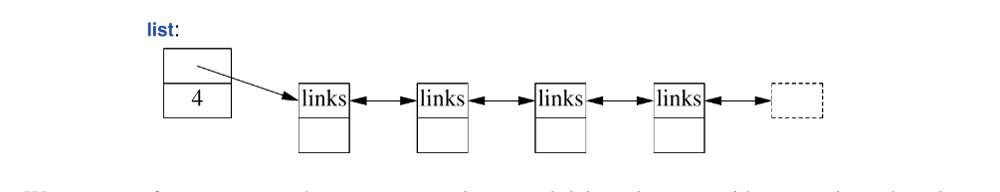
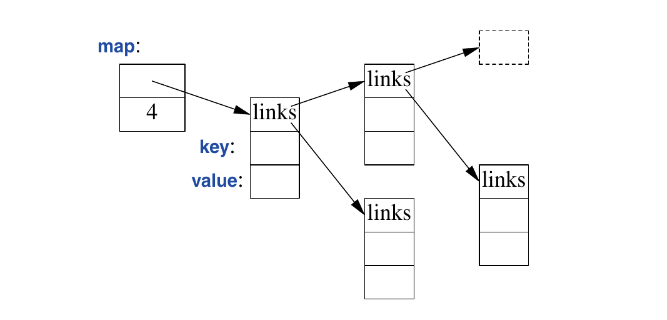
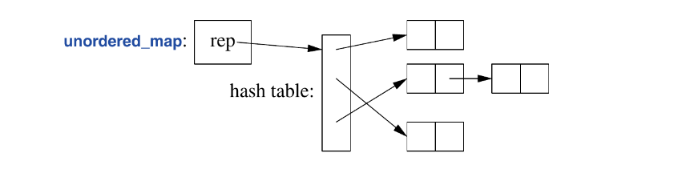

A class with the main purpose of holding objects is commonly called a *container*.

## 12.2 `vector`
A `vector` is a sequence of elements of a given type. The elements are stored contiguously in memory. A typical implementation of `vector` will consist of a handle holding pointers to the first element, one-past-the-last element, and one-past-the-last allocated space.

### Things about vector

* We can initialize `vector` with a set of values of its element type:
```c++
vector<Entry> phone_book = {
	{"Dabvid Hume", 123456},
	{"Karl Popper", 234567},
	{"Bertrand Arthur Russell", 2345678}
};
```
* Elements can be accessed through sub-scripting and Indexing starts at zero
* The vector member `size()` gives the number of elements
* The elements constitute a range, so we can use a range-for-loop:
```c++
void print_book(const vector<Entry>& book)
{
	for(const auto& x: book)
		cout << x << '\n';
}
```
* When vectors are defined, we give it an initial size:
```c++
vector<int> v1 = {1, 2, 3, 4};   // size -> 4
vector<string> v2;               // size -> 0
vector<Shape*> v3(23);           // size -> 23
vector<double> v4(32, 9.9);      // size -> 32, default value -> 9.9
```
* `.push_back()` adds a new element to a vector ans increases its size by one. The standard library is devised such that growing a vector with repeated  `.push_back()` is efficient.
* A `vector` can be copied in assignments and initialization. For example:
```c++
vector<Entry> phone_book = { {"Caligula", 8}, {"Camus", 5} };
vector<Entry> book2 = phone_book;    // this is a copy
```
Assigning a vector involves copying its elements. Thus after initialization of `book2`, `book2` and `phone_book` holds separate copied of every `Entry` in the phone book.

In cases where a vector contains a lot of elements and copying is undesirable, the *move* operations should be used. The `vector` is a very flexible and efficient. It should be used regularly unless there exists a solid reason not to.

## 12.2.1 Elements
When we insert a new element into a vector, the value (dependent on the type the container is instructed to hold) is copied into the container.

If we have a class hierarchy that relies on `virtual` functions to get polymorphic behavior, we should not store objects directly in a container. Instead we should store a pointer (or a smart pointer). An example:
```c++
vector<Shape> vs;          // DONT: no room for a circle or smiley
vector<Shape*> vps;        // better: potential leak though
vector<unique_ptr<Shape>>  // OK.
```

## 12.2.2 Range Checking
* std `vector` does not guarantee range checking. For example:
```c++
void silly(vector<Entry>& book)
{
	int i = book[book.size()].number;
}
```
This initialization is likely to place some random value in i rather tan giving an error. This is undesirable and a common problem. What bjarne does to combat this is using a simple range-checking adaptation of `vector`
```c++
template<typename T>
struct Vec: std::vector<T> {
	using vector<T>::vector; // use the constr. from vector under vec

	T& operator[](int i) { return vector<T>::at(i); }  // range check
	const T& operator[](int i) const { return vector<T>::at(i); } // const

	auto begin() { return Checked_iter<vector<T>>(*this); } // 13.1
	auto end() { return Checked_iter<vector<T>>(*this,vector<T>::end()); }
};
```
`Vec` inherits everything from `vector` except what it redefines to do range chacking. Vector’s `at()` performs a subscript operation that throws an `out_of_range` exception when the range has been exceeded. So now we can catch range check errors:
```c++
void checked(Vec<Entry>& book)
{
	try { book[book.size()] = {"Joe", 999999}; // will throw exception
	}
	catch ( out_of_range&) { cerr << "range error\n"; 
	}
}
```


* Once way to avoid surprises from uncaught exceptions is to use a `main()` with a `try-` block as its body:
```c++
int main()
{
try {
	// your code
}
catch (out of range&) {
	cerr << "range error\n";
}
catch (...) {     // default exception handler.
	cerr << "unknown expception thrown\n";
}
```

The reason why std `vector` do not guarantee range checking is; Many performance critical applications use `vectors` and checking all subscripting implies a cost on the order of 10% (and this can vary dramatically depending on the environment of the application), And experience shows that such overhead can lead users to prefer more unsafe mechanisms like bare arrays.

Bjarne also explains that if we use `vector::at()`, then we do not need to worry ourselves with the struct workaround adaptation of `vector`.

## 12.3 `list`
The standard library offers a doubly linked list called list.



We use a `list` for sequences where we want to insert and delete elements without moving other elements, like in a phone book:
```c++
list<Entry> phone_book = {
	{"David Hume", 123456},
	{"Kart Popper", 234567},
	{"Bertrand Arthur William Russel", 345678}
};
```
* Elements in linked list are not accessed via subscripting (like vectors), instead we search the list looking for what we need. An example:
```c++
int get_number(const string& s)
{
	for(const auto& x: phone_book)
		if(x.name==s)
			return x.number;
	return 0;     // use 0 to represent number not found.
}
```
Sometime we need to identify an element in a list to perform some computation related to it (delete/place a new element adjacent to it). To achieve this we use a list *iterator*. 

Every standard library container provides a `begin()`and `end()`, which returns an iterator to the first and one-past-the-last element, respectively, of the container:
```c++
int get_number(const string&s)
{
	for(auto p = phone_book.begin(); p!=phone_book.end(); ++p)
		if (p->name == s)
			return p->number;
	return 0;
}
```
This roughly the way the terser and less error-prone range-for loop is implemented by the compiler.

* Adding/removing elements to/from a `list` is really easy. in `list.insert(p,elem)` inserts an element with a copy of the value `elem` before p. Conversely `erase(p)` removes p and destroys it:
```c++
void f(const Entry& ee, list<Entry>::iterator p, list<Entry>::iterator q)
{
	phone_book.insert(p, ee);  // add ee before the element p refers to
	phone_book.erase(q);       // remove element q refers to
}
```

We should prefer vectors to list (unless in novel cases)

## 12.4 `forward list`
A forward list differs from a (doubly-linked) list only by allowing forward iteration. its point is to save space. The size of an empty `forward_list` is just one pointer. It doesn’t even keep its number of elements, if you need a “size”, you count, if you can’t afford to count, you probably shouldn’t be using a `forward_list`
## 12.5 `map`
This is basically a balanced binary search tree (usually a red-black tree) called a `map`:



A map is known as an associative array or dictionary. The standard-library `map` is a container of pairs of values optimized fro lookup and insertion.

*  It can be initialized the same was as vectors and lists
```c++
map<string, int> phone_book {
	{"David Hume", 123456},
	{"Kart Popper", 234567},
	{"Betrand Artur William Russel", 345678}
};
```
When indexed by a value of its first type (the key), a `map` returns the corresponding value of the second type (the value). For example:
```c++
int get_number(const string& s)
{
	return phone_book[s];
}
```
if a `key` isn’t found, it is entered into the `map` with a default value for its `value`. If we want to prevent entering invalid numbers into our phone book, we could use `find()` and `insert()` instead of `[]`.

## 12.6 `unodered map`
cost → `Olog(n)`, where n → number of elements. standard library hashed containers are referred to as “unordered” because they don’t require an ordering function. 



We can use an `unordered_map` from `<unordered_map>` for our phone book:
```c++
unodered_map<string, int> phone_book {
	{"David Hume", 123456},
	{"Karl Popper", 234567},
	{"Bertrand Arthur William Russel", 345678}
};
```

Just like a `map`, we can subscript an `unordered_map`

The standard library provides a default hash function for `strings` as well as fro other std types, but if necessary, we can provide our own. Usually the need arises when we want an unordered container of out own type. An example:
```c++
struct Record {
	string name;
	int product_code;
};

bool operator==(const Record&, const Record&) { //.. };

struct RHash {
	size_t& operator()(const Record& r) const
	{
		return hash<string>()(r.name) ^ hash<int>()(r.product_code)
	}
}
```
Designing good hash function is an art on its own but creating a new hash function by combining existing has functions using exclusive-or (`^`) is (often) simple and effective. Man he explains some stuff further.

We can avoid explicitly passing the `hash` operation by defining it as a specialization of the standard library-hash:
```c++
namespace std { //mkae a hash function for Record.
	template<>
	struct hash<Record> {
		using argument_type = Record;
		using result_type = size_t;
		
		result_type operator()(const Record& r) const
		{
			return hash<string>()(r.name) ^ hash<int>()(r.product_code);
		}
	};
}
```
Given a good hash function, an `unordered_map`  is much faster than a `map` for large containers. However, the worst case behavior of an `unordered_map` with a poor hash function is far worse than that of a `map`

## 12.7 Allocators
By default, the standard-library containers allocate space using `new`. Operators `new` and `delete` provide a free store (dynamic memory or heap) that can hold objects of arbitrary size and user-controlled lifetime.

The standard library (due to the time and space effectiveness of `new` and `delete`, wen used properly) provides the opportunity to install allocators with specific semantic where needed. 

These has been used to address a wide variety of concerns related to performance:
* pool allocators (performance based)
* security allocators (clean-up memory as part of deletion)
* per-thread allocators 
* non-uniform memory architecture allocators (allocating in specific memories wit pointer types to match)


Here is a real world example of a problem that was solved using a *pool allocator*: An important,long running system used an event queue, using `vectors` as events that were passed as `shared_ptrs`. That way the last user of an event implicitly deletes it:
```c++
struct Event {
	vector<int> data = vector<int>(512);
};

list<shared_ptr<Event>> queue;

void producer() 
{
	for(int n=0; n!=LOTS; ++n) {
		lock_guard ik (m);
		queue.push_back(make_shared<Event>());
		cv.notify_one();
	}
}

```
At first glance this seems fine, but unfortunately this leads to massive fragmentation, one in which more than 6GB of memory would have been consumed after 100,000 events has been passed among 16 producers and 4 consumers.

Fortunately  a pool allocator solves this issue. A pool allocator is an allocator that manages objects in a single fixed size and allocates spaces for many objects at a time, rather than using individual allocations. The pool allocator is defined in C++ in the `pmr` (“polymorphic memory resource“) sub-namespace of `std`:
```c++
pmr::synchronized_pool_resource pool;

struct Event {
	vector<int> data = vector<int>(512, &pool);
};

list<shared_ptr<Event>> q {&pool};

void producer()
{
	for (int n=0; n!=LOTS; ++n) {
		scoped_lock ik (m);
		q.push_back(allocate_shared<Event,
		 pmr::polymorphic_allocator<Event>>(&pool));
		cv.notify_one();
	}
}
```
in these re-edition, the same conditions apply here but still less than 3MB of memory had been consumed (eliminating the issue fragmentation was previously imposing). A 2000-fold improvement.

Techniques like these have been used in earliest days of c++, but they required programs to be re-written to support specified allocations (like pool allocation), but now the standard library containers can optionally take allocator arguments.

The default is for containers is to use `new` and `delete` (free store random allocation—Fragmentation prone).

Other polymorphic memory resources include:
* `unsynchronized_polymorphic_resource`: like `polymorphic_resource` but can only be used by one thread.
* `monotonic_polymorphic_resource`: a fast allocator that releases its memory only upon its destruction and can only be used by one thread.

A polymorphic resource must be derived from `memory_resource` and define members `allocate()`, `deallocate()` and `is_equal()`. The idea is for users to build their own resources to tune code.

## 12.8 Container overview
Containers are defined in the `std` namespace and presented in headers `<vector>`, `<list>`, `<map>`, etc. Look up what you need felix.

The `emplace_back()` of a container basically takes in the arguments its element type requires for construction, and constructs the object in the container directly. Eliminating the need to copy or move:
```c++
v.push_back(pair{1, "copy or move"}); // makes a pair and moves it
v.emplace_back(1, "build in place"); // build a pair in v
```

Unordered containers are basically hash-maps.

A list of c++ basics containers and their generally supported operations are listed in this subsection of the book. I ain’t documenting that shwiz.

## Advice
* Use `vector` as default container
* use `reserve()` to avoid invalidating pointers and iterators to elements and dont assume performance benefits from this operation without measurement
* use `push_back` or `resize()` on a container rather than `realloc()` on an array.
* Never assume `[]` range checks; `at()` guarantees range check on the other hand
* Elements are copied into a container.
* To preserve polymorphic behaviors of objects, store pointers.
* vector insertions are surprisingly efficient
* When it comes to performance, don’t trust intuition; measure.
* pass a container by reference and return by value.
* prefer compact and contiguous data structures (to avoid fragmentation)
* Experiment to check if you have an acceptable hash function
* A hash function obtained by combining hash functions for elements using exclusive or operator `^` is often good.
* Prefer standard-library containers to handcrafted data structures
* If your application is suffering performance problems related to memory, minimize free store use and/or consider using a specialized allocator.


