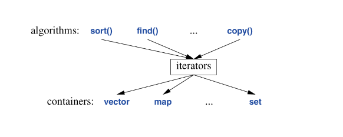

This chapter focuses on iterators, predicates, parallel algorithm and an overview on algorithms

A data structure on its own isn’t that useful, we usually need some operation to be performed on them, this operations is achieved via an *algorithm*

The standard library is equipped to perform most common algorithms on the common containers its also provided.

An example illustrating sorting a vector of `Entrys` and then making a list copy of the sort:
```c++
void f(vector<Entry>& vec, list<Entry>& lst)
{
	sort(vec.begin(), vec.end());
	unique_copy(vec.begin(), vec.end(), lst.begin());
}
```
for this to work, less than (`<`) and equal (`==`) must be defined for `Entry`s.

### Standard Library Algorithms
A standard library algorithm is expressed in terms of (half-open) sequences of elements. 

The standard library doesn’t offer an abstraction to support range-checked writing into a container. BUt we can define one as so:
```c++
templaate <typename C>
class Checked_iter {

	void check end() const { if (ptr == cntr->end()) throw Overflow(); }
	C* cntr {};
	typename C::iterator ptr = pc->begin();
	
public:

	using value_type = typename C::value_type;
	using difference_type = int;
	
	Checked_iter() { throw Missing_container{}; } // must be -> to cntr
	Checked_iter(&C cc) : cntr{&cc} {}
	Checked_iter(&C cc, typename C::iterator p) : cntr{&cc}, ptr{p} {}
	
	Checked_iter& operator++() { check_end(); ++p; return *this; }
	Checked_iter& operator++(int) { 
		check_end(); auto t{*this}, ++p; return *this;
		}
	value_type& operator*() const { check_end(); return *p; }
	
	bool operator==(const Checked_iter& a) const { return p == a.p; }
	bool operator!=(const Checked_iter& a) const { return p != a.p; }
};
```
Now when we use this iterator instead of an overflow to occur, it throws an exception that we can catch and handle.

Following the previous read and sort, if we wanted to place the unique elements in a `list`, we can via:
```c++
list<Entry> f(vector<Entry>& vec)
{
	list<Entry> res;
	sort(vec.begin(), vec.end());
	unique_copy(vec.begin(), vec.end(), back_inserter(res));
	return res;
}
```
`back_inserter()`constructs an iterator for res that adds elements at the end of a container.

## 13.2 Use of Iterators
Iterators are used to separate algorithms and containers. An algorithm operates on its data through iterators and knows noting about the container in which the elements are stored. Also a container knows nothing about the algorithms operating on its elements. All it does is supply iterators upon request.



We utilize iterators using some sort of loop, moving the iterator forward one elements at a time via (`++`, that’s if that what we want there a negative iterators that traverse backwards via `--`) and looking at the elements using a dereference operator `*`. I like to think of iterators, in a very basic incomplete attempt in summarizing them, as fancy pointers to container elements that does something.

We could define a simple generic algorithm that searches for all occurences of a specified element in a container an returns a vector of pointers to the occurences as so:
```c++
template <typename C, typename V>
vector<typename C::iterator> find_all(C& cntr, V val)
{
	Vector<typename C::iterator> res;
	for(auto p = cntr.begin(); p!=cntr.end(); ++p) {
		if (*p==val)
			res.push_back(p);
	}
	return res;
}
```
I think; we could even be more specific if we enforce constrain that the type for the parameter val must be the same type as the elements of the container by:
```c++
template<typename C>
vector<typename C::iterator> find_all(C& cntr, typename C::value_type val)
{
	Vector<typename C::iterator> res;
	for(auto p = cntr.begin(), p!=cntr.end(), ++p) {
		if(*p==val)
			res.push_back(p);
	}
	return res;
}
```

## 13.3 Iterator Types
An *iterator* is a general idea, a concept if you will, that represent an an object that does something to container. The definition of an iterator is dependent on the container its tailored to work upon. For example, a vectors iterator can be an ordinary pointer plus an index, while that for a list can be pointer to a link in the list. 

Although iterators have different definition dependent on the required context, their underlying semantics and operations-naming are general/common.

## 13.3.1 Stream Iterators
Iterators also functions on streams and their content. The notion of iterators can be usefully applied to input and output.

For example, to  make an `ostream_iterator`, we need to specify which stream will be used and the type of objects to be written to it:
```c++
ostream_iterator<string> oo {cout};
```
An the effect of assigning to `*oo` is to write the assigned value to `cout`:
```c++
int main()
{
	*oo = "Hello, ";
	++oo;
	*oo = "world\n";
}
```
`++oo` is done to mimic writing into an array through a pointer. That way we can use algorithms on streams:
```c++
vector<string> vec {"Hello", ",", " ", "Barthelona\n"};
copy(vec, oo);   // prints vec to standard output.
```
________
Similarly, an `istream_iterator` is something that allows us treat an input stream as a read-only container. We must also specify the stream to be used and the values to be expected:
```c++
istream_iterator<string> ii {cin};
```
An since input iterators are defined as pairs to represent a sequence, we must also provide an `istream_iterator` to indicate the end of input. This is the default `istream_iterator`:
```c++
istream_iterator eos {};
```
________
Typically, `istream_iterator` and `ostream_iterator` are  not used directly. Instead they are provided as arguments to algorithms. For example a program tthat reads a file, sort the words, eliminated duplicates and writes the result to another file:
```c++
int main()
{
	string from, to;
	cout >> from >> to;

	ifstream is {from};
	istream_iterator<string> ii {is};
	istream_iterator<string eos {};
	
	vector<string> words {ii, eos};
	sort(words);
	
	ostream os {to};
	ostream_iterator<string> oi {os, "\n"};

	unique_copy(words, oi);

	return !is.eof || !os;       // return error state.
}
```
he range versions of `sort()` and `unique_sort` where used in this, code. We could have used the iterators directly `sort(words.begin(), words.end())`. as is common is older code.

Remember, That to use both a traditional iterator version of the standard -library algorithm and its ranges counterpart we need to explicitly qualify the call of the range version:
```c++
copy(v, oi);              // potentially ambiguous
ranges::copy(v, oi)       // OK, specified that we want the ranges version
using range::copy(v, oi); // ranges version explcitly scoped in.
copy(v, oi);              // OK; hads been scoped in via `using`
```
_______
* An `ifstream` is an `istream` that can be attached to a file
	* `ostream_iterator` second argument is used to delimit output values
* An `ofstream` is an `ostream` that can be attached to a file.
_____
We can make the previous program more concise by:
```c++
int main()
{
	string from, to;
	cin >> from >> to;
	
	ifstream ifs {from};
	ofstream ofs {to};
	
	set<string> unique {istream_iterator<string> {is}, 
		istream_iterator<string> {}};
	copy(unique, ostream_iterator<string> {ofs, "\n"});
	
	return !ifs.eof() || !ofs;
}
```

## 13.4 Use of Predicates
In previous we made the algorithms constrained to have a “built in“ action to be performed on each element, But this approach is somewhat “not ideal” and concrete. 

Like in the `find_all` function a more general variant looks for an element that fulfills a specified requirement, *a predicate.*

Using predicates, we can pass our condition into the algorithm and allow the algorithm perform its duty while enforcing the specified predicate. A predicate is simply an entity that returns a boolean that satisfies some condition.

For example:
```c++
void f(map<string, int>& m)
{
	auto p = find_if(m, Greater_than{42}); // Greater_than is a predicate
}
```
Here `Greater_than` is a function object holding the value (42) that returns a boolean that tells if an elements value is greater than 42 .: a *predicate* (since it enforces some condition).

`Greater_than` can be written as so:
```c++
struct Greater_than {
	Greater_than(int v) : value{v} {};
	bool operator()(const map<string, int>& m) const {
		return m.second>value; }
private:
	int value;
}
```
Alternatively we can also use a lambda as a predicate:
```c++
auto p = finc_if(m, [](const auto& m){ return m.second>42; });
```
A predicate should not modify the elements in which its applied to.

## 13.5 Algorithm overview
A general definition of an algorithm is a “finite set of rules representing a sequence of operations for solving specific set of problems [and] has five important features: Finiteness … Definiteness … Input … Output and Effectiveness” [Knuth, 1968, §1.1].

In the context of C++ standard library, an algorithm is a function template operating on a sequence of elements. They are defined in the `std` namespace and presented in the `<algorithm>` and `<numeric>` headers. They all take sequences as input, Half open ones `[b:e)`.

Reference text for a list of some algorithms.

For algorithms taking a `[b:e)` range, `<ranges>` offers a version that takes a range. To use both a traditional iterator version of a standard-library algorithm and its ranges counterpart. We need to either explicitly qualify the call or use a `using`-declaration.

## 13.6 Parallel Algorithms
When the same task is to be done to many data items, we can execute it in parallel on each data item provided the computations on different data items are independent:
* *parallel execution*: tasks are done on multiple threads
* *vectorized execution*: tasks are done on a single thread using vectorization, also known as *SIMD* (“Single Instruction, Multiple Data)

Standard library offers support fir both, and we can be specific about wanting sequential execution; in `<execution>` in namespace `execution`we find:
* `seq`: sequential execution
* `par`: parallel execution (if feasible)
* `unseq`: unsequenced (vectorized) ececution (if feasible)
* `par_unseq`: parallel and/or unsequenced (vectorized) execution (if feasible).

consider `std::sort()`:
```c++
sort(v.begin(), v.end());            // sequenntial
sort(seq, v.begin(), v.end());       // sequential (same as default)
sort(par, v.begin(), v.end());       // parallel
sort(par_unseq, v.begin(), v.end())  // parallel and/or vectorized
```
*execution policy indicators* are just hints, and the compiler and/or run-time scheduler will decide how much concurrency to use. Always measure to ensure efficiency.

Unfortunately, the range versions of the parallel algorithms are not yet in standard, but we can easily cook them up when needed:
```c++
void sort(auto pol, random_access_range auto& r)
{
	sort(pol, r.begin(), r.end());
}
```