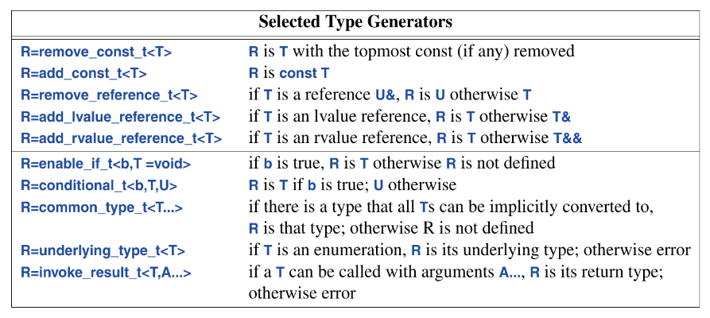

## 16.2 Time
library: `<chrono>`, provides facilities do deal with time.
* Clocks, `time_point`, and `duration` for measuring how long some action takes
* `day, month, year and weekdays` for mapping `time_point`s into our everyday lives
* `time_zone` and `zoned_time`, to deal with differences in time around the globe

## 16.2.1 Clocks
Here is a basic way of timing some action:
```c++
using namespace std::chrono;
auto t0 = system_clock::now();
do_work();
auto t1 = system_clock::now();

cout << t1-t0 << "\n";
cout << duration_cast<milliseconds>(t1-t0).count() << "ms\n";
cout << duration_cast<nanoseconds>(t1-t0).count() << "ns\n";
```
The clock returns a `time_point` a point in time, and its subtraction returns a `duration`; a period of time, different clocks have different units of time, the one used here counts in hundreds of nanoseconds. In some cases we would want a duration to be converted from one unit to another; `duration_cast`s help is achieve that. 

Never make assumptions on efficacy without measuring. `std::chrono_literals` define time-unit suffixes.
```c++
this_thread::sleep_for(10ms+33us);
```

## 16.2.2 Calendars
The standard library supports dates:
```c++
auto spring_day = April/7/2018;
cout << weekday(sping_day) << ´\n´;
```
Naturally `April` is month more specifically a `std::chrono::Month`, we could also write:
```c++
auto sprinday = 2018y/April/7;
```
The `y` suffix distinguishes the year from plain `int`s, which are used for the day of the month. In mot cases if very probable for write invalid dates, to be sure we use the `ok()`to ensure our date is valid:
```c++
auto bad_day = January/0/2024;

if(!bad_day())
	cout << "Date in invalid.";
```
Dates are compose by overloading operator/ with `year`, `month` and `int`. The result is type `Year_month_day` that allows conversions to and from `time_points` to allow accurate and efficient date computes.
```c++
sys_day t = sys_day(February/25/2000); // ret. timpoint, precision-> days
t += days(7);
auto d = Year_month_day(t);
```

## 16.2.3 Time Zones
A `time_zone` is a time relative to the standard zone used by `system_clock`, GMT or UTC. The standard library synchronized with global database (IANA) to get its answers right. The names of times zones are C-style strings of the form `"continent/major-city"`, A `zoned_time` is a `time_zone` together with a `time_point`:
```c++
auto tp = system_clock::now();
zoned_time zt {current_zone(), tp};
cout << zt << '\n';                     // tp in EST time

const time_zone est {"Europe/Copenhagen"};
cout << zoned_time{&est, tp} << '\n';   // to in GMY+1
```

## 16.3 Function Adaptation
I don understand the explanation here.

## 16.3.1 Lambdas as Adaptors
```c++
void draw_all(vector<Shape*>& v)
{
	for_each(v.begin(), v.end(), [](Shape* p){p->draw();});
}
```
## 16.3.1 `mem_fn()`
Given the member function, the function adaptor `mem_fn(mf)` produces a function  object that can be called as a nonmember function:
```c++
void draw_all(vector<Shape*>& v)
{
	for_each(v.begin(), v.end(), mem_fn(&Shape::draw));
}
```
## 16.3.3 `function`
The standard library `function` is a type that can hold any object you can invoke using the call `operator()`. That is an object of type `function` is an object function:
```c++
int f1(double);
function<int(double)>fct1 {f1};

int f2(string);
function fct2 {f2};      // type deduction

function fct3 = [](Shape*) { p->draw(); };
```
Although functions are useful, they might result to some runtime overhead, especially those in which the `function` object is not computed at runtime, free store allocation might occur (detriment to performance critical applications).

## 16.4 Type functions
A *type function* is a function that operates on types, or return a type (rather than a value) at compile time, don’t know what the fuck bjarne defined; The english wonky as hell. Examples:
```c++
constexpr int szi = sizeof(int); // takes a type as arguement
constexpr float min = 
	numeric_limits<float>::min(); // type are template argument.
```
 `<type_traits>`, provide functions for inquiring about properties of types:
 ```c++
 bool b = is_arithmetic_v<X>;  // true if X is a built in arithmet.type
 using Res = invoke_result<decltype(f)>; // res is int if f is func->int
 ```
 `decltype(f` is a call to built in type function `decltype()`, which returns the declared type of argument: here `f`.

some type functions create new types based on inputs.
```c++
typename <typename T>
using Store = conditional_t(sizeof(T)<max, On_stack<T>, On_heap<T>);

auto conditional_t(bool cond, auto t1, auto t2)
{
	return cond ? decltype(t1) : decltype(t2);
}
```
-------------------
Below is a example in which we can create our own type function, either from standard ones or via concepts (concepts are type functions):
```c++
template<typename F, typename...Args>
auto call(F f, Args...a, Allocator alloc)
{
	if constexpr(invocable<F, alloc, Args...>)
		return f(f,alloc,a...);
	else
		return f(f,a...);
}
```
The standard library uses `_v` for type functions that return values, and `_t` for type functions that return types.

Type functions are part of c++’s mechanism for compile time computation that allow tighter type checking and better performance that would have been possible without them. Use of type functions and concepts → *metaprogramming* or, when templates are involved, → *template metaprogramming*

## 16.4.1 Type Predicates
in `<type_traits>`, std offers numerous type functions to answer questions about types, these type functions are called: *type predicates*.

A list was provided, if you need reference felix, check the book or cppreference, For clarity while reading beyond this sentence, `is_arithmetic_v()`  is one of the type predicates in that list.

A use of this predicates is to constrain template arguments:
```c++
template <typename Scalar>
class complex {
	Scalar re, img;
public:
	static_assert(is_arithmetic_v<Scalar>, 
		"Sorry; I only support complex arithmetic types");
	//..
};
```
the above can also be achieved elegantly via concepts:
```c++
template<Arithmetic Scalar>
class complex {
	Scalar re, img;
public:
	//..
}
```
some type predictes dissappear in the definition of some concepts:
```c++
template <typename T>
concept Arithmetic = is_arithmetic_v<T>;
```
We define concepts that are more general than standard library type predicates. Type predicates are found deep in implementation of fundamental services, often to distinguish cases for optimization:
```c++
template <typename T>
void copt(T* first, T* last, T* target)
{
	if constexpr(is_trivially_copyable_v<T>)
		memcpy(first, target (last-first)*sizeof(T));
	else
		while (first!=last) *target++ = *first++;
}
```
“This simple optimization, beat its non-optimized variant with about 50% in some implementations”, says Bjarne. Always use standard facilities, if a facilities you request is non existent, make your own.

## 16.4.2 Conditional Properties
Consider designing a smart pointer:
```c++
template <typename T>
class Smart_pointer {
	//..
	T& operator*() const;
	T* operator->() const;
};
```
The `->`, should be defined if and only if T is a class type, we can enforces this using a type function, since we can’t use `constexpr ifs` outside a function:
```c++
template <typename T>
class Smart_pointer {
	//..
	T& operator*() const;
	T* operator->() const requires is_class_v<T>;
};
```
We could also use a concept for this but since there are no std concpts that enforces this we could define ours:
```c++
template <typename T>
concept Class = is_class_v<T> || is_union_v<T>;

template <typename T>
class Smart_pointer {
	//..
	T& operator*() const;
	T* operator->() const requires Class<T>;
};
```
Unions are classes.

## 16.4.3 Type Generators
Many type functions, returns types, often new types that they can compute. Such functions are called type generators. 



These type functions are typically used in the implementation of utilities, rather than in application code directly. An example with `enable_if` (very common even in the pre-concepts era): 
```c++
template <typename T>
class Smart_pointer {
	//..
	T& operator*() const;
	enable_if(is_class_v<T>, T&) operator->() const;
}
```
`enable_if` relies on a subtle language feature called SFINAE (“Substitution Failure Is Not An Error“).

## 16.4.4 Associated Types
All standard containers (and containers designed to follow their pattern), have associated types. value types, and iterator types. can be found in `<ranges> && <iterator>.

* `range_value_t<R>`  → type of ranges `R`’s elements
* `iter_value_t<T>`    → type of elements pointed to by the iterator `T`
* `iterator_t<R>`        → type of range `R`’s iterator

## 16.5 `source_location`

std provides `source_loaction`, to pinpoint the location in source code, where an error occurs, it is helpful when writing out trace message or error messages:
```c++
void log(const string mess="",
	const source_location loc = source_location::current())
{
	cout << loc.file_name()
		 << '{' << loc.line() << ':' << loc.coloumn << '}'
		 << loc.functon_name()
		 << mess;
}
```
The call of `current` is a default argument so that we can get the location of the caller of `log()`, rather than the location of `log()

## 16.6 `move()` and `forward()`
The choice between moving in copying is implicit, but in some case, in order to get a desired outcome we have to perform this explcitly, for example; a `unique_ptr`, it is the sole owner of its object so it cannot be copied, so if we want it elsewhere we have to move it:
```c++
void f1()
{
	auto p = make_unique<int>(2);
	auto q = p;                 // ERROR, unique ptr can't be copied
	auto q = move(p);   // p now hoTlds a nullptr
}
```
`std::move()`, doesn't actually move anything, what it does is cast its arguments into a rvalue, the constructor of the target notices this and invokes its move constructor/assigner.

A simple swap:
```c++
template <typename T>
void swap(T& t1, T& t2)
{
	T temp {move(t1)};
	t1 = move(t2);
	t2 = move(temp);
}
```
Since we don’t want to repeatedly copy large objects, we move. The use of `std::move` is quite error prone, so it should not be use unless in cases where well ***calculated*** performance measures are required.

A move leaves its moved-from object in a state in which it could be safely destroyed or re-initialized just like a new object.
___________________________________
Forwarding object is also another case that requires move computes. Sometimes, we want to move a set of arguments to another function, without modification to achieve “perfect forwarding”:
```c++
template <typename T, typename... Args>
unique_ptr<T> make_unique(Args&& ...args)
{
	return unique_ptr<T> {new T {std::forward<Args>(args)...}};
}
```
`forward()` differs from `move()`, by correctly handling subtleties regarding rvalue and lvalues. `std::forward`, should be used exclusively for forwarding and do not forward twice, once you forward an object, do not attempt to use it anymore; it is no longer yours.

## 16.7 Bit Manipulation
package/library: `<bit>`, contains functions for low-level but manipulation. This can prove essential the closer we get to hardware. `bit_cast` lets is convert a value of one type of another of the same size.

The best type to do bit operations on is an unsigned integer or `std::byte`. (By best he means the fastest and less likely to surprise)

## 16.8 Exiting a program
Occasionally a piece of code encounters a problem it cannot handle:
* If the kind of problem is frequent and its immediate caller can handle it; return an error code.
* If the problem is infrequent or its immediate caller can’t handle it, throw an exception
* If the problem is so serious, that no ordinary part of the program can be expected to handle it. exit the program.
std provides, facilities to deal with the last case (Exiting the program):
* `exit(x)`: call functions registered with `atexit()` and returns value `x`. `atexit()` is basically a primitive destructor mechanism shared with the C language.
* `abort()`: exit the program immediately and unconditionally with a return value indicating unsuccessful termination.
* `quick_exit(x)`: call functions registered with `at_quick_exit()`; then exit program with return value `x`.
* `terminate()`: call the `terminate_handler`, default `terminate_handler` is `abort()`.
These functions are for serious errors, they do not invoke destructors. The various handlers are used to take actions before exiting. such actions must be simple, because the reason for calling these function is that the program state is corrupted.

A reasonable popular action is “restart the system in a well defined state relying on no state from the current program”. Another dicier action is to “log an error message and exit”, These could be a problem too because the I/O system might have been corrupted by whatever cause the exit function to be called.

No general purpose library should unconditionally terminate.

## 16.9 Advice
* Time programs, before making claims on efficiency
* Use `duration_case` to report time measurement with proper units.
* use symbolic notations to represent dates
* check validity of a date resulted computation via `ok()`
* Use lambdas to express minor changes in calling conventions
* prefer concepts to explicit type predicate use.
* prefer concepts over traits and `enable_if` wherever we can.
* Use `function` to store something that can be called
* Use `mem_fn()` or a lambda to create function objects that can invoke a member function when called.
* Avoid explicit use of `std::move()`